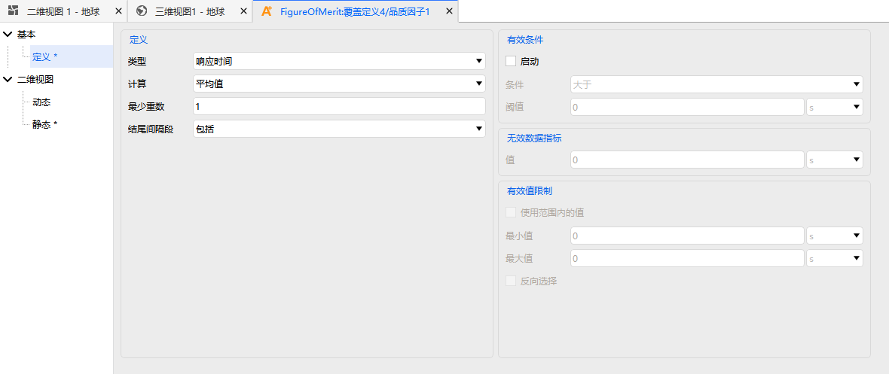

# 基本定义

品质因子的定义配置包含四个部分：

- [**定义**](#定义)：选择品质因子类型、统计参数类型及类型特有参数。
- [**有效条件**](#有效条件)：在可见性约束之上进一步筛选有效覆盖窗口。
- [**无效数据指标**](#无效数据指标)：当特定条件不满足时赋予指定的无效值。
- [**有效值限制**](#有效值限制)：对计算结果施加额外的上下限约束。

## 定义

定义选项卡用于选择品质因子类型并指定计算参数，主要配置项包括：

- **类型**：从 16 种品质因子中选择
- **统计参数类型**：选择需要计算的统计值，不同品质因子类型对应不同的统计值选项
- **类型特有参数**：部分类型需要额外设置，例如：
  - 重访时间：设置最少重数
  - 精度衰减因子：选择子方法和计算类型

## 有效条件

有效条件用于在可见性约束之上进一步筛选覆盖窗口。

例如，若需要分析"被至少 2 个资源同时覆盖"的时段，可将"类型"设为"覆盖重数"，启用有效条件，并设定为"大于"有效值"2"。

## 无效数据指标

某些品质因子需要特定条件才能进行计算。当条件不满足时，系统会赋予一个指定的无效值，以区分"无效"和"零覆盖"。

例如，"几何精度定位因子"的计算需要实现至少 3 重的覆盖，对于小于 3 重覆盖的时间段，其品质因子始终显示为设定的无效值。

## 有效值限制

有效值限制提供了计算模型限制以外的约束。当覆盖情况满足品质因子的计算模型要求，但不在"有效值限制"所定义的范围内时，该值会被认为是一个无效值。

::: tip 品质因子结果输出方式
分析完成后，品质因子结果可通过**数据报告**和**图表报告**输出，部分类型还支持在二维/三维视图中以**热力图**或**动态数据**形式展示。
:::