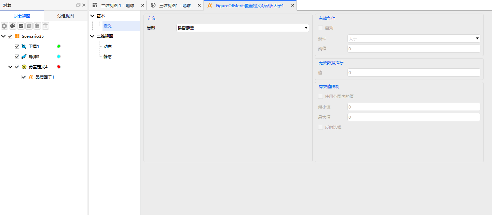

# 品质因子

品质因子（FOM, Figure of Merit）是覆盖分析的核心机制，用于对覆盖、访问、导航、通信等任务效果进行量化评估。ATK 支持 16 种品质因子，涵盖覆盖时间、系统响应、导航定位和访问约束等多个方面，通过统一的属性配置界面进行设置。

品质因子适用于 [覆盖性工具](../../../../5.专业使用指南/01-可见性与覆盖分析/02-覆盖性工具.md) 和 [区域覆盖工具](../../../../5.专业使用指南/01-可见性与覆盖分析/03-区域覆盖工具.md)。
