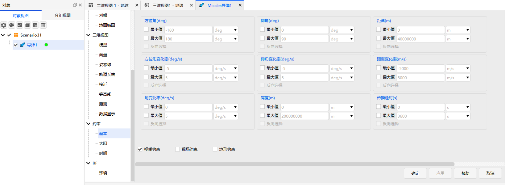

# 基本约束

## 功能说明

基本约束用于根据分析对象与关联对象之间的相对几何关系，对可见时段、通信时段或覆盖时段进行筛选。通过方位角、仰角、距离及其变化率、角变化率、高度、传播延时等几何条件，结合视线、视场与地形遮挡判断，可确定两个对象在当前时刻是否满足任务要求。

参与判定的几何参数逐项列出，每项均可设置**最小值**与**最大值**：勾选并输入数值后，参数取值须落在所设范围之内；勾选**反向选择**后，落在所设范围内的访问将被剔除，仅保留范围之外的访问。当同时启用最小值与最大值时，对应参数 $x$ 应满足：

$$
x_{\min}\leq x\leq x_{\max}
$$

视线约束、视场约束和地形约束以复选框给出，勾选后分别判断视线是否被中心天体遮挡、关联对象是否位于传感器视场内、视线是否被地形高程遮挡。**各项约束相互独立，只有全部已启用的约束均满足时，当前时刻才被判定为满足基本约束**。

各参数的几何定义、参考坐标系和计算模型见 [理论基础 - 基本约束](../../../04-理论基础/02-约束配置/01-基本约束.md)。

## 参数说明

<Entry meta="量纲：角度|单位：deg、rad、arcSec、arcMin、revs" name="方位角" desc="关联对象相对于分析对象在参考平面内的投影方向角，用于描述关联对象的水平方位。" objects="接收器,车辆,传感器,导弹,地面站,发射器,飞机,覆盖定义,火箭,卫星集群,舰船,潜艇,卫星,卫星系统">

<HtmlDemo
  src="./media/01-基本约束/satellite-azimuth-elevation.html"
  title="卫星方位角、仰角示意图"
/>

几何定义和参考坐标系见 [几何定义与参考坐标系](../../../04-理论基础/02-约束配置/01-基本约束.md#几何定义与参考坐标系)，计算方法见 [方位角](../../../04-理论基础/02-约束配置/01-基本约束.md#方位角)。

</Entry>

<Entry meta="量纲：角速度|单位：deg/s、rad/s、revs/day" name="方位角变化率" desc="方位角随时间的变化率，反映目标在参考平面内的转动速度。" objects="接收器,车辆,传感器,导弹,地面站,发射器,飞机,覆盖定义,火箭,卫星集群,舰船,潜艇,卫星,卫星系统">

计算方法见 [方位角变化率](../../../04-理论基础/02-约束配置/01-基本约束.md#方位角变化率)。

</Entry>

<Entry meta="量纲：角度|单位：deg、rad、arcSec、arcMin、revs" name="仰角" desc="分析对象指向关联对象的视线与参考平面之间的夹角，用于描述关联对象相对于分析对象的垂直方向。" objects="接收器,车辆,传感器,导弹,地面站,发射器,飞机,覆盖定义,火箭,卫星集群,舰船,潜艇,卫星,卫星系统">

几何定义和参考坐标系见 [几何定义与参考坐标系](../../../04-理论基础/02-约束配置/01-基本约束.md#几何定义与参考坐标系)，计算方法见 [仰角](../../../04-理论基础/02-约束配置/01-基本约束.md#仰角)。

</Entry>

<Entry meta="量纲：角速度|单位：deg/s、rad/s、revs/day" name="仰角变化率" desc="仰角随时间的变化率，反映目标在垂直方向的角运动速度。" objects="接收器,车辆,传感器,导弹,地面站,发射器,飞机,覆盖定义,火箭,卫星集群,舰船,潜艇,卫星,卫星系统">

计算方法见 [仰角变化率](../../../04-理论基础/02-约束配置/01-基本约束.md#仰角变化率)。

</Entry>

<Entry meta="量纲：长度|单位：m、km、dm、cm、mm、in、kin、ft、kft、yd、kyd、fur、mi、nm、Au、ly、Re" name="距离" desc="分析对象与关联对象之间的直线距离。" objects="接收器,车辆,传感器,导弹,地面站,发射器,飞机,覆盖定义,火箭,卫星集群,舰船,潜艇,卫星,卫星系统">

计算方法见 [距离](../../../04-理论基础/02-约束配置/01-基本约束.md#距离)。

</Entry>

<Entry meta="量纲：速度|单位：m/s、km/s、m/h、km/h" name="距离变化率" desc="两对象间距离随时间的变化率。" objects="接收器,车辆,传感器,导弹,地面站,发射器,飞机,覆盖定义,火箭,卫星集群,舰船,潜艇,卫星,卫星系统">

正值表示两对象相互远离，负值表示两对象相互接近。

计算方法见 [距离变化率](../../../04-理论基础/02-约束配置/01-基本约束.md#距离变化率)。

</Entry>

<Entry meta="量纲：角速度|单位：deg/s、rad/s、revs/day" name="角变化率" desc="角变化率表征关联对象相对于分析对象的旋转速度。" objects="接收器,车辆,传感器,导弹,地面站,发射器,飞机,覆盖定义,火箭,卫星集群,舰船,潜艇,卫星,卫星系统">

<HtmlDemo
  src="./media/01-基本约束/angular-rate.html"
  title="角变化率示意图"
/>

角变化率可用于评估跟踪能力；在构建通信链路时，也可用于表征两个对象之间链路的稳定性。

计算方法见 [角变化率](../../../04-理论基础/02-约束配置/01-基本约束.md#角变化率)。

</Entry>

<Entry meta="量纲：长度|单位：m、km、dm、cm、mm、in、kin、ft、kft、yd、kyd、fur、mi、nm、Au、ly、Re" name="高度" desc="对象相对于中心天体参考表面的高度。" objects="接收器,车辆,传感器,导弹,地面站,发射器,飞机,覆盖定义,火箭,卫星集群,舰船,潜艇,区域目标,卫星,卫星系统">

可设置**最小值**和**最大值**，限定分析对象与关联对象建立可见关系时的高度范围。

计算方法见 [高度](../../../04-理论基础/02-约束配置/01-基本约束.md#高度)。

</Entry>

<Entry meta="量纲：时间|单位：s、min、h、day、cd、EarthTU、SunTU、FN、yr" name="传播延时" desc="传播延时表征分析对象与关联对象之间传输信息所需的时间。" objects="车辆,导弹,地面站,飞机,覆盖定义,火箭,卫星集群,舰船,潜艇,卫星">

计算方法见 [传播延时](../../../04-理论基础/02-约束配置/01-基本约束.md#传播延时)。

</Entry>

<Entry meta="量纲：角度|单位：deg、rad、arcSec、arcMin、revs" name="最小俯仰角" desc="区域目标类对象专属。限定分析对象观测/访问区域目标所需的最小俯仰角，低于该角度的访问不满足约束。" objects="区域目标">

</Entry>

<Entry name="访问整个对象" desc="区域目标类对象专属。启用后要求当次访问覆盖区域目标的整个范围；未启用时，仅覆盖目标的一部分即视为满足。" objects="区域目标">

</Entry>

<Entry name="视线约束" desc="判断分析对象与关联对象之间的视线是否被地球或其他中心天体遮挡。" objects="接收器,车辆,传感器,导弹,地面站,发射器,飞机,覆盖定义,火箭,卫星集群,舰船,潜艇,区域目标,卫星,卫星系统,行星">

视线约束用于分析中心天体遮挡导致的对象间不可见情况，评估两个对象之间的通视质量。根据视线约束所属对象类型的不同，其输出值的计算方法也不同。

固定对象、移动对象的计算模型，以及天体表面对象的简化计算和负高程处理，见 [视线约束原理](../../../04-理论基础/02-约束配置/01-基本约束.md#视线约束)。

</Entry>

<Entry name="视场约束" desc="判断关联对象是否位于传感器的有效观测范围内。" objects="传感器,导弹,卫星集群">

视场范围由传感器的特征角度决定。只有当目标方向位于传感器视场内部时，当前时刻才满足视场约束。

</Entry>

<Entry name="地形约束" desc="判断对象间的视线是否被实际地形遮挡，用于考虑地形高程对可见性及覆盖性的影响。" objects="接收器,车辆,传感器,导弹,地面站,发射器,飞机,覆盖定义,火箭,卫星集群,舰船,潜艇,卫星,卫星系统,行星">

::: warning 地形数据配置说明
勾选 **地形约束** 前，应先在 **[场景对象属性 - 地形](../../02-场景管理/03-场景属性配置/02-基本/03-地形.md)** 中配置需要参与分析的地形数据。

参与约束计算的地形数据与三维视图中的地形可视化配置相互独立。即使三维视图中已经显示地形，该地形数据也不一定参与约束计算。

若需要在三维视图中显示地形效果，还应在每个 **三维视图** 中分别配置对应的**可视化地形数据**。
:::

</Entry>
