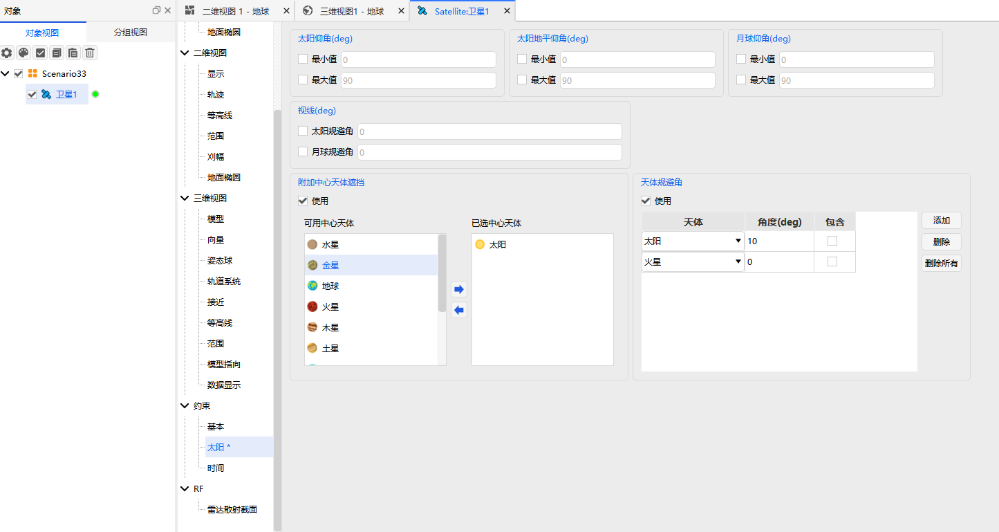
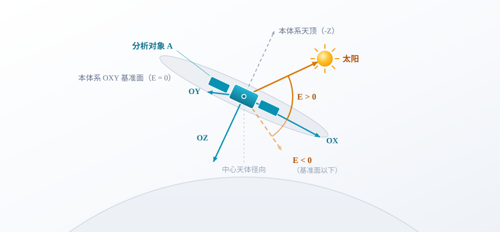
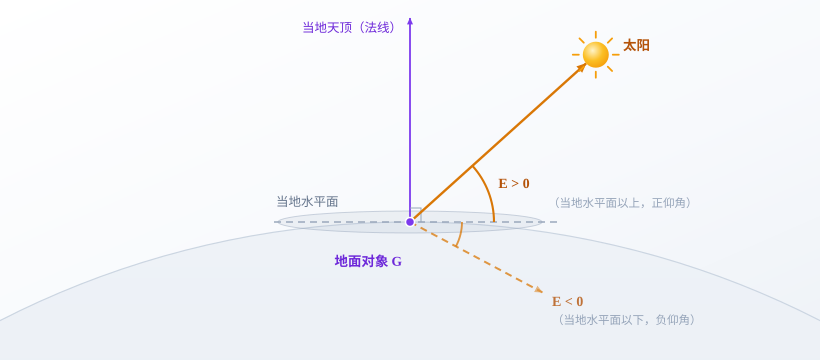
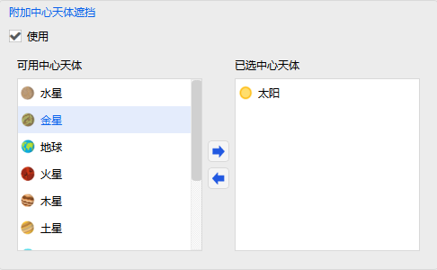
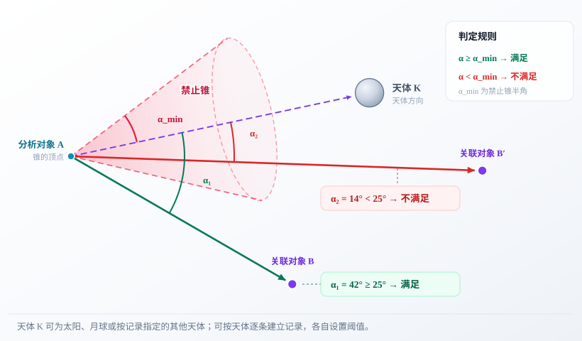
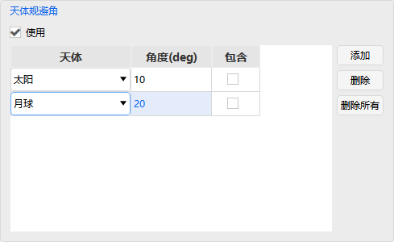
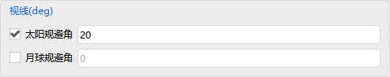
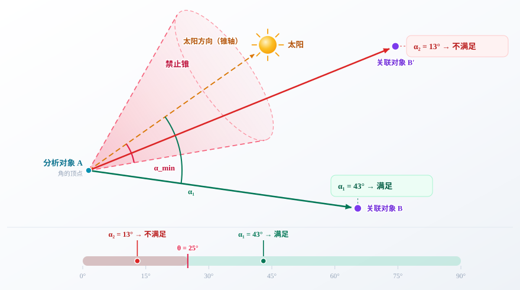

# 太阳约束

## 功能说明

太阳约束是一组依据太阳、月球及指定天体的相对位置来筛选访问的约束，用于规避不利的光照条件与天体几何关系。

::: info 相关文档
各条件的几何定义、参考坐标系与计算模型见 [理论基础 - 太阳约束](../../../04-理论基础/02-约束配置/02-太阳约束.md)。
:::

## 参数说明

<Entry meta="量纲：角度|单位：deg|范围：[-90°, 90°]" name="太阳仰角" desc="分析对象指向太阳的方向与其本体系 OXY 平面之间的夹角。太阳位于基准面以上为正值，位于以下为负值。" objects="车辆,传感器,导弹,地面站,飞机,覆盖定义,火箭,卫星集群,舰船,卫星,卫星系统">

- 勾选【最小值】后，仅保留太阳仰角不小于设定值的时段；
- 勾选【最大值】后，仅保留太阳仰角不大于设定值的时段；
- 两项同时启用时，保留太阳仰角落在所设范围内的时段。

> **例如：** 最小值设为 10、最大值设为 60，表示仅保留太阳仰角在 10° 至 60° 之间的时段。

<HtmlDemo
  src="./media/02-太阳约束/sun-elevation-range.html"
  title="太阳仰角三维示意：太阳绕轴匀速转圈，仰角随之升降；两个阈值圈之间为允许区间"
/>

基准面与仰角的定义及计算方法见[太阳和月球仰角](../../../04-理论基础/02-约束配置/02-太阳约束.md#elevation)。

</Entry>

<Entry meta="量纲：角度|单位：deg|范围：[-90°, 90°]" name="太阳地平仰角" desc="参考地面对象指向太阳的方向与其当地水平面之间的夹角。太阳位于当地水平面以上为正值，位于以下为负值。" objects="车辆,传感器,导弹,地面站,飞机,覆盖定义,火箭,卫星集群,舰船,卫星,卫星系统">

勾选【最小值】或【最大值】并输入相应角度，例如：

> - 最小值设为 -6，表示仅保留该角度不低于 -6° 的时段。
> - 最大值设为 10，表示仅保留参考地面位置处太阳地平仰角不高于 10° 的时段。

坐标系及角度定义见[太阳地平仰角](../../../04-理论基础/02-约束配置/02-太阳约束.md#sun-ground-elevation)。

</Entry>

<Entry meta="量纲：角度|单位：deg|范围：[-90°, 90°]" name="月球仰角" desc="分析对象指向月球的方向与其本体系 OXY 平面之间的夹角。月球位于基准面以上为正值，位于以下为负值。" objects="车辆,传感器,导弹,地面站,飞机,覆盖定义,火箭,卫星集群,舰船,卫星,卫星系统">

与【太阳仰角】采用同一基准面（分析对象本体系 OXY 平面），最小值/最大值的判定方式也相同，只是把太阳方向换成月球方向。

基准面的定义与计算方法见[太阳和月球仰角](../../../04-理论基础/02-约束配置/02-太阳约束.md#elevation)。

</Entry>

<Entry name="附加中心天体遮挡" desc="判断分析对象与关联对象之间的视线路径是否穿过所选天体的本体。" objects="车辆,传感器,导弹,地面站,飞机,覆盖定义,火箭,卫星集群,舰船,卫星,卫星系统">

勾选本组的【使用】后，在左侧【可用中心天体】列表中选择需要考虑的天体，点击右箭头，将其移入右侧【已选中心天体】列表。计算时 ATK 对已选天体逐一作遮挡判断：**任一已选天体遮挡分析对象与关联对象之间的视线路径时，该时刻即不满足本约束**。

移除天体时，在【已选中心天体】中选中该天体并点击左箭头。取消本组【使用】可停用整组附加遮挡条件。

::: warning 注意
本约束仅判断视线路径是否被天体遮挡，不判断视线与天体方向的夹角是否过小；后者见【天体规避角】。两者不可互相替代。
:::

几何原理见[附加中心天体遮挡](../../../04-理论基础/02-约束配置/02-太阳约束.md#central-body-obstruction)。

</Entry>

<Entry meta="量纲：角度|单位：deg" name="天体规避角" desc="访问视线与所指定天体方向之间的夹角。可按天体逐条建立记录，各自设置阈值。" objects="车辆,传感器,导弹,地面站,飞机,覆盖定义,火箭,卫星集群,舰船,卫星,卫星系统">

以分析对象为顶点、天体方向为轴、该天体的阈值角 α_min 为半角，可作出一支**禁止锥**。当访问视线落入锥内（即实际夹角 α < α_min）时，表示与天体方向过近，该时刻不满足本约束。

勾选本组的【使用】，通过【添加】建立规避记录，并设置对应天体及角度。选中已有记录后，点击【删除】可移除该记录；点击【删除所有】可清空本组记录。取消【使用】则停用本组设置。

与【太阳规避角】【月球规避角】的区别是：本约束可对任意天体逐条建立记录、各自设置阈值，【太阳规避角】【月球规避角】两项则是太阳、月球的固定快捷设置。

| 属性 | 说明 |
|---|---|
| 天体 | 该条记录对应的天体。 |
| 角度（deg） | 该天体的规避角阈值，表示访问视线与该天体方向之间的最小允许夹角。 |

::: warning 注意
本条件只比较方向夹角，不判断访问视线是否被天体本体遮挡；后者见【附加中心天体遮挡】。两者不可互相替代。
:::

通用角度模型见[视线规避角](../../../04-理论基础/02-约束配置/02-太阳约束.md#exclusion-angle)。

</Entry>

### 视线

以下两项按**访问视线**（分析对象指向关联对象的方向）与天体方向的夹角判定，角度单位均为 deg。

<Entry meta="量纲：角度|单位：deg" name="太阳规避角" desc="访问视线与太阳方向之间的夹角。实际夹角小于设定阈值时，该时刻不满足约束。" level="4" objects="车辆,传感器,导弹,地面站,飞机,覆盖定义,火箭,卫星集群,舰船,卫星,卫星系统">

勾选该项并填入角度。访问视线与太阳方向的实际夹角**小于**该值时，视线落入以太阳方向为轴的禁止锥内，该时刻不满足本约束。

判定原理与【天体规避角】完全一致，区别仅在于天体固定为太阳，无需逐条建立记录。

通用角度模型见[视线规避角](../../../04-理论基础/02-约束配置/02-太阳约束.md#exclusion-angle)。

</Entry>

<Entry meta="量纲：角度|单位：deg" name="月球规避角" desc="访问视线与月球方向之间的夹角。实际夹角小于设定阈值时，该时刻不满足约束。" level="4" objects="车辆,传感器,导弹,地面站,飞机,覆盖定义,火箭,卫星集群,舰船,卫星,卫星系统">

勾选该项并填入角度。判定原理与【太阳规避角】完全一致，区别仅在于天体固定为月球。

通用角度模型见[视线规避角](../../../04-理论基础/02-约束配置/02-太阳约束.md#exclusion-angle)。

</Entry>
