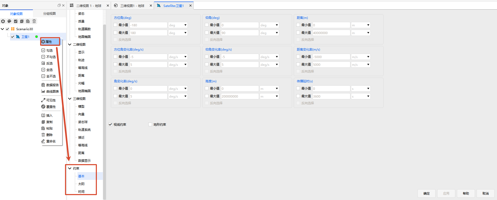

# 约束配置

## 功能说明

约束限定对象之间在何种条件下才构成一次有效访问。进行可见性分析、覆盖性分析或通信链路计算时，软件先根据对象的相对运动求出访问时段，再由已启用的约束对时段逐时刻筛选：某一时刻只有全部已启用的约束都满足，该时刻才被判定为满足约束，并计入访问时段。

各类约束相互独立：可以单独启用一类约束，也可以组合使用多类约束。每个条件也相互独立，只有被启用的条件才参与判定。

## 打开约束

1. 在【对象视图】中右键对象，在弹出菜单中选择【属性】，打开该对象的属性面板。

2. 在属性面板左侧的属性树中展开【约束】节点，其下列出该对象开放的各项约束，点击其中一项即可打开对应的约束页。

图中为卫星对象的属性面板：【约束】节点下包含基本、太阳、时间三项，右侧为【基本】约束页的参数区，以及底部的视线约束、地形约束开关。

## 约束页

不同对象开放的约束页可能不同，例如通信约束只与发射器、接收器相关。各对象实际开放的约束页见对象属性页的「约束」段。

- [基本约束](01-基本约束.md) — 按方位角、仰角、距离等相对几何关系，以及视线、视场和地形遮挡判定访问是否有效

- [太阳约束](02-太阳约束.md) — 按太阳、月球的相对位置与规避角，以及附加中心天体遮挡判定访问是否有效

- [时间约束](03-时间约束.md) — 限定访问在时间维度上落入允许的时间范围

- [通信约束](04-通信约束.md) — 按频率、接收功率、信噪比、误码率等链路指标判定通信访问是否可用

## 参数与判定规则

同一约束页中的各项条件可分别启用，判定规则如下：

- **取值范围**：几何参数、链路指标等数值型参数提供【最小值】与【最大值】，勾选并输入数值后，参数取值须落在所设范围之内；未勾选的一端不作限制。

- **反向选择**：基本约束的几何参数与通信约束的链路指标提供该项，勾选后落在所设范围内的访问将被剔除，仅保留范围之外的访问。

- **开关类条件**：视线约束、地形约束等以复选框的形式给出，勾选即参与判定。

- **组类条件**：时间约束的时段、太阳约束的附加中心天体遮挡等成组给出，需先勾选该组的【使用】，组内的设置才生效。

## 相关文档

本章节介绍约束界面的通用定义与参数含义。各参数的几何定义、计算模型等见[理论基础](../../../04-理论基础/02-约束配置/README.md)，各约束页在对应参数处给出具体链接。
