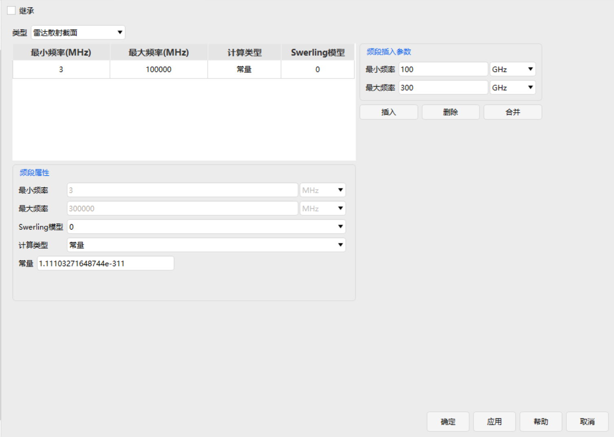

# 雷达散射截面

## 功能说明

雷达散射截面（Radar Cross Section，RCS）用于描述对象作为雷达目标时对入射电磁波的等效散射能力。RCS 越大，在其他条件相同的情况下，目标产生的雷达回波通常越强。

ATK 允许按照雷达工作频率将 RCS 划分为一个或多个频段，并为各频段分别设置 RCS 计算类型和 Swerling 起伏模型。当前界面支持的 RCS 计算类型包括【常量】和【外部文件】：

- 【常量】：在对应频段内使用固定的 RCS 值；
- 【外部文件】：加载外部 RCS 数据文件，用于描述随目标视向等条件变化的 RCS。

RCS 频段的总设置范围为约 3 MHz～300 GHz。雷达计算时，根据当前工作频率选择相应频段的 RCS 模型。

> **说明**：RCS 是目标的电磁散射特性，不等同于目标的实际几何面积。RCS 的物理定义、单位、视向相关性以及 Swerling 模型见配套的[雷达散射截面理论基础](../../../04-理论基础/03-RF环境/雷达散射截面.md#rcs-definition)。。

## 参数说明

<Entry name="继承" desc="使用场景级雷达散射截面设置，而不单独设置当前对象的 RCS。">

勾选【继承】后，当前对象使用场景级定义的 RCS 模型，页面中的频段和 RCS 参数不再单独参与编辑。

取消【继承】后，可为当前对象单独设置频率范围、计算类型、Swerling 模型以及常量或外部文件参数。

> **说明**：当多个潜在雷达目标使用统一的 RCS 假设时，可在场景级设置后由各对象继承；当某个对象具有独立的 RCS 数据时，应取消继承并单独设置。

</Entry>

<Entry name="类型" desc="指定当前 RF 属性采用雷达散射截面模型。">

在当前页面中选择【雷达散射截面】，表示为该对象配置供雷达探测计算使用的 RCS 属性。

</Entry>

### RCS 频段

RCS 表格按频率区间组织目标散射特性。每一行表示一个频段，并包含【最小频率】【最大频率】【计算类型】和【Swerling模型】。

雷达计算时，软件根据当前雷达信号频率选择对应频段，并采用该频段所设置的 RCS 模型。

<Entry meta="量纲：频率|单位：MHz、GHz 等" name="最小频率" desc="当前 RCS 频段的下限频率。">

**最小频率**用于确定当前频段的起始位置。最前一个频段的下限对应 RCS 模型支持的最低频率，界面约为 3 MHz。

</Entry>

<Entry meta="量纲：频率|单位：MHz、GHz 等" name="最大频率" desc="当前 RCS 频段的上限频率。">

**最大频率**用于确定当前频段的结束位置。最后一个频段的上限对应 RCS 模型支持的最高频率，为 300 GHz，即 300000 MHz。

</Entry>

<Entry name="频段插入参数" desc="输入新频段的最小频率和最大频率，并将其加入 RCS 频段列表。">

在【频段插入参数】区域输入【最小频率】和【最大频率】，确认单位后点击【插入】，即可在当前 RCS 频率范围内建立新的频段。

新增频段后，应在【频段属性】中为该频段设置计算类型、Swerling 模型及相应的 RCS 参数。

> **说明**：频段用于描述目标 RCS 随雷达工作频率变化的情况。若目标在整个工作频率范围内均采用同一模型，可保留一个覆盖全部频率范围的频段。

</Entry>

<Entry name="插入" desc="按照频段插入参数建立新的 RCS 频段。">

点击【插入】后，软件按照输入的最小频率和最大频率更新频段列表。

</Entry>

<Entry name="删除" desc="删除当前选中的 RCS 频段。">

在频段表中选择需要删除的频段，点击【删除】即可移除该频段。

</Entry>

<Entry name="合并" desc="合并设置一致的相邻 RCS 频段。">

当相邻频段采用相同的 RCS 设置时，可点击【合并】将其合成为一个连续频段，以简化频段表。

</Entry>

### 频段属性

在上方频段表中选择某一频段后，可在【频段属性】区域查看或修改该频段的参数。

频段位于总频率范围的边界时，相应的最小频率或最大频率可能由软件固定，输入框将不可编辑。

<Entry name="Swerling模型" desc="指定该频段使用的目标 RCS 统计起伏模型。">

ATK 支持 Swerling 0、I、II、III、IV 五种模型：

| 模型 | 使用含义 |
|---|---|
| Swerling 0 | 不考虑随机 RCS 起伏，使用确定性的 RCS。 |
| Swerling I | 一次扫描内 RCS 保持相关，不同扫描之间变化；适用于无明显主散射中心的慢起伏目标。 |
| Swerling II | RCS 可随脉冲快速变化；适用于无明显主散射中心的快起伏目标。 |
| Swerling III | 一次扫描内 RCS 保持相关，不同扫描之间变化；适用于存在明显主散射中心的慢起伏目标。 |
| Swerling IV | RCS 可随脉冲快速变化；适用于存在明显主散射中心的快起伏目标。 |

如果只希望使用固定 RCS，不考虑统计起伏，选择【0】。

> **说明**：Swerling 模型影响目标回波的统计起伏以及后续探测概率计算，并不改变频段本身的频率范围。详细统计模型见[Swerling RCS 起伏模型](../../../04-理论基础/03-RF环境/雷达散射截面.md#swerling)。。

</Entry>

<Entry name="计算类型" desc="指定当前频段采用固定 RCS 还是从外部文件读取 RCS。">

当前 ATK 支持：

| 计算类型 | 说明 |
|---|---|
| 常量 | 在当前频段内使用指定的固定 RCS 值。 |
| 外部文件 | 从外部 RCS 文件读取目标散射数据，可用于描述随视向等因素变化的 RCS。 |

选择不同计算类型后，下方显示相应的参数项。

</Entry>

#### 常量

<Entry meta="量纲：面积的对数表示|常用单位：dBsm" name="常量" desc="设置当前频段的固定雷达散射截面。">

当【计算类型】选择【常量】时，在【常量】输入框中设置该频段的 RCS。常量 RCS 按 dBsm 表示。dBsm 是相对于 1 m² 的分贝表示，例如：

- 0 dBsm 对应 1 m²；
- 10 dBsm 对应 10 m²；
- -10 dBsm 对应 0.1 m²。

当 Swerling 模型为 0 时，该值作为确定性的目标 RCS；采用 Swerling I～IV 时，该值作为目标 RCS 统计模型的基准/平均水平参与起伏建模。

> **注意**：界面中出现类似 `1.11103271648744e-311` 的极小数值，不应将其作为具有物理意义的默认 RCS 使用。进行雷达计算前，应根据目标特性输入有效的 RCS 值。

</Entry>

#### 外部文件

<Entry name="外部文件" desc="加载外部 RCS 数据文件，用于描述目标随视向等条件变化的雷达散射截面。">

当【计算类型】选择【外部文件】时，指定 RCS 数据文件路径，或通过文件选择按钮加载文件。

外部 RCS 文件可用于提供比常量模型更真实的目标散射特性。例如，同一飞机从机头、机侧或机尾方向被雷达照射时，RCS 往往不同，外部文件可以按照目标本体坐标系中的视向角给出相应的 RCS 数据。

加载外部文件前，应确认：

- 文件格式符合 ATK 支持的 RCS 文件格式；
- 文件包含的频率和角度范围与当前仿真条件相符；
- RCS 数值的单位和标度与文件定义一致；
- 文件中的目标坐标轴定义与 ATK 中目标姿态定义一致。

外部 RCS 文件的方向角、Rho/Theta 定义、线性值与 dBsm 转换等见[外部 RCS 文件模型](../../../04-理论基础/03-RF环境/雷达散射截面.md#external-rcs)。

</Entry>

## 使用建议

当缺少目标方向图数据，只需要进行初步雷达性能分析时，可采用【常量】RCS；若目标 RCS 已通过电磁仿真、试验测量或其他工具获得，并且需要考虑目标姿态和视向变化，宜采用【外部文件】。

频段划分应与实际雷达工作频率和已有 RCS 数据一致。若所有频率均使用同一个 RCS，可保留一个覆盖约 3 MHz～300 GHz 的完整频段；若不同频率下 RCS 差异明显，则应建立多个频段分别设置。

Swerling 模型应根据目标散射特性和起伏时间尺度选取。对于仅需固定等效 RCS 的基础分析，可使用 Swerling 0；需要进行探测概率等统计性能分析时，再根据目标是否存在主散射中心以及起伏是扫描间还是脉冲间变化选择 I～IV。
