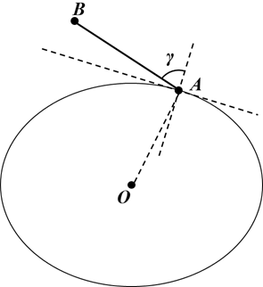

# 基本约束

本节介绍基本约束中几何参数的定义、参考坐标系和计算方法，以及中心天体遮挡下的视线约束模型。

## 几何参数约束

几何参数包括方位角（Azimuth，$Az$）、仰角（Elevation，$El$）、距离（Range，$R$）及其变化率，以及角变化率、高度和传播延时。

### 几何定义与参考坐标系

方位角、仰角和距离表征关联对象相对于分析对象的空间方位与距离。

设 $\boldsymbol r$ 为关联对象相对于分析对象的位置矢量，$r_x$、$r_y$、$r_z$ 分别为相对位置在 $OX$、$OY$、$OZ$ 轴上的分量，其几何关系如下图所示。

设 $\boldsymbol v$ 为关联对象相对于分析对象的速度矢量，$v_x$、$v_y$、$v_z$ 分别为相对速度的三个分量。

根据分析对象类型的不同，相对位置矢量 $\boldsymbol r$ 所采用的参考坐标系也不同。对于地面固定对象，$\boldsymbol r$ 定义在对象当地 LH（Local Horizontal）坐标系中；对于地面移动对象，$\boldsymbol r$ 定义在中心天体固连系（Central Body Fixed，CBF）下的 VVLH（Vehicle Velocity Local Horizontal）坐标系中；对于空间移动对象，$\boldsymbol r$ 定义在中心天体惯性系（Central Body Inertial，CBI）下的 VVLH 坐标系中。

对象类型与参考坐标系的对应关系如下表所示。

| 参考坐标系 | 对象类型 |
| --- | --- |
| LH | 地面站 |
| CBF-VVLH | 车辆、船、潜艇、飞机 |
| CBI-VVLH | 卫星、火箭、导弹 |

对于附属对象，其采用的参考坐标系与父对象保持一致。

### 方位角

方位角的计算公式为：

$$
Az
=
\operatorname{arctan2}
\left(
r_y,r_x
\right)
$$

### 仰角

仰角的计算公式为：

$$
El
=
\arctan
\left(
\frac{r_z}
{\sqrt{r_x^2+r_y^2}}
\right)
$$

### 距离

距离的计算公式为：

$$
R
=
\sqrt{
r_x^2+r_y^2+r_z^2
}
$$

### 方位角变化率

方位角变化率的计算公式为：

$$
\frac{\mathrm dAz}{\mathrm dt}
=
\frac{
r_xv_y-r_yv_x
}{
r_x^2+r_y^2
}
$$

### 仰角变化率

仰角变化率的计算公式为：

$$
\frac{\mathrm dEl}{\mathrm dt}
=
\frac{
-v_z+\dfrac{r_z}{\boldsymbol r\cdot\boldsymbol v}
}{
\sqrt{
(R-r_z)(R+r_z)
}
}
$$

### 距离变化率

距离变化率的计算公式为：

$$
\frac{\mathrm dR}{\mathrm dt}
=
\frac{
r_x\omega_x+r_y\omega_y+r_z\omega_z
}{
R
}
$$

式中：

$$
\boldsymbol\omega
=
\boldsymbol v
-
\boldsymbol\omega_{\mathrm{orb}}
\times
\boldsymbol v
$$

$$
\boldsymbol\omega_{\mathrm{orb}}
=
\frac{
\boldsymbol r\times\boldsymbol v
}{
R^2
}
$$

其中，$\boldsymbol\omega_{\mathrm{orb}}$ 为分析对象的轨道角速度矢量。

### 角变化率

角变化率的计算公式为：

$$
val
=
\frac{
\left\|
\boldsymbol r\times\boldsymbol v
\right\|
}{
R^2
}
$$

### 高度

高度的计算公式为：

$$
h
=
R_{\mathrm{obj}}
-
R_{C,\mathrm{local}}
$$

式中：

- $R_{\mathrm{obj}}$ 表示分析对象在 LLR 坐标系下的地心距；
- $R_{C,\mathrm{local}}$ 表示当地中心天体半径。

### 传播延时

传播延时的计算公式为：

$$
val
=
\frac{R}{v_{\mathrm{light}}}
$$

式中：

$$
v_{\mathrm{light}}
=
299792458.0\ \mathrm{m/s}
$$

其中，$v_{\mathrm{light}}$ 表示光速。

## 视线约束

不同对象视线约束的计算方法为：

### 固定对象

若视线约束所属对象在参考坐标系中的位置保持不变，例如地面站及其附属传感器、雷达等，则视线约束输出值定义为：

$$
val
=
\cos\beta-\cos\alpha
$$

式中，$\alpha$ 和 $\beta$ 的几何关系如上图所示。

### 移动对象

若视线约束所属对象具有运动属性，例如卫星、飞机、火箭、汽车、轮船、潜艇及其附属对象，则视线约束输出值定义为：

$$
val
=
R_C
\left(
\cos\beta-\cos\alpha
\right)
$$

式中，$R_C$ 表示中心天体的最长半轴，适用于三轴椭球体、旋转椭球体和标准球体三种中心天体模型。

### 天体表面对象的简化计算

当视线起点或终点位于中心天体表面，即对象高程为 $0$ 时，可对视线约束计算模型进行简化。此时，视线约束输出值为：

$$
val
=
\begin{cases}
\cos\gamma, & \text{固定对象} \\[4pt]
R_C\cos\gamma, & \text{移动对象}
\end{cases}
$$

式中，$\gamma$ 为图中所示的视线约束几何角度。

当对象高程为负值时，需要对中心天体模型进行修正，使对象位于修正后的中心天体模型表面，再按照上述公式计算视线约束输出值。
