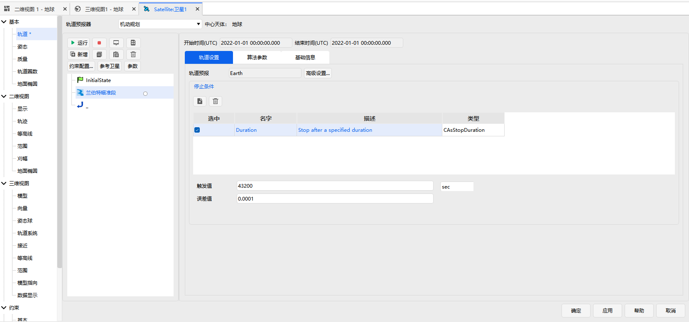
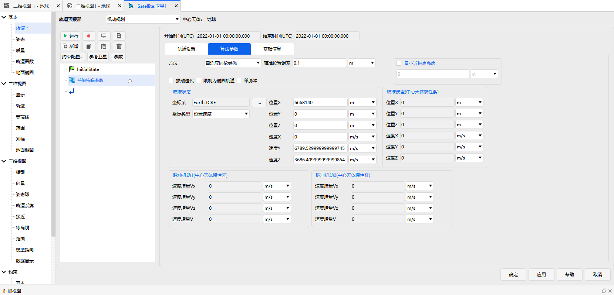
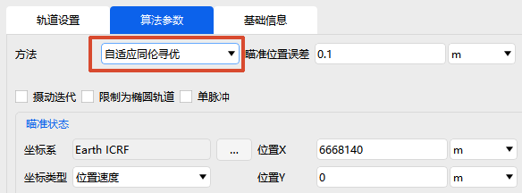
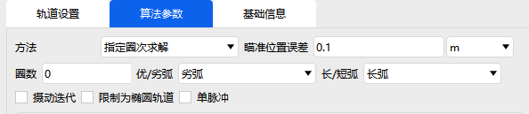
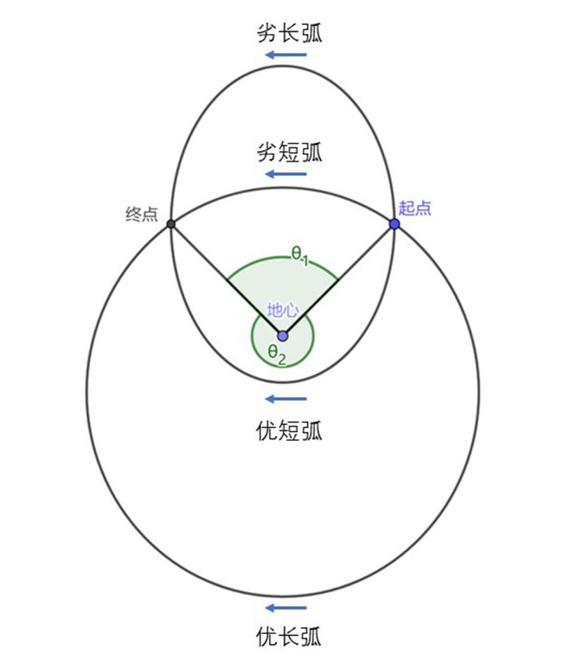

# 兰伯特瞄准段

## 功能说明

兰伯特瞄准段根据用户设定的期望时间与期望末状态，求解自当前状态出发的转移轨道。功能上，它等效于末状态约束下的目标序列段：{机动段—预报段—机动段}。

兰伯特转移问题在实际物理条件下可能存在多解或无解。本模块可求解总速度脉冲（即燃料消耗）最小的转移轨道。

兰伯特瞄准段的初始状态继承自前一序列段。其【轨道设置】页面与预报段相近，用于配置停止条件：

【算法参数】页面用于设置目标状态（即瞄准状态）：

运行后，模块可计算始末时刻的脉冲机动及瞄准状态误差，并将实际末时刻状态向下传递。

## 求解方法

在【算法参数】页面上方，通过【方法】下拉框可选择兰伯特瞄准段的求解方法，共三种。

- **指定圈次求解**：内部采用自适应同伦迭代，支持指定圈次、优/劣弧与长/短弧。
- **次数同伦寻优**：可自由指定牛顿迭代次数与同伦次数。遍历方向从燃料最优的二体解开始，沿燃料最优排序依次遍历，求解成功一次即退出。
- **自适应同伦寻优**：内部采用自适应同伦迭代。首先基于燃料最优的二体解方向遍历，求解成功一次后，再基于摄动偏移修正燃料最优排序，重新遍历并求解成功一次。

### 方法选择建议

- 优先使用**自适应同伦寻优**，大多情况下都能找到燃料最优解。
- 求解失败时，改用**次数同伦寻优**，通过设置较高的迭代次数来稳健求解。
- 不需要燃料最优解时，选择**指定圈次求解**，可自由指定圈次、优/劣弧与长/短弧对应的二体解初值，并自适应迭代出摄动解。
  - 使用该方法时，建议先取消勾选【摄动迭代】求解二体解，确认瞄准误差为非 NaN（瞄准误差为 NaN 说明该二体解撞地球），再勾选【摄动迭代】，即可基本求解出以该二体解为初值的摄动解。

## 转移弧段的分支

当求解方法为**指定圈次求解**时，还需指定转移弧段所属的分支。

- **圈数**：转移轨迹回到起点的次数。
- **优/劣弧**：起点、终点分别与地心的连线形成两个角，沿小于 180° 的角出发的属于劣弧，沿大于 180° 的角出发的属于优弧。
- **长/短弧**：在同一转移方向（优弧或劣弧）下，首次抵达终点耗时更短的是短弧，耗时更长的是长弧。

优、劣弧与长、短弧的组合示意图如下。

## 摄动、单脉冲与轨道类型

在【算法参数】中，可设置是否考虑摄动迭代、是否限制为椭圆轨道、是否实现单脉冲机动。瞄准位置误差指用户可容忍误差。

- **摄动迭代**：
  - 勾选后，摄动力学环境由【轨道设置】页面的【轨道预报-高级设置】决定；
  - 不勾选时，计算出的脉冲机动1和脉冲机动2均为二体解，由于考虑摄动力学环境，瞄准误差会存在较大偏差。
- **限制为椭圆轨道**：
  - 勾选后，转移轨道被限制为椭圆轨道；
  - 不勾选时，转移轨道可能存在抛物线、双曲线等轨道。
- **单脉冲**：
  - 勾选后，脉冲机动2并不会施加，即实际末时刻状态与瞄准状态存在较大的速度误差，并向下传递。

## 求解失败的反馈

- 使用**指定圈次求解**以外的方法时，若 Lambert 求解失败，会将速度增量置 0，可据此分辨求解是否成功。
- 使用**指定圈次求解**时，建议先取消勾选【摄动迭代】，确认二体解可解（瞄准误差为非 NaN；瞄准误差为 NaN 说明该二体解撞地球）。在二体解可解的前提下，若求解仍失败，速度增量分量同样会被置 0。
