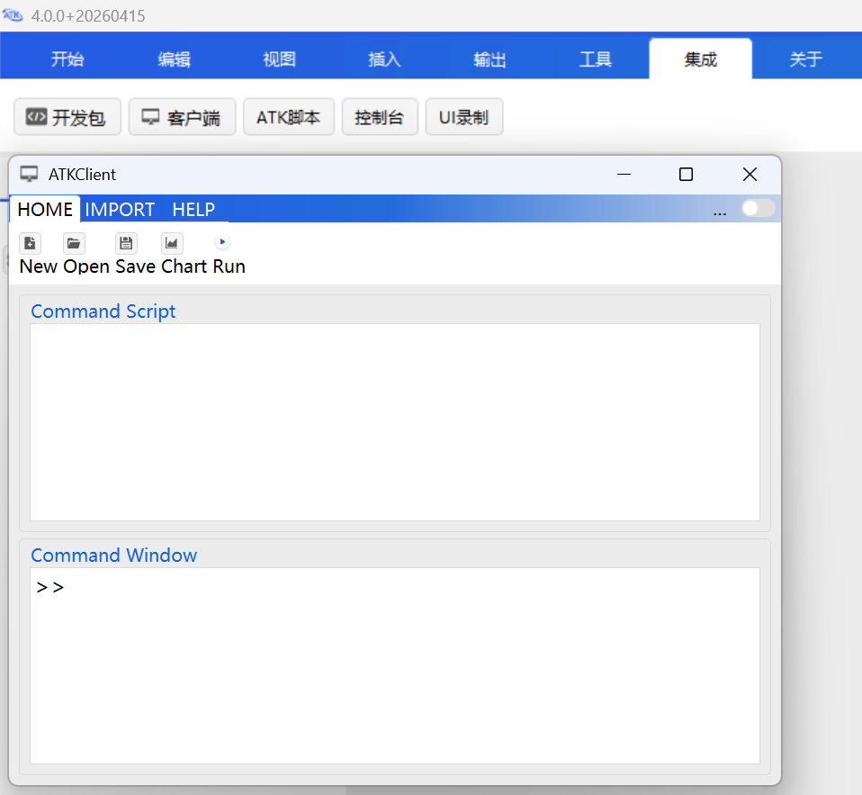
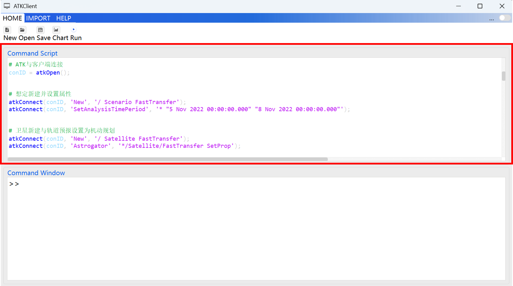
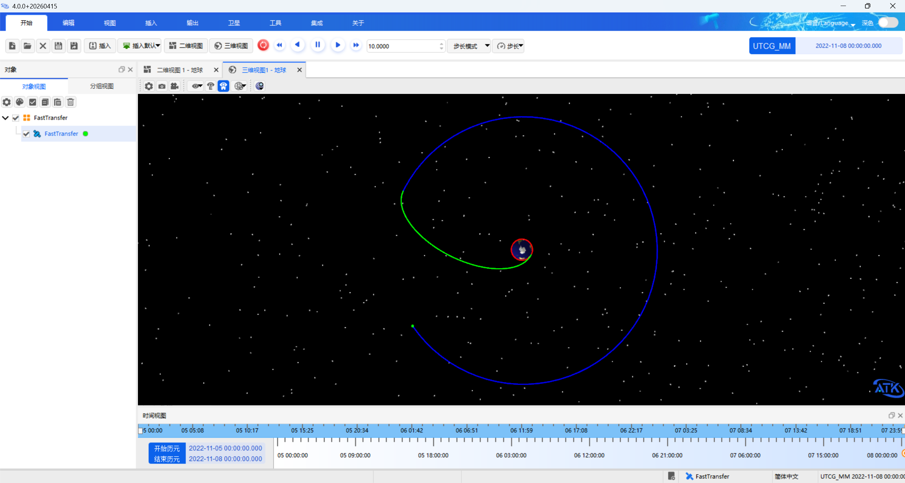
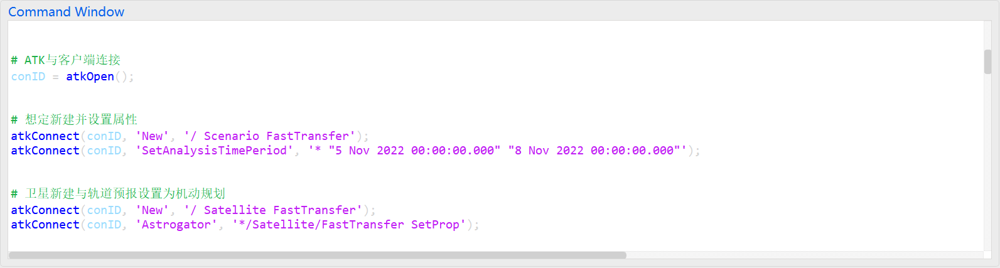

# 基于ATK.Connect模式的轨道快速转移的C++实现

## 内容简介

本案例实现半径为 6700 km 的近地停泊轨道（LEO 轨道）快速转移到半径为 42164.197 km 的地球同步轨道（GEO 轨道）的轨道机动规划设计。案例使用基于 Connect 模式的集成客户端实现。

本案例使用 ATK 软件，通过集成客户端程序，使用接口函数进行数据解析与传递，完成案例实现。集成客户端界面如下图所示：



接口函数通过命令输入，对想定属性进行设置与修改，完成案例构建，如下图所示：



运行客户端命令，想定轨迹如下图所示：



## 案例实现

本案例使用 ATK 软件提供的集成客户端实现，可以通过输入多条命令一起运行的方式进行参数设置，案例实现流程如下：

1. 启动 ATK 软件，在 <kbd>集成</kbd> 菜单栏中，单击 <kbd>客户端</kbd> 按钮，弹出客户端对话框；

2. 在 <kbd>HOME</kbd> 菜单栏中，点击 <kbd>New</kbd> 按钮，在【Command Script】对话框输入参数设置命令（代码可以直接拷贝到对话框）：

```lua
# (1) ATK与客户端连接
conID = atkOpen();

# (2) 想定新建并设置属性
atkConnect(conID, 'New', '/ Scenario FastTransfer');
atkConnect(conID, 'SetAnalysisTimePeriod', '* "5 Nov 2022 00:00:00.000" "8 Nov 2022 00:00:00.000"');

# (3) 卫星新建与轨道预报设置为机动规划
atkConnect(conID, 'New', '/ Satellite FastTransfer');
atkConnect(conID, 'Astrogator', '*/Satellite/FastTransfer SetProp');

# (4) 机动规划添加段（新添加卫星会有默认初始段）
atkConnect(conID, 'Astrogator', '*/Satellite/FastTransfer InsertSegment MainSequence.SegmentList.- Propagate');
atkConnect(conID, 'Astrogator', '*/Satellite/FastTransfer InsertSegment MainSequence.SegmentList.- Target_Sequence');
atkConnect(conID, 'Astrogator', '*/Satellite/FastTransfer InsertSegment MainSequence.SegmentList.Target_Sequence.SegmentList.- Maneuver');
atkConnect(conID, 'Astrogator', '*/Satellite/FastTransfer InsertSegment MainSequence.SegmentList.- Propagate');
atkConnect(conID, 'Astrogator', '*/Satellite/FastTransfer InsertSegment MainSequence.SegmentList.- Target_Sequence');
atkConnect(conID, 'Astrogator', '*/Satellite/FastTransfer InsertSegment MainSequence.SegmentList.Target_Sequence1.SegmentList.- Maneuver');
atkConnect(conID, 'Astrogator', '*/Satellite/FastTransfer InsertSegment MainSequence.SegmentList.- Propagate');

# (5) 初始段属性设置
atkConnect(conID, 'Astrogator', '*/Satellite/FastTransfer SetValue MainSequence.SegmentList.Initial_State.InitialState.Epoch "5 Nov 2022 00:00:00.000" UTCG');
atkConnect(conID, 'Astrogator', '*/Satellite/FastTransfer SetValue MainSequence.SegmentList.Initial_State.CoordinateType "Modified Keplerian"');
atkConnect(conID, 'Astrogator', '*/Satellite/FastTransfer SetValue MainSequence.SegmentList.Initial_State.InitialState.Keplerian.sma 6700000 m');
atkConnect(conID, 'Astrogator', '*/Satellite/FastTransfer SetValue MainSequence.SegmentList.Initial_State.InitialState.Keplerian.ecc 0');
atkConnect(conID, 'Astrogator', '*/Satellite/FastTransfer SetValue MainSequence.SegmentList.Initial_State.InitialState.Keplerian.inc 0');
atkConnect(conID, 'Astrogator', '*/Satellite/FastTransfer SetValue MainSequence.SegmentList.Initial_State.InitialState.Keplerian.RAAN 0');
atkConnect(conID, 'Astrogator', '*/Satellite/FastTransfer SetValue MainSequence.SegmentList.Initial_State.InitialState.Keplerian.w 0');
atkConnect(conID, 'Astrogator', '*/Satellite/FastTransfer SetValue MainSequence.SegmentList.Initial_State.InitialState.Keplerian.ta 0');

# (6) 第一个预报段属性设置
atkConnect(conID, 'Astrogator', '*/Satellite/FastTransfer SetValue MainSequence.SegmentList.Propagate.SegmentColor -16776961');
atkConnect(conID, 'Astrogator', '*/Satellite/FastTransfer SetValue MainSequence.SegmentList.Propagate.StoppingConditions Duration');
atkConnect(conID, 'Astrogator', '*/Satellite/FastTransfer SetValue MainSequence.SegmentList.Propagate.StoppingConditions.Duration.TripValue 7200 sec');
atkConnect(conID, 'Astrogator', '*/Satellite/FastTransfer SetValue MainSequence.SegmentList.Propagate.StoppingConditions.Duration.Tolerance 0.0001 sec');

# (7) 第一个瞄准段中机动段属性设置
atkConnect(conID, 'Astrogator', '*/Satellite/FastTransfer SetValue MainSequence.SegmentList.Target_Sequence.SegmentList.Maneuver.ImpulsiveMnvr.ThrustAxes "Satellite VNC(Earth)"');
atkConnect(conID, 'Astrogator', '*/Satellite/FastTransfer AddMCSSegmentControl MainSequence.SegmentList.Target_Sequence.SegmentList.Maneuver ImpulsiveMnvr.Cartesian.X');

# (8) 第一个瞄准段添加属性页
atkConnect(conID, 'Astrogator', '*/Satellite/FastTransfer SetValue MainSequence.SegmentList.Target_Sequence.Profiles Differential_Corrector');
# 控制变量
atkConnect(conID, 'Astrogator', '*/Satellite/FastTransfer SetMCSControlValue MainSequence.SegmentList.Target_Sequence.Profiles.Differential_Corrector Maneuver ImpulsiveMnvr.Cartesian.X Active true');
atkConnect(conID, 'Astrogator', '*/Satellite/FastTransfer SetMCSControlValue MainSequence.SegmentList.Target_Sequence.Profiles.Differential_Corrector Maneuver ImpulsiveMnvr.Cartesian.X MaxStep 100 m/sec');
atkConnect(conID, 'Astrogator', '*/Satellite/FastTransfer SetMCSControlValue MainSequence.SegmentList.Target_Sequence.Profiles.Differential_Corrector Maneuver ImpulsiveMnvr.Cartesian.X Correction 2781.50365947627 m/sec');
atkConnect(conID, 'Astrogator', '*/Satellite/FastTransfer SetMCSControlValue MainSequence.SegmentList.Target_Sequence.Profiles.Differential_Corrector Maneuver ImpulsiveMnvr.Cartesian.X Perturbation 0.1 m/sec');
atkConnect(conID, 'Astrogator', '*/Satellite/FastTransfer SetMCSControlValue MainSequence.SegmentList.Target_Sequence.Profiles.Differential_Corrector Maneuver ImpulsiveMnvr.Cartesian.X Scale 1 m/sec');
# 约束条件
atkConnect(conID, 'Astrogator', '*/Satellite/FastTransfer SetValue MainSequence.SegmentList.Target_Sequence.SegmentList.Maneuver.Results "RadiusOfApoapsis"');
atkConnect(conID, 'Astrogator', '*/Satellite/FastTransfer SetMCSConstraintValue MainSequence.SegmentList.Target_Sequence.Profiles.Differential_Corrector Maneuver StateCalcRadiusOfApoapsis Active true');
atkConnect(conID, 'Astrogator', '*/Satellite/FastTransfer SetMCSConstraintValue MainSequence.SegmentList.Target_Sequence.Profiles.Differential_Corrector Maneuver StateCalcRadiusOfApoapsis Desired 84328394 m');
atkConnect(conID, 'Astrogator', '*/Satellite/FastTransfer SetMCSConstraintValue MainSequence.SegmentList.Target_Sequence.Profiles.Differential_Corrector Maneuver StateCalcRadiusOfApoapsis Scale 1 m');
atkConnect(conID, 'Astrogator', '*/Satellite/FastTransfer SetMCSConstraintValue MainSequence.SegmentList.Target_Sequence.Profiles.Differential_Corrector Maneuver StateCalcRadiusOfApoapsis tolerance 0.1 m');
atkConnect(conID, 'Astrogator', '*/Satellite/FastTransfer SetMCSConstraintValue MainSequence.SegmentList.Target_Sequence.Profiles.Differential_Corrector Maneuver StateCalcRadiusOfApoapsis Weight 1');

# (9) 第二个预报段属性设置
atkConnect(conID, 'Astrogator', '*/Satellite/FastTransfer SetValue MainSequence.SegmentList.Propagate1.SegmentColor -16711936');
atkConnect(conID, 'Astrogator', '*/Satellite/FastTransfer SetValue MainSequence.SegmentList.Propagate1.StoppingConditions Apoapsis');
atkConnect(conID, 'Astrogator', '*/Satellite/FastTransfer SetValue MainSequence.SegmentList.Propagate1.StoppingConditions.Apoapsis.Tolerance 1e-4 m');
atkConnect(conID, 'Astrogator', '*/Satellite/FastTransfer SetValue MainSequence.SegmentList.Propagate1.StoppingConditions.Apoapsis.RepeatCount 1');

# (10) 第二个瞄准段中机动段属性设置
atkConnect(conID, 'Astrogator', '*/Satellite/FastTransfer SetValue MainSequence.SegmentList.Target_Sequence1.SegmentList.Maneuver.SegmentColor -16711681');
atkConnect(conID, 'Astrogator', '*/Satellite/FastTransfer SetValue MainSequence.SegmentList.Target_Sequence1.SegmentList.Maneuver.ImpulsiveMnvr.ThrustAxes "Satellite VNC(Earth)"');
atkConnect(conID, 'Astrogator', '*/Satellite/FastTransfer AddMCSSegmentControl MainSequence.SegmentList.Target_Sequence1.SegmentList.Maneuver ImpulsiveMnvr.Cartesian.X');
atkConnect(conID, 'Astrogator', '*/Satellite/FastTransfer AddMCSSegmentControl MainSequence.SegmentList.Target_Sequence1.SegmentList.Maneuver ImpulsiveMnvr.Cartesian.Z');

# (11) 第二个瞄准段添加属性页
atkConnect(conID, 'Astrogator', '*/Satellite/FastTransfer SetValue MainSequence.SegmentList.Target_Sequence1.Profiles Differential_Corrector');
# 控制变量
atkConnect(conID, 'Astrogator', '*/Satellite/FastTransfer SetMCSControlValue MainSequence.SegmentList.Target_Sequence1.Profiles.Differential_Corrector Maneuver ImpulsiveMnvr.Cartesian.X Active true');
atkConnect(conID, 'Astrogator', '*/Satellite/FastTransfer SetMCSControlValue MainSequence.SegmentList.Target_Sequence1.Profiles.Differential_Corrector Maneuver ImpulsiveMnvr.Cartesian.X MaxStep 300 m/sec');
atkConnect(conID, 'Astrogator', '*/Satellite/FastTransfer SetMCSControlValue MainSequence.SegmentList.Target_Sequence1.Profiles.Differential_Corrector Maneuver ImpulsiveMnvr.Cartesian.X Correction 1581.97670664023 m/sec');
atkConnect(conID, 'Astrogator', '*/Satellite/FastTransfer SetMCSControlValue MainSequence.SegmentList.Target_Sequence1.Profiles.Differential_Corrector Maneuver ImpulsiveMnvr.Cartesian.X Perturbation 0.1 m/sec');
atkConnect(conID, 'Astrogator', '*/Satellite/FastTransfer SetMCSControlValue MainSequence.SegmentList.Target_Sequence1.Profiles.Differential_Corrector Maneuver ImpulsiveMnvr.Cartesian.X Scale 1 m/sec');
atkConnect(conID, 'Astrogator', '*/Satellite/FastTransfer SetMCSControlValue MainSequence.SegmentList.Target_Sequence1.Profiles.Differential_Corrector Maneuver ImpulsiveMnvr.Cartesian.Z Active true');
atkConnect(conID, 'Astrogator', '*/Satellite/FastTransfer SetMCSControlValue MainSequence.SegmentList.Target_Sequence1.Profiles.Differential_Corrector Maneuver ImpulsiveMnvr.Cartesian.Z MaxStep 300 m/sec');
atkConnect(conID, 'Astrogator', '*/Satellite/FastTransfer SetMCSControlValue MainSequence.SegmentList.Target_Sequence1.Profiles.Differential_Corrector Maneuver ImpulsiveMnvr.Cartesian.Z Correction 30.0 m/sec');
atkConnect(conID, 'Astrogator', '*/Satellite/FastTransfer SetMCSControlValue MainSequence.SegmentList.Target_Sequence1.Profiles.Differential_Corrector Maneuver ImpulsiveMnvr.Cartesian.Z Perturbation 0.1 m/sec');
atkConnect(conID, 'Astrogator', '*/Satellite/FastTransfer SetMCSControlValue MainSequence.SegmentList.Target_Sequence1.Profiles.Differential_Corrector Maneuver ImpulsiveMnvr.Cartesian.Z Scale 1 m/sec');
# 约束条件
atkConnect(conID, 'Astrogator', '*/Satellite/FastTransfer SetValue MainSequence.SegmentList.Target_Sequence1.SegmentList.Maneuver.Results "Eccentricity" "CosineVFPA"');
atkConnect(conID, 'Astrogator', '*/Satellite/FastTransfer SetMCSConstraintValue MainSequence.SegmentList.Target_Sequence1.Profiles.Differential_Corrector Maneuver StateCalcEccentricity Active true');
atkConnect(conID, 'Astrogator', '*/Satellite/FastTransfer SetMCSConstraintValue MainSequence.SegmentList.Target_Sequence1.Profiles.Differential_Corrector Maneuver StateCalcEccentricity Desired 0');
atkConnect(conID, 'Astrogator', '*/Satellite/FastTransfer SetMCSConstraintValue MainSequence.SegmentList.Target_Sequence1.Profiles.Differential_Corrector Maneuver StateCalcEccentricity Scale 1');
atkConnect(conID, 'Astrogator', '*/Satellite/FastTransfer SetMCSConstraintValue MainSequence.SegmentList.Target_Sequence1.Profiles.Differential_Corrector Maneuver StateCalcEccentricity tolerance 0.1');
atkConnect(conID, 'Astrogator', '*/Satellite/FastTransfer SetMCSConstraintValue MainSequence.SegmentList.Target_Sequence1.Profiles.Differential_Corrector Maneuver StateCalcEccentricity Weight 1');
atkConnect(conID, 'Astrogator', '*/Satellite/FastTransfer SetMCSConstraintValue MainSequence.SegmentList.Target_Sequence1.Profiles.Differential_Corrector Maneuver StateCalcCosineVFPA Active true');
atkConnect(conID, 'Astrogator', '*/Satellite/FastTransfer SetMCSConstraintValue MainSequence.SegmentList.Target_Sequence1.Profiles.Differential_Corrector Maneuver StateCalcCosineVFPA Desired 0');
atkConnect(conID, 'Astrogator', '*/Satellite/FastTransfer SetMCSConstraintValue MainSequence.SegmentList.Target_Sequence1.Profiles.Differential_Corrector Maneuver StateCalcCosineVFPA Scale 1');
atkConnect(conID, 'Astrogator', '*/Satellite/FastTransfer SetMCSConstraintValue MainSequence.SegmentList.Target_Sequence1.Profiles.Differential_Corrector Maneuver StateCalcCosineVFPA tolerance 0.1');
atkConnect(conID, 'Astrogator', '*/Satellite/FastTransfer SetMCSConstraintValue MainSequence.SegmentList.Target_Sequence1.Profiles.Differential_Corrector Maneuver StateCalcCosineVFPA Weight 1');

# (12) 第三个预报段属性设置
atkConnect(conID, 'Astrogator', '*/Satellite/FastTransfer SetValue MainSequence.SegmentList.Propagate2.SegmentColor -65536');
atkConnect(conID, 'Astrogator', '*/Satellite/FastTransfer SetValue MainSequence.SegmentList.Propagate2.StoppingConditions Duration');
atkConnect(conID, 'Astrogator', '*/Satellite/FastTransfer SetValue MainSequence.SegmentList.Propagate2.StoppingConditions.Duration.TripValue 259200 sec');
atkConnect(conID, 'Astrogator', '*/Satellite/FastTransfer SetValue MainSequence.SegmentList.Propagate2.StoppingConditions.Duration.Tolerance 0.0001 sec');

# (13) 机动规划运行
atkConnect(conID, 'Astrogator', '*/Satellite/FastTransfer RunMCS');
atkConnect(conID, 'Animate', '* Reset');
atkConnect(conID, 'Astrogator', '*/Satellite/FastTransfer ApplyAllProfileChanges');

# (14) 想定保存
atkConnect(conID, 'Save', '/ *');

# (15) ATK与客户端断开连接
atkClose(conID);
```

3. 点击 <kbd>Save</kbd> 按钮，保存 "FastTransfer.atk" 文件；

4. 点击 <kbd>Run</kbd> 按钮，执行命令，案例构建完成，ATK 软件显示想定界面，可查看案例轨迹。

另外，客户端也可以通过输入单条命令单次运行的方式进行参数设置，案例实现流程如下：

1. 启动 ATK 软件，在 <kbd>集成</kbd> 菜单栏中，单击 <kbd>客户端</kbd> 按钮，弹出客户端对话框；

2. 在【Command Window】对话框中输入参数设置命令，可单条命令输入，也可多条命令输入（代码可以单条或多条直接拷贝到对话框），点击键盘 <kbd>回车</kbd> 按钮。执行代码同上；

3. 参数设置后，案例构建完成，ATK 软件显示想定界面，可查看案例轨迹。

::: tip 说明
若在脚本运行完毕后没有在三维视图窗口看到轨迹，可以点击 ATK 软件界面上方 <kbd>开始</kbd> 工具栏中的 <kbd>重置</kbd> 按钮，重置动画状态，然后即可在三维视图中看到轨迹。
:::

## 案例展示

**输入展示**

在【Command Script】对话框中输入多条命令，如下图：


在【Command Window】对话框中输入单条或多条命令，如下图：



**输出展示**

点击运行后，ATK 软件显示想定界面，三维展示卫星快速转移轨迹如下图：


::: tip 说明
若发现快速转移轨迹显示不全，请在 ATK 图形界面中，右键点击 "FastTransfer" 卫星对象，选择 <kbd>属性</kbd>，进入卫星对象属性设置界面，然后选择【二维视图 -> 轨迹】设置，将轨迹类型由【时间】更改为【所有】。
:::
