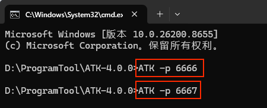
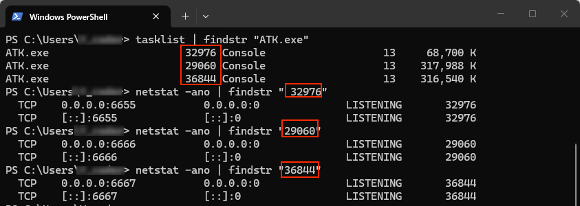

# ATK 启动与端口配置

ATK 通过 TCP 端口与外部程序通信，启动时必须监听一个端口。**默认端口为 6655**，直接双击 `ATK.exe` 即在此端口启动，`atkOpen` 不传参时也默认连接此端口。

实际使用中可能会遇到端口相关的问题：比如不小心连错了端口，或者需要同时运行多个 ATK 实例。下面分别说明如何**指定端口**启动 ATK，以及如何**查看当前 ATK 占用的端口**。

## 指定端口启动

打开 ATK 安装目录（右键桌面 ATK 快捷方式 → **打开文件所在位置**），在地址栏输入 `cmd` 回车，打开命令提示符：


通过 `-p` 参数可以在启动 ATK 时指定任意端口号：



执行以下命令（`<端口号>` 替换为实际端口）：

```bash
ATK.exe -p <端口号>
```

::: details open **示例：在 6666 端口启动**
启动 ATK 并指定 6666 端口：

```bash
ATK.exe -p 6666
```

连接时在 `atkOpen` 中传入对应端口：

::: code-tabs
@tab Python
```python
conID = atkOpen('127.0.0.1', 6666)
```

@tab C++
```cpp
conID = atkOpen("127.0.0.1", 6666);
```

@tab Java
```java
conID = atkOpen("127.0.0.1", 6666);
```

@tab MATLAB
```matlab
conID = atkOpen('127.0.0.1', 6666);
```
:::

## 查看当前端口

如果不确定当前 ATK 在哪个端口（比如连不上或连错了），可以打开 PowerShell 查看（<kbd>Win</kbd> + <kbd>R</kbd>，输入 `powershell`，回车）：



**第一步：查找 ATK 进程，获取 PID**

```powershell
tasklist | findstr "ATK.exe"
```

输出中每行代表一个 ATK 进程，**第二列即为 PID**（如下面三个进程的 PID 分别为 32976、29060、36844）：

```
ATK.exe    32976    Console    13    68,700 K
ATK.exe    29060    Console    13    317,988 K
ATK.exe    36844    Console    13    316,540 K
```

**第二步：逐个查询 PID 占用的端口**

```powershell
netstat -ano | findstr "<PID>"
```

将 `<PID>` 替换为上一步查到的进程 ID。查询结果示例：

- PID **32976** → 占用 **6655** 端口（默认端口）
- PID **29060** → 占用 **6666** 端口
- PID **36844** → 占用 **6667** 端口

对照查询结果即可确认 ATK 当前占用的端口，判断连接时是否填对了端口号。
