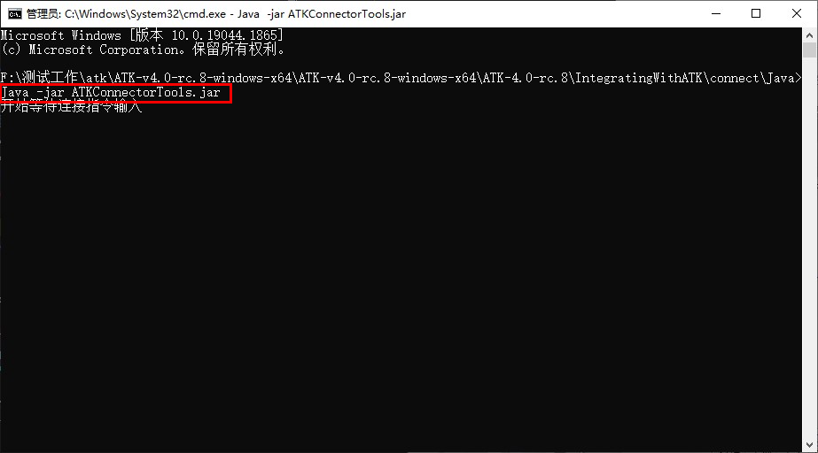

# 简介与配置

## 简介

ATK 提供了可直接启动的 Java 命令行客户端 `ATKConnectorTools.jar`，无需编写代码，在命令行窗口中输入 Connect 命令即可与 ATK 交互，适用于快速上手和轻量操作场景。

启动后在命令行中看到 `开始等待连接指令输入` 提示后，直接输入 [Connect 命令](../4-命令语法约定.md)，按 <kbd>Enter</kbd> 执行。使用方式与 [Python 客户端工具](../2-Python客户端工具/1-简介与配置.md) 的命令窗口类似，共享相同的通信协议和命令格式。

::: tip 开发方式选择
各开发方式的详细对比请参考 [CONNECT 模式概述](../README.md#开发方式对比)。
:::

## 环境与配置

运行 jar 包需要 Java 环境支持，需用户自行下载安装。ATK 命令行客户端基于 Java 1.8.0（JDK 8）开发测试，建议使用 JDK 8 及以上版本以确保兼容性。

::: warning 注意
使用命令行客户端发送命令前，必须打开 ATK 软件（不需要打开场景）。若需新建场景，需将已打开的场景关闭。
:::

## 使用方式

### 客户端文件

ATK 命令行客户端随安装包一同提供，位于安装包目录下的 <PathCopy :entry="javaDir" /> 文件夹中：

<PathViewer :relative-paths="sdkFiles" />


### 配置步骤

在 <PathCopy :entry="javaDir" /> 目录下打开命令行（cmd），运行 jar 包：

```bash
java -jar ATKConnectorTools.jar
```

启动后命令行将提示 `开始等待连接指令输入`，此时输入 Connect 命令与 ATK 交互，基本流程如下：

```java
// 1. 建立与 ATK 的连接
conID = atkOpen()

// 2. 发送命令（示例：新建一个场景）
atkConnect(conID, "New", "/ Scenario MyScenario")

// 3. 断开连接
atkClose(conID)
```



详细的命令格式与参数说明见 [核心 API](./2-核心API.md)，完整案例见 [完整示例](./3-完整示例.md)。

<script setup>
import PathViewer from "@components/PathViewer/PathViewer.vue";
import PathCopy from "@components/PathCopy/PathCopy.vue";

const javaDir = { path: 'IntegratingWithATK\\connect\\Java', name: 'Java 命令行客户端' };

const sdkFiles = [
  javaDir,
  { path: 'IntegratingWithATK\\connect\\Java\\ATKConnectorTools.jar', name: 'ATKConnectorTools.jar', description: 'ATK Java 命令行客户端 jar 包，通过 java -jar 启动后在命令行中直接输入 Connect 命令与 ATK 交互' },
];
</script>
