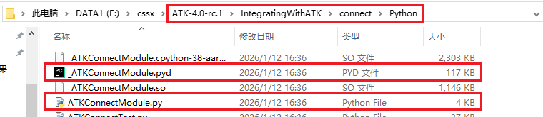

# 简介与配置

## 简介

Python SDK 是 ATK 提供的 Python 通信库，允许用户在自己的 Python 开发环境中编写脚本，通过 TCP 网络连接与 ATK 交互，实现场景搭建、参数设置、仿真运行等自动化操作。

作为 CONNECT 模式的核心开发方式之一，Python SDK 与 ATK 内置的 [Python 客户端工具](../../2-Python客户端工具/1-简介与配置.md) 共享相同的通信协议和命令格式，区别在于 Python SDK 运行在用户自建的 Python 环境中，适合需要将 ATK 功能集成到自有项目、或需要利用外部 Python 生态（如 numpy、matplotlib 等第三方库）的场景。

::: tip 开发方式选择
各开发方式的详细对比请参考 [CONNECT 模式概述](../../README.md#开发方式对比)。
:::

## 环境与配置

### Python 环境

Python 环境需用户自行下载安装。ATK 通信库基于 Python 3 开发，建议使用 Python 3.6 及以上版本。

::: warning 注意
使用 Python SDK 发送命令前，必须打开 ATK 软件（不需要打开场景）。若需新建场景，需将已打开的场景关闭。
:::

### 通信库文件

ATK 的 Python 通信库随安装包一同提供，位于安装包目录下的 <PathCopy :entry="pythonDir" label="Python" /> 文件夹中：

<PathViewer :relative-paths="sdkFiles" />



### 配置步骤

1. 将 <PathCopy :entry="pythonDir" label="Python" /> 文件夹中的 `ATKConnectModule.py` 和 `_ATKConnectModule.pyd` 复制到你的 Python 项目工作目录


2. 在 Python 代码中导入所需接口函数：

```python
from ATKConnectModule import atkOpen, atkConnect, atkClose
```

## 使用方式

完成上述配置后，即可在代码中调用三组核心 API 操控 ATK。基本流程如下：

```python
from ATKConnectModule import atkOpen, atkConnect, atkClose

# 1. 建立与 ATK 的连接
conID = atkOpen()

# 2. 发送命令（示例：新建一个场景）
atkConnect(conID, 'New', '/ Scenario MyScenario')

# 3. 断开连接
atkClose(conID)
```

详细的 API 参数说明见 [核心 API](./2-核心API.md)，完整案例见 [完整示例](./3-完整示例.md)。

## 与 Python 客户端工具的对比

| 对比项 | Python SDK | Python 客户端工具 |
| :--- | :--- | :--- |
| Python 环境 | 需自行安装和配置 | ATK 内置，无需安装 |
| 库文件 | 需手动复制到工作目录 | ATK 内置，无需配置 |
| 第三方库 | 可使用 numpy、matplotlib 等 | 仅限 ATK 内置标准库 |
| 运行方式 | 外部 IDE 或命令行 | ATK 内置客户端窗口 |
| 适用场景 | 集成到自有项目、复杂开发 | 快速上手、轻量脚本 |

下一步请参考 [核心 API](./2-核心API.md) 了解接口用法，或直接查看 [完整示例](./3-完整示例.md) 跟随实操。

<script setup>
import PathViewer from "@components/PathViewer/PathViewer.vue";
import PathCopy from "@components/PathCopy/PathCopy.vue";

const pythonDir = { path: 'IntegratingWithATK\\connect\\Python', name: 'Python 通信库' };

const sdkFiles = [
  pythonDir,
  { path: 'IntegratingWithATK\\connect\\Python\\ATKConnectModule.py', name: 'ATKConnectModule.py', description: 'Python 通信模块，封装了 atkOpen、atkConnect、atkClose 等接口函数' },
  { path: 'IntegratingWithATK\\connect\\Python\\_ATKConnectModule.pyd', name: '_ATKConnectModule.pyd', description: 'Windows 平台 Python 扩展模块，ATKConnectModule.py 的底层实现' },
];
</script>
