# 操作流程

以轨道倾角改变场景为例，此案例实现是从初始近地轨道到指定半径的地球同步轨道的转移轨道机动规划。以下为通过Matlab客户端在ATK软件中新建想定并设置参数的使用介绍。

::: warning 连接前须知

- 使用 Matlab 向 ATK 发送命令前，必须打开 ATK，不需要打开场景；

- 若需新建场景，需将已打开的场景关闭。ATK 网络通信端口为 `6655`

:::

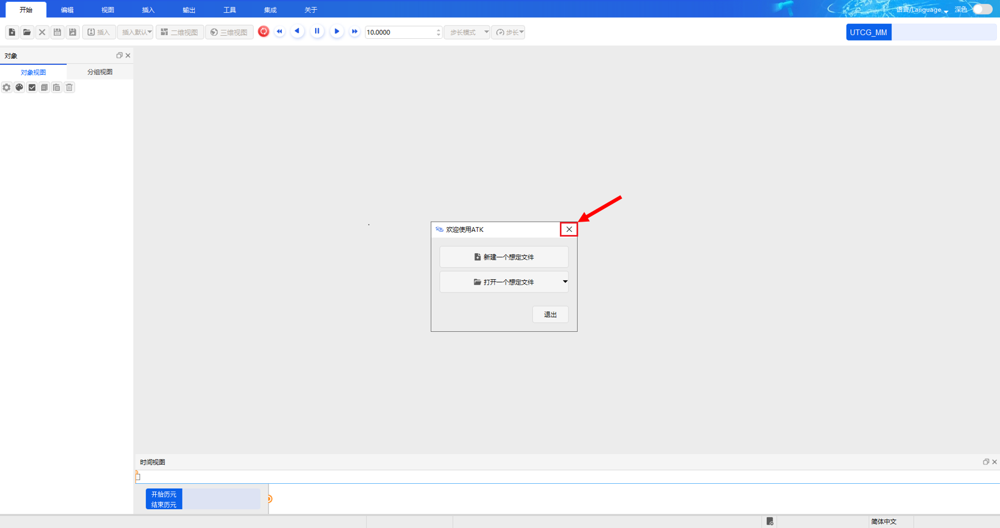

## 将Matlab库加入到运行路径

其中Matlab库文件在 <PathCopy :entry="matlabDir" /> 文件夹中。

```matlab
addpath('<ATK安装目录>\IntegratingWithATK\connect\Matlab\Win_2015b')
```

## 从命令窗口新建场景

::: warning 注意

若有已打开场景，请先关闭场景。

:::

### 第一步：打开 Matlab，在命令行窗口输入命令与 ATK 进行连接

与 ATK 进行连接使用 [`atkOpen`](./README.md#atkopen) 命令。

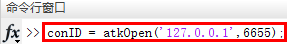

### 第二步：输入新建命令，新建想定并设置场景分析时间

以新建轨道倾角改变场景为例，[`New`](../../1-Connect对象命令库/场景/New.md) 命令。

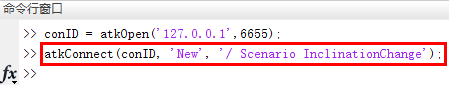

执行命令后，相应界面如下。


使用 [`SetAnalysisTimePeriod`](../../1-Connect对象命令库/场景/SetAnalysisTimePeriod.md) 命令设置场景开始结束时间；

使用 [`Animate`](../../1-Connect对象命令库/场景/Animate.md) 命令设置场景仿真状态。

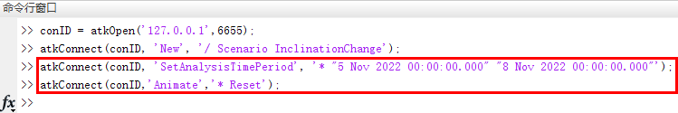

### 第三步：新建卫星对象并设置对象属性

可以通过 [`New`](../../1-Connect对象命令库/场景/New.md) 命令，新建对象，以新建卫星为例。

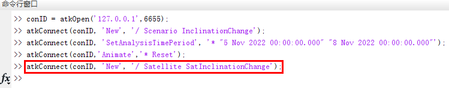

执行命令后，相应界面如下

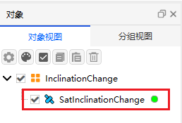

以设置卫星属性为例，具体命令格式请参考Connect命令库。

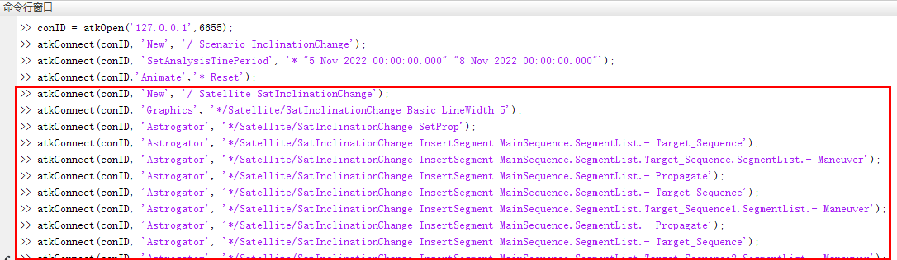

执行命令后，可在界面右键点击对象，选择 <kbd>属性</kbd> 按钮，查看设置结果

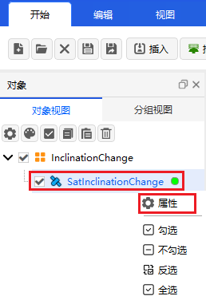


### 第四步：开始仿真；属性设置完成后，请关闭连接


使用 [`Save`](../../1-Connect对象命令库/场景/Save.md) 命令保存场景，若保存脚本文件，请在客户端界面点击 <kbd>保存</kbd> 按钮。


场景及对象设置完成后，使用 [`atkClose`](./README.md#atkclose) 命令与 ATK 断开连接。


## 从输入脚本窗口新建场景

::: warning 注意

- 除去逐条运行命令新建场景外，也可以多条命令批量处理。

- 若有已打开场景，请先关闭场景。

:::

### 第一步：打开 Matlab，在主页菜单栏下点击 <kbd>新建脚本</kbd> 按钮或 <kbd>新建</kbd> 按钮。

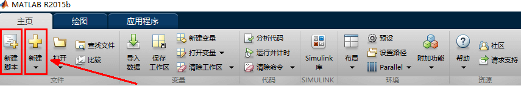

### 第二步：输入多条命令，新建想定以及对象，并对其属性进行设置

1. 与 ATK 进行连接使用 [`atkOpen`](./README.md#atkopen) 命令。

2. 以新建 InclinationChange 场景为例，使用 [`New`](../../1-Connect对象命令库/场景/New.md) 命令新建场景。

3. 使用 [`SetAnalysisTimePeriod`](../../1-Connect对象命令库/场景/SetAnalysisTimePeriod.md) 命令设置场景开始结束时间；

    使用 [`Animate`](../../1-Connect对象命令库/场景/Animate.md) 命令设置场景仿真状态。

4. 新建卫星对象，设置卫星为机动规划类型，并设置每个段的参数后运行算例。

5. 使用 [`Save`](../../1-Connect对象命令库/场景/Save.md) 命令保存场景。

6. 使用 [`atkClose`](./README.md#atkclose) 命令与 ATK 断开连接。

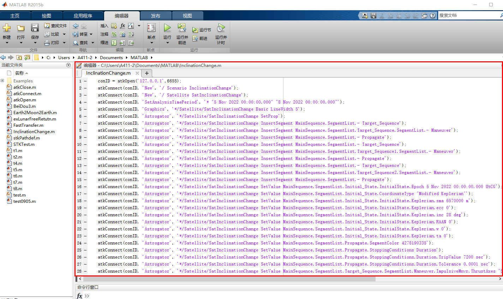

### 第三步：点击 <kbd>运行</kbd> 按钮，保存文件，即可开始仿真。


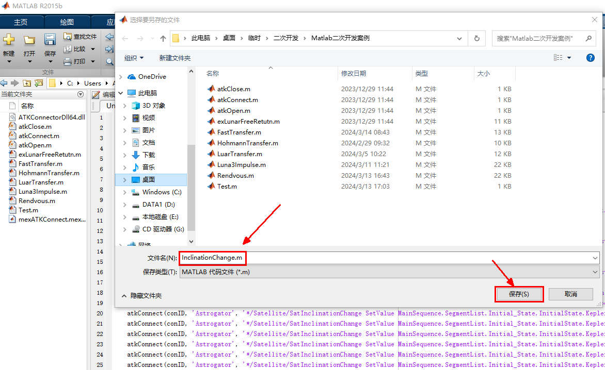


## 打开已保存场景脚本

::: warning 注意

- 若有已打开场景，请先关闭场景。

:::

### 第一步：打开 Matlab，在主页菜单栏下点击 <kbd>打开</kbd> 按钮


### 第二步：选择需要打开的脚本文件，点击 <kbd>打开</kbd> 按钮

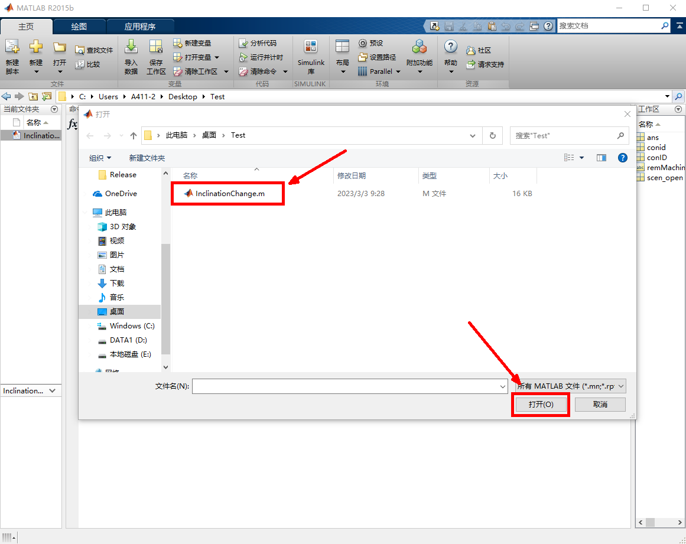

文件打开后，相应界面如下：

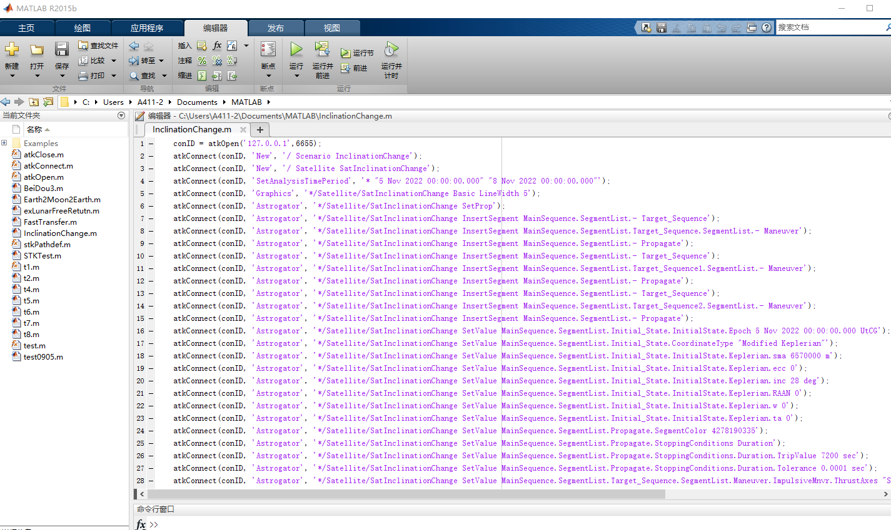

### 第三步：点击 <kbd>运行</kbd> 按钮，即可开始仿真


脚本文件执行后，相应界面如下。


<script setup>
import PathCopy from "@components/PathCopy/PathCopy.vue";

const matlabDir = { path: 'IntegratingWithATK\\connect\\Matlab\\Win_2015b', name: 'Win_2015b' };
</script>
