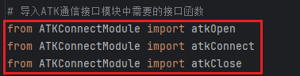
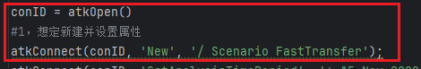
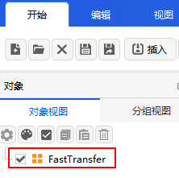
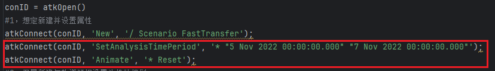
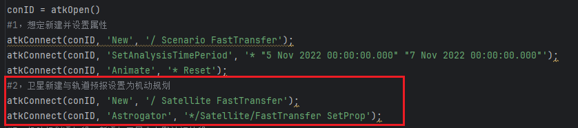
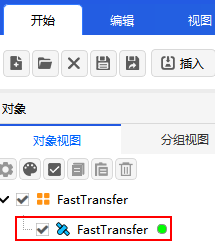
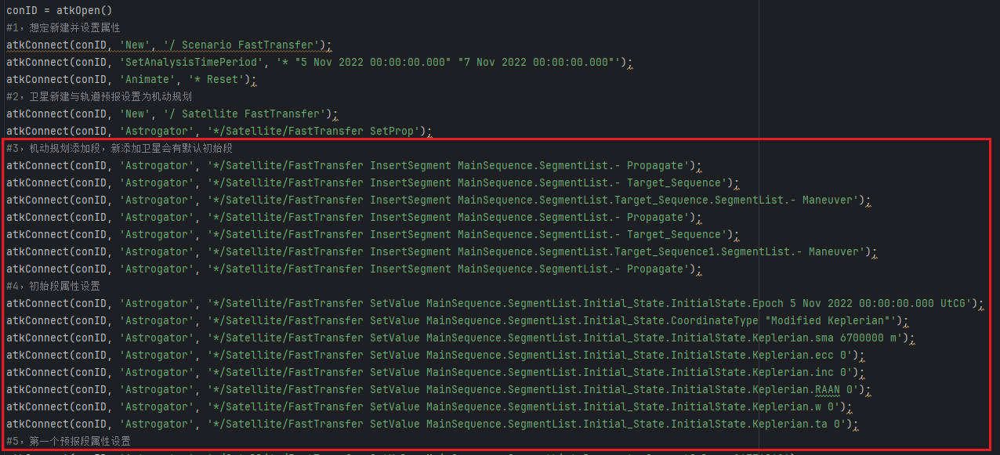
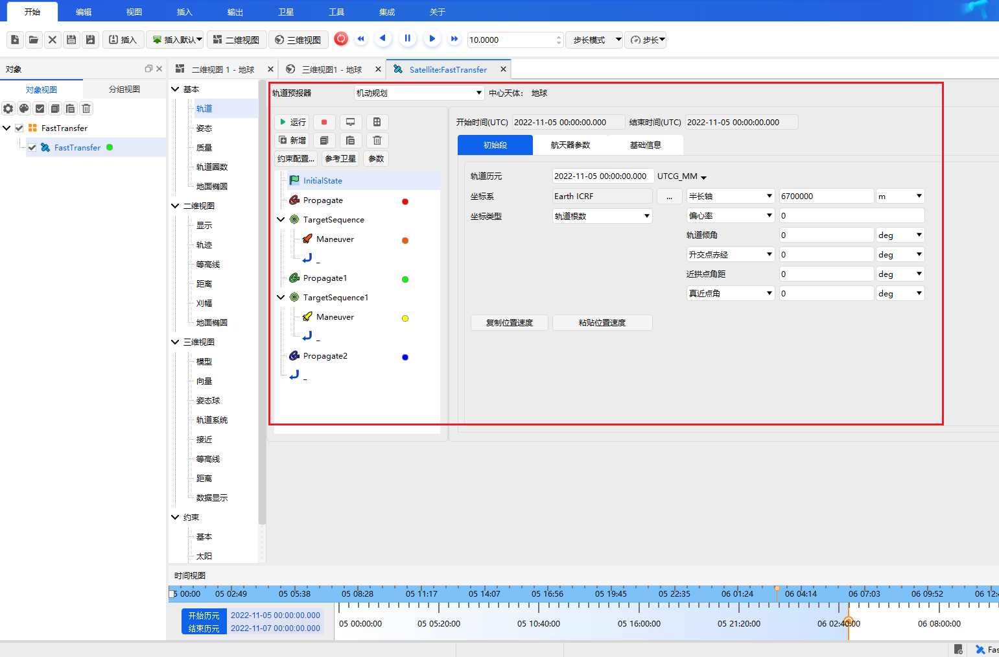
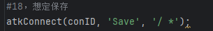
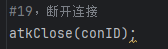

# 操作流程

以轨道快速转移场景为例，此案例实现是从半径为6700km的近地停泊轨道（LEO轨道）快速转移到半径为42164.197km的地球同步轨道（GEO轨道）的轨道机动规划设计。以下通过Python客户端与ATK软件连接，发送Connect命令完成新建想定并设置参数的使用介绍。

::: warning 注意
- 使用 Matlab 向 ATK 发送命令前，必须打开 ATK，不需要打开场景；
- 若需新建场景，需将已打开的场景关闭。
:::

## 将Python库函数复制到使用目录

## 从命令窗口新建场景

::: warning 注意
- 若有已打开场景，请先关闭场景。
:::
        
### 第一步：导入ATK通信接口模块中需要的接口函数

### 第二步：输入新建命令，新建想定并设置场景分析时间

以新建快速转移轨道场景为例，使用 [`New`](../../1-Connect对象命令库/场景/New.md) 命令

执行命令后，相应界面如下。

使用 [`SetAnalysisTimePeriod`](../../1-Connect对象命令库/场景/SetAnalysisTimePeriod.md) 命令设置场景开始结束时间；

使用 [`Animate`](../../1-Connect对象命令库/场景/Animate.md) 命令设置场景仿真状态

### 第三步：新建卫星对象并设置对象属性

可以通过 [`New`](../../1-Connect对象命令库/场景/New.md) 命令新建对象。以新建卫星，并设置轨道类型机动规划为例。

执行命令后，相应界面如下。

以设置卫星属性为例，具体命令格式请参考Connect命令库。

执行命令后，可在界面右键点击对象，选择属性按钮，查看设置结果。

### 第四步：开始仿真；属性设置完成后，请关闭连接

使用 [`Save`](../../1-Connect对象命令库/场景/Save.md) 命令保存场景，若保存脚本文件，请在客户端界面点击保存按钮

场景及对象设置完成后，使用 [`atkClose`](./README.md#atkclose) 命令与 ATK 断开连接。

