# 操作流程

以轨道倾角改变场景为例，此案例实现是从初始近地轨道到指定半径的地球同步轨道的转移轨道机动规划。以下为通过C++客户端在ATK软件中新建想定并设置参数的使用介绍。

使用C++方式与ATK进行连接，首先需要打开ATK。不需要打开场景；若需新建场景，需将已打开的场景关闭，ATK.Connect模式仅支持加载一个场景。

::: warning
- 使用客户端方式与 ATK 进行连接，首先需要打开 ATK。
- 若需新建场景，需将已打开的场景关闭。
:::

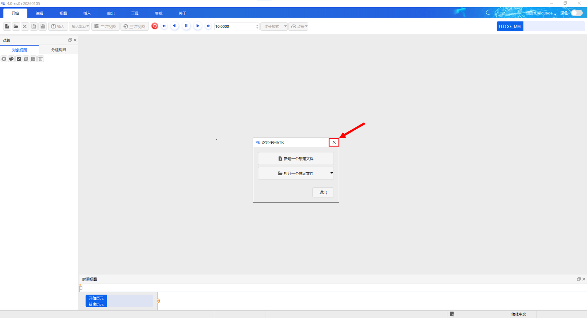

## 从命令窗口新建场景

::: warning 注意
若有已打开场景，请先关闭场景。
:::

### 第一步：在菜单栏选择集成菜单，再选择客户端窗口

点开客户端后，界面如下。

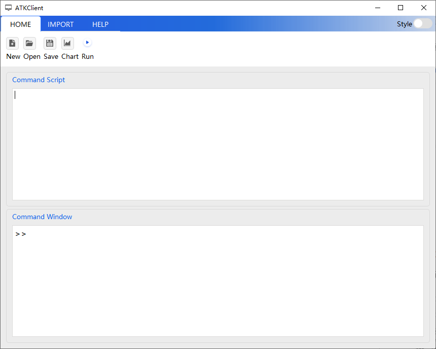

### 第二步：在命令窗口输入命令，与 ATK 进行连接

与 ATK 进行连接使用 [`atkOpen`](./README.md#atkOpen) 命令

### 第三步：输入新建命令，新建想定并设置场景分析时间

以新建轨道倾角改变场景为例，使用 [`New`](../../1-Connect对象命令库/场景/New.md) 命令

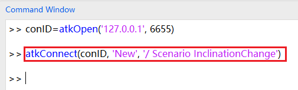

执行命令后，相应界面如下

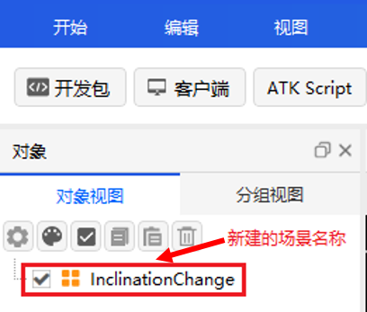

使用 [`SetAnalysisTimePeriod`](../../1-Connect对象命令库/场景/SetAnalysisTimePeriod.md) 命令设置场景开始结束时间；使用 [`Animate`](../../1-Connect对象命令库/场景/Animate.md) 命令设置场景仿真状态。

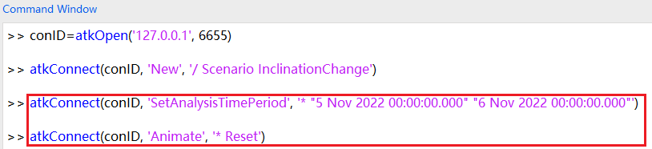

### 第四步：新建卫星对象

可以通过 [`New`](../../1-Connect对象命令库/场景/New.md) 命令，以新建卫星为例。

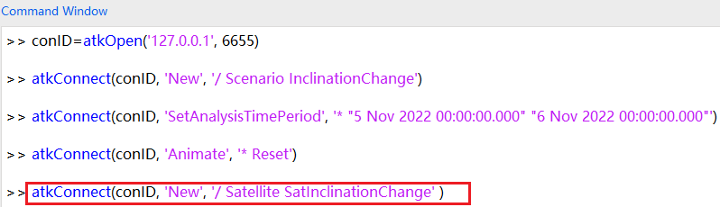

执行命令后，相应界面如下：

### 第五步：设置对象属性

以设置卫星属性为例，具体命令格式请参考Connect命令库。

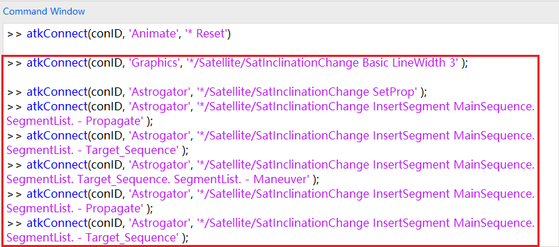

执行命令后，可在界面右键点击对象，选择属性按钮，查看设置结果。

### 第六步：开始仿真，属性设置完成后，请关闭连接

机动规划使用 [`Astrogator RunMCS`](../../2-Connect机动规划命令库/命令/运行轨道规划.md) 命令。

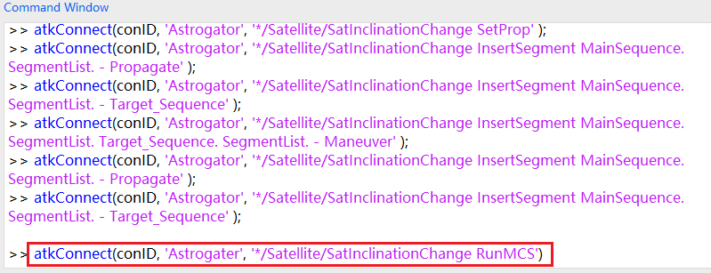

使用 [`Save`](../../1-Connect对象命令库/场景/Save.md) 命令保存场景，若保存脚本文件，请在客户端界面点击保存按钮。

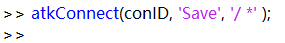

场景及对象设置完成后，使用 [`atkClose`](./README.md#atkclose) 命令与 ATK 断开连接

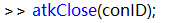

## 从输入脚本窗口新建场景

除去逐条运行命令新建场景外，也可以多条命令批量处理。

::: warning 注意
若有已打开场景，请先关闭场景。
:::

### 第一步：在菜单栏选择集成菜单，再选择客户端窗口

点开客户端后，界面如下。

### 第二步：点击 New 按钮新建脚本文件

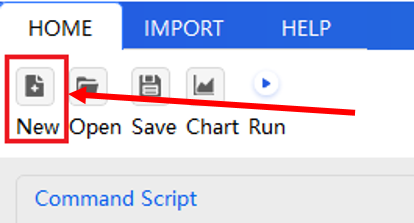

### 第三步：输入脚本命令，新建想定以及对象，并对其属性进行设置

1. 与 ATK 进行连接使用 [`atkOpen`](./README.md#atkopen) 命令。
2. 以新建轨道倾角改变场景为例，使用 [`New`](../../1-Connect对象命令库/场景/New.md) 命令新建场景，新建卫星对象。
3. 使用 [`SetAnalysisTimePeriod`](../../1-Connect对象命令库/场景/SetAnalysisTimePeriod.md) 命令设置场景开始结束时间；使用 [`Animate`](../../1-Connect对象命令库/场景/Animate.md) 命令设置场景仿真状态；
4. 以设置卫星轨道属性为例，具体命令格式请参考Connect命令库。
5. 使用 [`Save`](../../1-Connect对象命令库/场景/Save.md) 命令保存场景，若保存脚本文件，请在客户端界面点击保存按钮。
6. 使用 [`atkClose`](./README.md#atkclose) 命令与 ATK 断开连接。

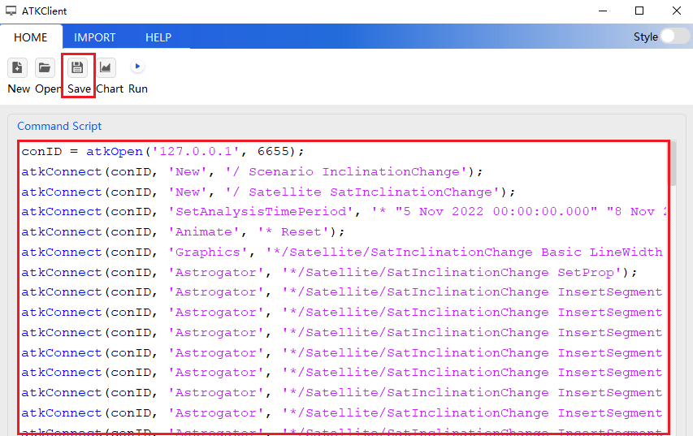

### 第四步：点击 Run 按钮，即可开始仿真

场景及对象属性设置完成后，即可运行脚本

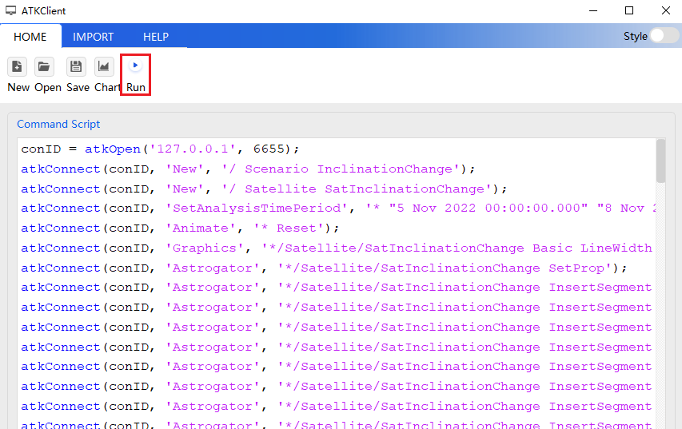

脚本运行结束后，相应界面如下。

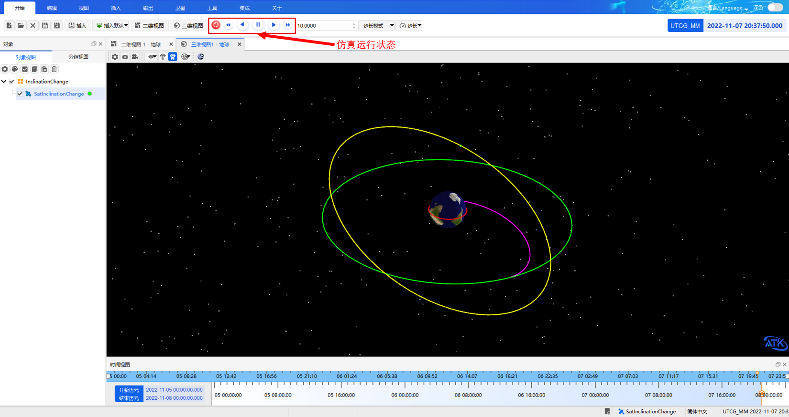

## 打开已保存场景

::: warning 注意
若有已打开场景，请先关闭场景
:::

### 第一步：在菜单栏选择集成菜单，再选择客户端窗口

点开客户端后，界面如下。

### 第二步：在客户端主菜单点击 Open 按钮

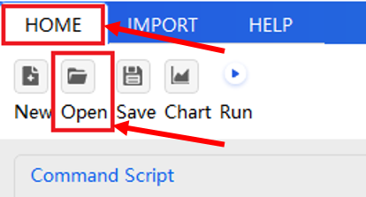

### 第三步：选择需要打开的.atks 脚本文件，点击打开按钮

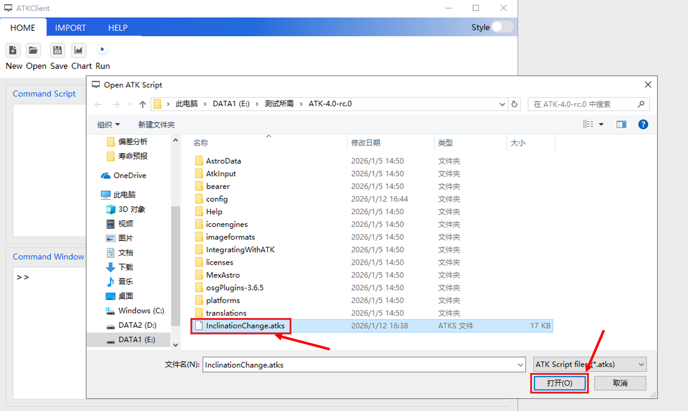

文件打开后，相应界面如下：

### 第四步：打开后点击主菜单中的 Run 按钮，即可运行

脚本文件执行后，相应界面如下：

