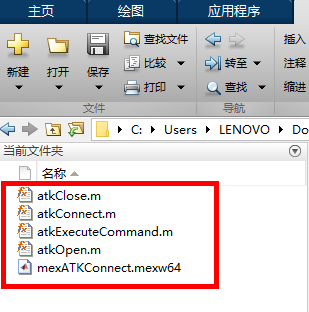

# 接口说明

<PathViewer
  :relative-paths="files"
/>

## 文件说明

Matlab客户端为用户提供与ATK软件进行网络连接、操作的途径，客户端需自行下载安装，ATK适配测试版本为Matlab R2015b。

ATK配套Matlab通信库文件存放路径：<PathCopy :entry="matlabDir" />，使用时需将库文件、函数文件添加至Matlab工作目录，如下图所示：

目录内核心文件作用说明：

1. `mexATKConnect.mexw64`：可执行Mex文件，提供MEX函数接口，负责Matlab与`ATKConnectorDll64.dll`的数据传输；

2. `atkOpen.m`、`atkConnect.m`、`atkExecuteCommand.m`、`atkClose.m`：Matlab函数M文件，通过调用MEX函数，完成Matlab 与 ATK 之间的连接建立与数据传递。

<!--@include:../.include/atkCommand-matlab.md-->

