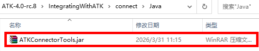

# 客户端说明

<PathViewer :relative-paths="files" />

## 文件说明

Java客户端为ATK面向用户提供的脚本命令输入程序，配套Java库文件由ATK提供，用户可引用该jar包进行自主程序开发。

jar包在ATK软件安装包目录下的 文件夹中：<PathCopy :entry="javaDir" />



客户端内置可执行工具包 `ATKConnectorTools.jar`，负责ATK与Java客户端之间的数据传输、解析；内置三组核心接口用于连接管理与参数配置：
1. `atkOpen`：建立和ATK的连接
2. `atkConnect`：行属性设置
3. `atkClose`：断开与ATK的连接

## 环境版本要求

该jar包适配 Java 1.8.0 版本，启动Java客户端即可与ATK进行连接。

## 客户端启动操作流程

若用户使用Java库自主编写程序，需提前自行安装Java环境；环境就绪后按以下步骤启动：
1. 以管理员身份打开Windows CMD；
2. 切换至ATK连接器 <PathCopy :entry="javaDir" /> 所在目录；
3. 执行启动命令：
```bash
java -jar ATKConnectorTools.jar
```


<!--@include:../.include/atkCommand.md-->

<script setup>
import PathViewer from "@components/PathViewer/PathViewer.vue";
import PathCopy from "@components/PathCopy/PathCopy.vue";

const javaDir = { path: 'IntegratingWithATK\\connect\\Java', name: 'Java 包' };
const javaJar = { path: 'IntegratingWithATK\\connect\\Java\\ATKConnectorTools.jar', name: 'ATKConnectorTools.jar' };

const files = [
  { path: 'IntegratingWithATK\\connect\\Java', name: 'Java' },
  javaJar,
];
</script>
