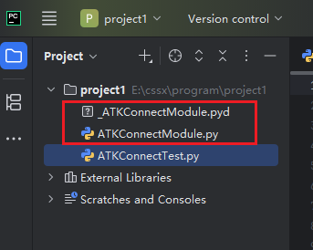

Python客户端是ATK软件向用户提供的一种支持Connect命令和Python语法混合解析运行的界面工具。支持Python遍历判断等逻辑语法的同时，也支持在Python代码中调用Connect命令接口与ATK连接通信。目前界面属性窗口不具备实时更新功能，故而设置属性后需重新打开对象属性界面属性数据才会更新。Python客户端需用户自行下载安装，ATK提供ATK与Python通信库文件再安装包目录下IntegratingWithATK\connect\Python文件夹中，用户需将使用库与使用函数添加到使用目录，如下图：




Python客户端支持Connect命令，用来完成与ATK软件之间的命令解析与数据传输，其中包含atkOpen、atkConnect、atkClose函数用以完成ATK与Java客户端的链接与参数设置，使用atkOpen进行连接，使用atkConnect进行属性设置。使用atkClose与ATK断开连接。

## atkOpen

::: note 用法
```
conID = atkOpen('hostStr', PortStr)
```
:::

::: info 说明
- `conID` - 连接句柄
- `hostStr` - 进行连接的网络地址，默认为：'127.0.0.1'
- `PortStr` - 进行连接的端口号，默认为：6655
:::

::: tip 举例
```
conID = atkOpen('127.0.0.1', 6655);
```

```
conID = atkOpen();
```
:::


## atkConnect

::: note 用法
```
rtnData = atkConnect(conID, 'command', 'objPath', 'cmdParamString')
```
:::

::: info 说明
- `conID` - 来自 `atkOpen` 的句柄
- `Command` - 具体请查看 `Connect` 命令库
- `objPath` - 接受命令的对象路径
- `cmdParamString` - 命令属性字符串
- `rtnData` - 从 atk 返回的响应的字符串
:::

::: tip 举例
```
atkConnect(conID, 'Graphics', '*/Satellite/Satellite1 SetColor 12');
```
:::


## atkClose

::: note 用法
```
atkClose(conID)
```
:::

::: info 说明
- `conID` - 来自 `atkOpen` 的连接句柄
:::

<Catalog />
