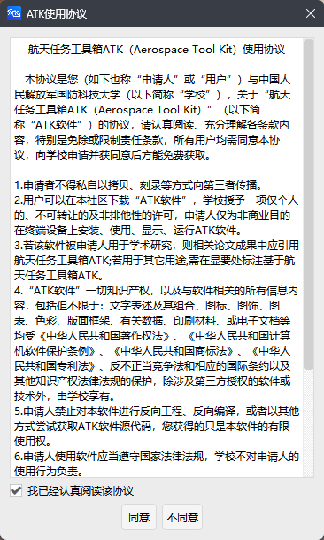

# ATK 注册步骤

ATK 采用 **免费使用模式**，但**首次使用必须完成注册**，否则功能将无法正常使用。

1. 双击运行 `ATK.exe`，自动弹出【ATK使用协议】对话框；
2. 仔细阅读协议后，勾选 **我已经认真阅读该协议**，点击 <kbd>同意</kbd>，进入【ATK注册机】界面；

3. 注册机界面中**机器码**将自动生成，无需手动修改；

4. 在注册码输入框填写获取到的注册码，点击 <kbd>注册</kbd> 完成激活。

   