# 地月自由返回轨道设计

## 内容简介

自由返回轨道是从地球出发，在不施加机动的情况下，能够绕月安全返回地球的轨道，如图所示。此类轨道对保障航天员的人身安全具有重要作用，因此被广泛应用于载人月球探测任务中，美国的阿波罗 8 号、10 号以及 11 号。

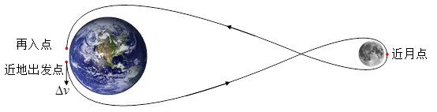

地月自由返回轨道设计本质上属于一类非线性方程组的边值问题。通过求解该边值问题，得到某一给定时刻下的满足约束的自由返回轨道。该问题的边界条件为近地出发轨道历元、近地出发点轨道高度、近地出发点轨道偏心率（等于 0）、近地出发点轨道倾角、近月点高度、绕月后返回的近地点高度和近地点轨道倾角，需要求解的参数为近地出发轨道升交点赤经、近地出发点纬度幅角、近地出发速度增量大小（通常施加切向的速度增量）。

在本案例中，边界条件参数设置如下：近地出发轨道历元为：2033-04-04 10:05:00.000（可以任意选择），近地出发点轨道高度为 170 km，近地出发点轨道偏心率为 0，近地出发点轨道倾角为 28°，近月点高度为 100 km，绕月后返回的近地点高度为 50 km，绕月后返回的近地点轨道倾角为 43°。需要求解的参数初值设置如下：近地出发轨道升交点赤经为 86°，近地出发点纬度幅角为 223°，近地点出发速度增量大小为 3.1645 km/s。

## 创建地月自由返回轨道任务场景与对象

[安装](https://www.osredm.com/atknudt/atk)并运行 ATK.exe，新建一个想定 "Earth2MoonTransfer"。设置开始历元为 2033-04-04 10:00:00.000000，结束历元为 2023-04-11 20:00:00.000000；插入卫星对象，将其命名为 "Earth2MoonTransfer"。轨道预报器类型选择机动规划。

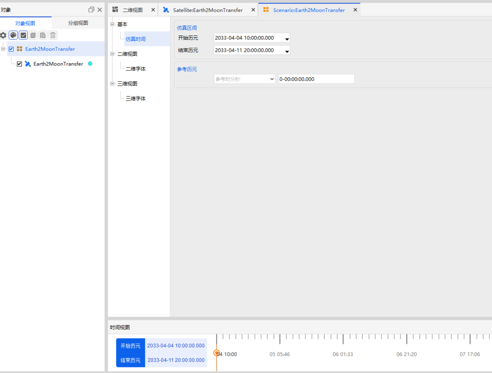

## 设计自由返回轨道

1. **定义瞄准序列段**

    添加一个瞄准序列段，命名为 "地月自由返回轨道规划"，然后嵌入一个初始段，命名为初始状态。设置轨道历元（UTCG）为 2033-04-04 10:05:00.000。坐标系选择 Earth CAsJ2000Axes，坐标类型选择轨道根数，如下图所示。

    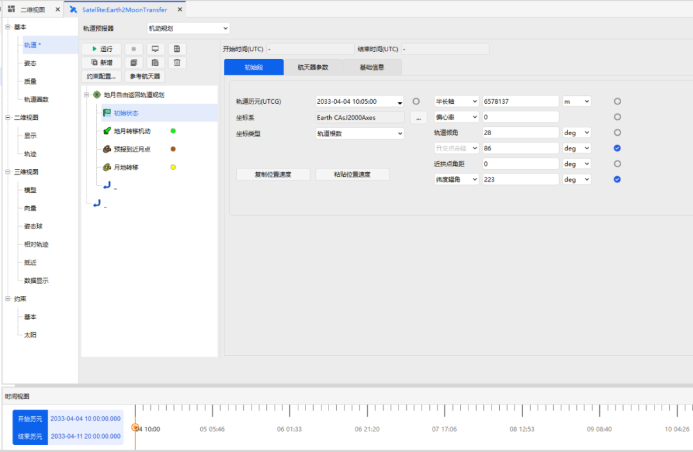

    在初始段后插入一个机动段，将其命名为 "地月转移机动"。机动类型为脉冲机动，推力坐标轴为 VVLH 坐标系。X、Y、Z 三轴的速度增量分别是 3.1645 km/s、0 km/s 和 0 km/s，仅勾选 X 方向的速度增量。

    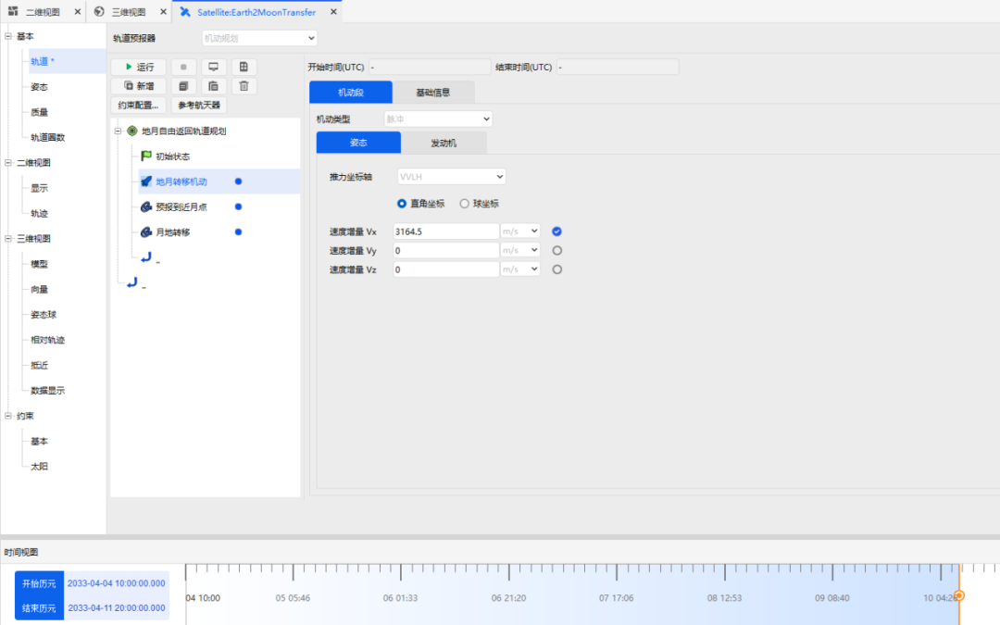

    在机动段后面插入一个预报段，命名为 "预报到近月点"，中心天体选择为地球，引力场模型选择为 JGM3，引力的次数和阶次均选择为 6，忽略大气阻力摄动和太阳光压摄动，考虑太阳和月球的三体摄动，并选择 "点质量" 模型。停止条件选择 "CAsStopPeriapsis"（预报到近拱点停止），中心天体选择 "Moon"。

    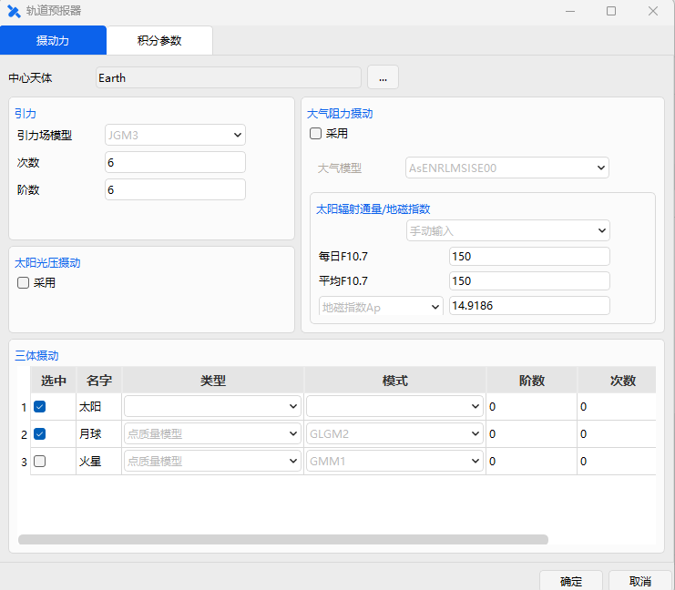

    在预报到近月点段后插入一个预报段，命名为 "月地转移"，摄动力的设置与上一步相同，停止条件选择 "CAsStopPeriapsis"（预报到近拱点停止），中心天体选择 "Earth"。

    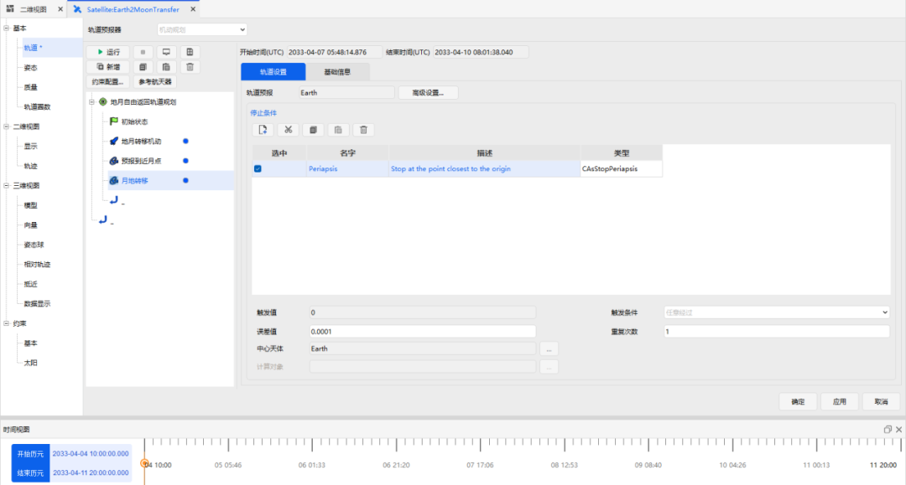

2. **选择变量**

    初始状态段中，选择纬度幅角、升交点赤经作为设计变量；地月转移机动段中，选择 X 方向的速度增量为设计变量；预报到近月点选择 CStateCalcAltitudeOfPeriapsis 作为约束条件，中心天体选择月球；月地转移段选择 CStateCalcAltitudeOfPeriapsis 和 CStateCalcInclination 作为约束条件，中心天体选地球。

3. **设置瞄准器**

    地月自由返回轨道规划配置类型选择 <kbd>微分修正一</kbd>。

    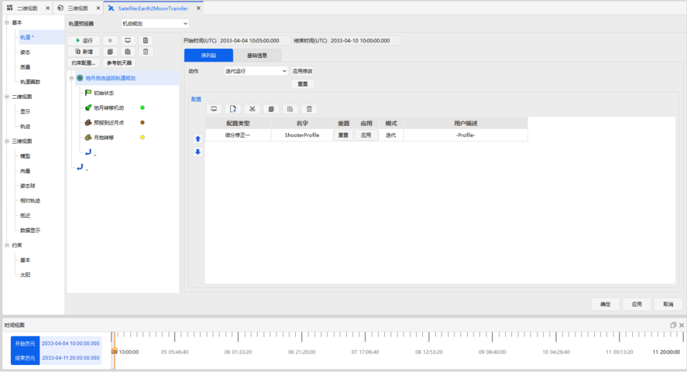

    双击 <kbd>微分修正一</kbd> 进入【瞄准器设置】界面。分别点击 "控制变量" 和 "约束" 中 "使用" 栏下的方框，勾选使用的控制变量和约束，具体的控制变量和约束及其数值如下图所示。近月点高度的期望值为 100 km、近地点高度的期望值为 50 km、近地点轨道倾角的期望值为 43°，近月点高度和近地点高度的收敛误差为 0.01 km、轨道倾角的收敛误差为 0.001°，其余参数可以选择默认参数。

    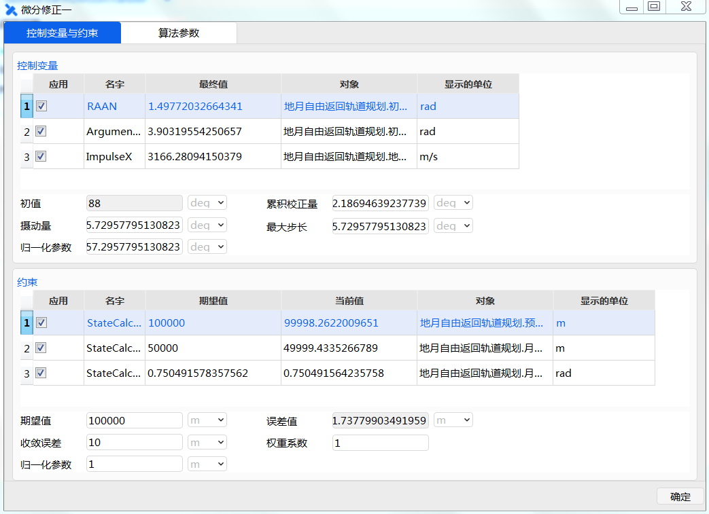

## 运行地月自由返回轨道并分析

构建完整个任务的控制序列后，点击瞄准序列段，选择 <kbd>迭代运行</kbd>，点击 <kbd>运行</kbd>，点击三维视图或者二维视图可以查看运行结果。

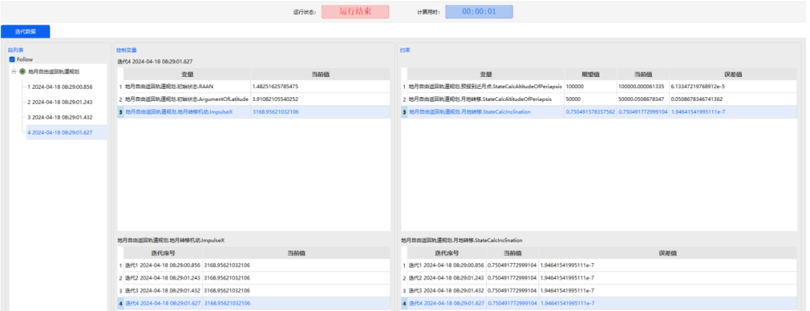

在 ATK 中，针对三个控制变量（近地出发点纬度幅角、近地出轨道升交点赤经和近地出发速度增量大小）设置四种不同的初值，分别计算满足约束条件的自由返回轨道。经过计算发现，这四种工况下，软件均可以得到满足约束条件的解，具体数值如表 1 所示。因此，在一定的初值范围内，通过使用 ATK 可以设计满足约束条件的自由返回轨道。

**表 1 四种不同控制变量对应的自由返回轨道计算结果**

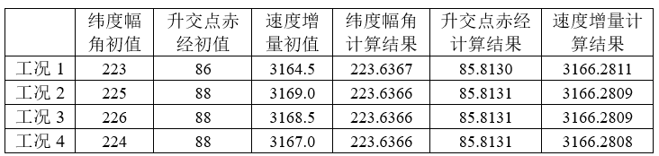

选取一条自由返回轨道结果展示如下图。

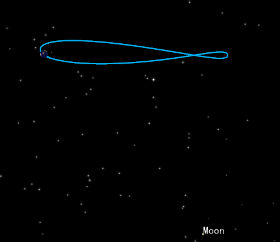