# 基于ATK.Component模式的轨道快速转移的C++实现

完成人：董敏，杨震，王华 | ATK 版本号：ATK 2.3

## 内容简介

本案例实现半径为 6700 km 的近地停泊轨道（LEO 轨道）快速转移到半径为 42164.197 km 的地球同步轨道（GEO 轨道）的轨道机动规划设计。案例使用 C++ 语言基于组件模式的 ATK.Component 动态库编码实现。

本案例使用 VS 工程，通过提供的头文件及库文件，使用 C++ 语言进行代码编译，完成案例实现，并保存想定文件。提供的文件及路径如下图所示。

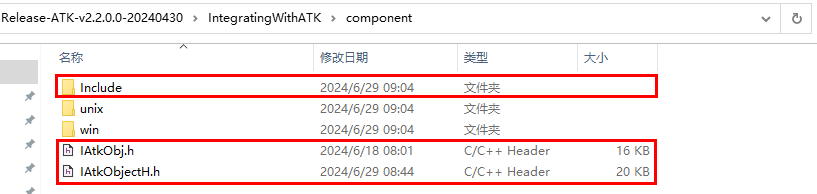

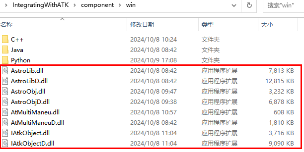


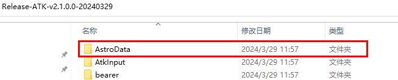

本案例会生成想定文件 "FastTransfer.xml"，报告文件 "J2000位置速度.txt"，控制变量累计校正量文件 "CorrectionsData.txt"，生成文件均在工程目录 Output 文件夹中，如下图所示。


使用 ATK 软件打开想定文件，快速转移轨道如下图所示。


## 案例实现

本案例使用 Visual Studio 2015 开发实现（ATK.Component 动态库可支持 Visual Studio 更高版本），案例实现流程如下所示。

1. 启动 Visual Studio 2015，在 <kbd>文件</kbd> 菜单栏，单击 <kbd>新建</kbd> 然后单击 <kbd>项目</kbd>，弹出【新建项目】对话框。

2. 在项目类型模板里选择 Visual C++ 项目，然后选择空项目，输入项目名称 "Test"，点击 <kbd>确定</kbd> 按钮完成项目创建。

3. 将所需的文件拷贝到工程目录下（具体操作可查看文件末尾附录）。

4. 添加 FastTransfer.cpp 文件，包含头文件 "IAtkObjectH.h"，添加 main() 函数，编写案例代码（代码可以直接拷贝编译运行）。

FastTransfer.cpp 文件代码说明如下：

```cpp
// 代码结构功能流程说明
//（1）包含所需头文件，并添加执行函数
//（2）添加根节点
//（3）想定新建与属性设置
//（4）卫星新建与轨道预报设置为机动规划
//（5）机动规划添加段，新添加卫星会有默认初始段
//（6）初始段属性设置
//（7）第一个预报段属性设置
//（8）第一个瞄准段中机动段属性设置
//（9）第一个瞄准段添加属性页，并设置属性页中控制变量与约束条件的属性
//（10）第二个预报段属性设置
//（11）第二个瞄准段中机动段属性设置
//（12）第二个瞄准段添加属性页，并设置属性页中控制变量与约束条件的属性
//（13）第三个预报段属性设置
//（14）机动规划运行
//（15）生成数据到文件
//（16）想定保存及关闭

#pragma once
#include <iostream>
#include <stdlib.h>
#include "IAtkObjectH.h"    // 包含头文件

using namespace std;

int main()
{
    IAtkObjectRoot* pRoot = new IAtkObjectRoot();

    // 想定新建与属性设置
    IScenario* pIScen = (IScenario*)pRoot->Children->New(eScenario, "FastTransfer");
    if (nullptr == pIScen) return false;
    pIScen->SetTimePeriod("5 Nov 2022 00:00:00.000", "6 Nov 2022 00:00:00.000");

    // 卫星新建与轨道预报设置为机动规划
    ISatellite* pISatellite = (ISatellite*)pIScen->Children->New(eSatellite, "Satellite1");
    pISatellite->SetPropagatorType(ePropagatorAstrogator);
    IVADriverMCS* pIVADriverMCS = (IVADriverMCS*)pISatellite->Propagator;
    IVAMCSSegmentCollection* pIVAMCSSegmentCollection = pIVADriverMCS->GetMainSequence();

    // 机动规划添加段，新添加卫星会有默认初始段
    IVAMCSInitialState* pIVAMCSInitialState = nullptr;
    if (eVASegmentTypeInitialState == pIVAMCSSegmentCollection->Item(0)->Type)
    {
        pIVAMCSInitialState = (IVAMCSInitialState*)pIVAMCSSegmentCollection->Item(0);
    }

    IVAMCSPropagate* pIVAMCSPropagate = (IVAMCSPropagate*)pIVAMCSSegmentCollection->Insert(
        eVASegmentTypePropagate, "Propagate", "-");
    IVAMCSTargetSequence* pIVAMCSTargetSequence = (IVAMCSTargetSequence*)pIVAMCSSegmentCollection->Insert(
        eVASegmentTypeTargetSequence, "TargetSequence", "-");
    IVAMCSManeuver* pIVAMCSManeuver = (IVAMCSManeuver*)pIVAMCSTargetSequence->GetSegments()->Insert(
        eVASegmentTypeManeuver, "Maneuver", "-");
    IVAMCSPropagate* pIVAMCSPropagate1 = (IVAMCSPropagate*)pIVAMCSSegmentCollection->Insert(
        eVASegmentTypePropagate, "Propagate", "-");
    IVAMCSTargetSequence* pIVAMCSTargetSequence1 = (IVAMCSTargetSequence*)pIVAMCSSegmentCollection->Insert(
        eVASegmentTypeTargetSequence, "TargetSequence1", "-");
    IVAMCSManeuver* pIVAMCSManeuver1 = (IVAMCSManeuver*)pIVAMCSTargetSequence1->GetSegments()->Insert(
        eVASegmentTypeManeuver, "Maneuver", "-");
    IVAMCSPropagate* pIVAMCSPropagate2 = (IVAMCSPropagate*)pIVAMCSSegmentCollection->Insert(
        eVASegmentTypePropagate, "Propagate", "-");

    // 初始段属性设置
    pIVAMCSInitialState->SetOrbitEpoch("5 Nov 2022 00:00:00.000");
    pIVAMCSInitialState->SetElementType(eVAElementTypeKeplerian);
    IVAElementKeplerian* pIVAElementKeplerian = (IVAElementKeplerian*)pIVAMCSInitialState->GetElement();
    pIVAElementKeplerian->SetSemiMajorAxis(6700);
    pIVAElementKeplerian->SetEccentricity(0);
    pIVAElementKeplerian->SetInclination(0);
    pIVAElementKeplerian->SetRAAN(0);
    pIVAElementKeplerian->SetArgOfPeriapsis(0);
    pIVAElementKeplerian->SetTrueAnomaly(0);

    // 第一个预报段属性设置
    IVAStoppingConditionElement* pIVAStoppingConditionElement =
        pIVAMCSPropagate->StoppingConditions->Add("Duration");
    IVAStoppingCondition* pIVAStoppingCondition =
        (IVAStoppingCondition*)pIVAStoppingConditionElement->Properties;
    pIVAStoppingCondition->SetTrip(7200);
    pIVAStoppingCondition->SetTolerance(0.0001);

    // 第一个瞄准段中机动段属性设置
    pIVAMCSManeuver->SetManeuverType(eVAManeuverTypeImpulsive);
    IVAManeuverImpulsive* pIVAManeuverImpulsive = (IVAManeuverImpulsive*)pIVAMCSManeuver->Maneuver;
    IVAAttitudeControlImpulsiveThrustVector* pIVAAttitudeControlImpulsiveThrustVector =
        (IVAAttitudeControlImpulsiveThrustVector*)pIVAManeuverImpulsive->AttitudeControl;
    pIVAAttitudeControlImpulsiveThrustVector->SetThrustAxesName("Satellite VNC(Earth)");
    pIVAMCSManeuver->EnableControlParameter(eVAControlManeuverImpulsiveCartesianX);
    pIVAMCSManeuver->Results->Add("Radius_Of_Apoapsis");

    // 第一个瞄准段添加属性页
    IVAProfileDifferentialCorrector* pIVAProfileDifferentialCorrector =
        (IVAProfileDifferentialCorrector*)pIVAMCSTargetSequence->GetProfiles()->Add(
            "Differential Corrector");
    IVADCControl* pIVADCControl = pIVAProfileDifferentialCorrector->ControlParameters->GetControlByPaths(
        "Maneuver", "ImpulseX");
    IVADCResult* pIVADCResult = pIVAProfileDifferentialCorrector->GetResults()->GetResultByPaths(
        "Maneuver", "RadiusOfApoapsis");

    // 属性页中控制变量属性设置
    pIVADCControl->SetEnable(true);
    pIVADCControl->SetMaxStep(100);
    pIVADCControl->SetCorrection(2781.50365947627);
    pIVADCControl->SetPerturbation(0.1);
    pIVADCControl->SetScalingValue(1);

    // 属性页中约束条件属性设置
    pIVADCResult->SetEnable(true);
    pIVADCResult->SetDesiredValue(84328394);
    pIVADCResult->SetScalingValue(1);
    pIVADCResult->SetTolerance(0.1);
    pIVADCResult->SetWeight(1);

    // 第二个预报段属性设置
    IVAStoppingConditionElement* pIVAStoppingConditionElement1 =
        pIVAMCSPropagate1->StoppingConditions->Add("RMagnitude");
    IVAStoppingCondition* pIVAStoppingCondition1 =
        (IVAStoppingCondition*)pIVAStoppingConditionElement1->Properties;
    pIVAStoppingCondition1->SetTrip(42164.197);
    pIVAStoppingCondition1->SetTolerance(1e-6);
    pIVAStoppingCondition1->SetRepeatCount(1);
    pIVAStoppingCondition1->SetCriterion(eVACriterionCrossEither);

    // 第二个瞄准段中机动段属性设置
    pIVAMCSManeuver1->SetManeuverType(eVAManeuverTypeImpulsive);
    IVAManeuverImpulsive* pIVAManeuverImpulsive1 = (IVAManeuverImpulsive*)pIVAMCSManeuver1->Maneuver;
    IVAAttitudeControlImpulsiveThrustVector* pIVAAttitudeControlImpulsiveThrustVector1 =
        (IVAAttitudeControlImpulsiveThrustVector*)pIVAManeuverImpulsive1->AttitudeControl;
    pIVAAttitudeControlImpulsiveThrustVector1->SetThrustAxesName("Satellite VNC(Earth)");
    pIVAMCSManeuver1->EnableControlParameter(eVAControlManeuverImpulsiveCartesianX);
    pIVAMCSManeuver1->EnableControlParameter(eVAControlManeuverImpulsiveCartesianZ);
    pIVAMCSManeuver1->Results->Add("Eccentricity");
    pIVAMCSManeuver1->Results->Add("Cosine_of_Vertical_FPA");

    // 第二个瞄准段添加属性页
    IVAProfileDifferentialCorrector* pIVAProfileDifferentialCorrector1 =
        (IVAProfileDifferentialCorrector*)pIVAMCSTargetSequence1->GetProfiles()->Add(
            "Differential Corrector");

    // 属性页中控制变量属性设置
    IVADCControl* pIVADCControl1 = pIVAProfileDifferentialCorrector1->ControlParameters->Item(0);
    pIVADCControl1->SetEnable(true);
    pIVADCControl1->SetMaxStep(300);
    pIVADCControl1->SetCorrection(-1581.97670664023);
    pIVADCControl1->SetPerturbation(0.1);
    pIVADCControl1->SetScalingValue(1);

    IVADCControl* pIVADCControl2 = pIVAProfileDifferentialCorrector1->ControlParameters->Item(1);
    pIVADCControl2->SetEnable(true);
    pIVADCControl2->SetMaxStep(300);
    pIVADCControl2->SetCorrection(-2771.82057041661);
    pIVADCControl2->SetPerturbation(0.1);
    pIVADCControl2->SetScalingValue(1);

    // 属性页中约束条件属性设置
    IVADCResult* pIVADCResult1 = pIVAProfileDifferentialCorrector1->GetResults()->Item(0);
    pIVADCResult1->SetEnable(true);
    pIVADCResult1->SetDesiredValue(0);
    pIVADCResult1->SetScalingValue(1);
    pIVADCResult1->SetTolerance(0.1);
    pIVADCResult1->SetWeight(1);

    IVADCResult* pIVADCResult2 = pIVAProfileDifferentialCorrector1->GetResults()->Item(1);
    pIVADCResult2->SetEnable(true);
    pIVADCResult2->SetDesiredValue(0);
    pIVADCResult2->SetScalingValue(1);
    pIVADCResult2->SetTolerance(0.1);
    pIVADCResult2->SetWeight(1);

    // 第三个预报段属性设置
    IVAStoppingConditionElement* pIVAStoppingConditionElement2 =
        pIVAMCSPropagate2->StoppingConditions->Add("Duration");
    IVAStoppingCondition* pIVAStoppingCondition2 =
        (IVAStoppingCondition*)pIVAStoppingConditionElement2->Properties;
    pIVAStoppingCondition2->SetTrip(86400);
    pIVAStoppingCondition2->SetTolerance(0.0001);

    // 机动规划运行
    pIVADriverMCS->RunMCS();
    pIVADriverMCS->ApplyAllProfileChanges();

    // 生成数据到文件
    std::string strReportFilePath = pRoot->OutputDataReport(pISatellite,
        "J2000位置速度", "5 Nov 2022 00:00:00.000", "6 Nov 2022 00:00:00.000");
    cout << "报告文件位置：" << strReportFilePath << endl;
    pRoot->GetAnimation()->OutputData();
    pRoot->GetAnimation()->OutputPropCortsData(pISatellite);

    // 想定保存及关闭
    pRoot->SaveScenario();
    pRoot->CloseScenario();
    delete pRoot;
    pRoot = nullptr;
    system("Pause");
}
```

5. 点击 <kbd>本地 Windows 调试器</kbd> 运行程序，使用保存想定接口，会生成想定文件，在项目目录 Output 文件夹中可查看生成文件。

## 案例结果

结果展示：生成文件均在工程目录 Output 文件夹中，如下图：


调用输出数据报告接口，会生成报告文件（接口返回值为数据报告文件位置），如下图：

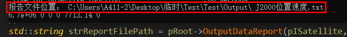

可输出卫星位置速度变化过程，如下图：

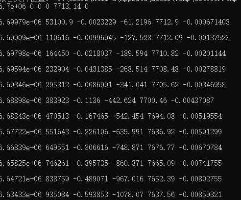

保存想定后，本案例生成 FastTransfer.xml 想定文件；启动 ATK 软件，打开生成的想定文件 FastTransfer.xml，三维展示卫星快速转移轨迹如下图：

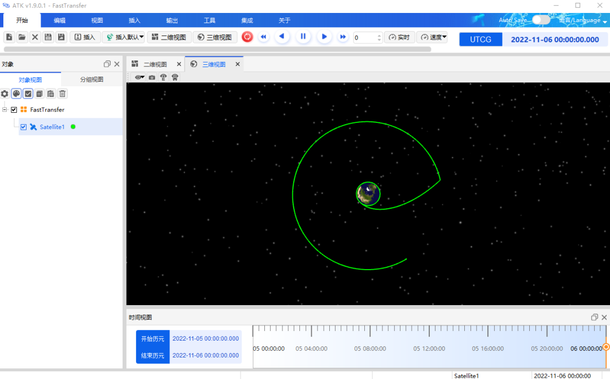

## 附录：工程配置

以 Visual Studio 2015 为例（库文件可支持 VS 更高版本），使用动态库进行项目规划。已新建工程 Test，并新建 cpp 文件 FastTransfer.cpp。

1. **文件配置**

    在 ATK 安装包目录中，点开 Component 文件夹。

    

    

    

    将所有文件添加至工程 Test 根目录中。

    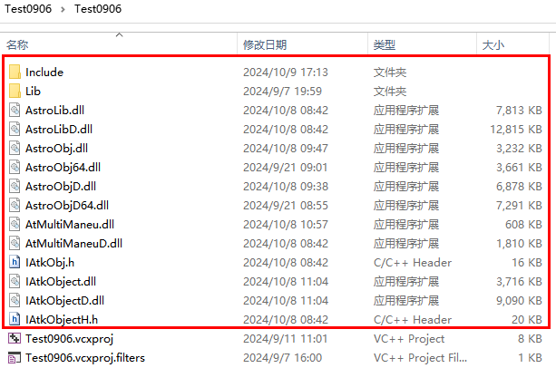

    将需要配置文件添加至此文件夹（其中 AstroData 文件夹在 ATK 安装目录下）。

    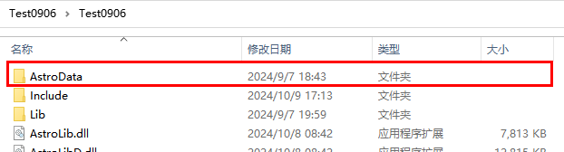

2. **项目添加文件**

    项目右键 -> <kbd>添加</kbd> -> <kbd>新建项</kbd>。

    

    设置文件名称及位置，点击 <kbd>添加</kbd>，完成后点击 <kbd>生成</kbd>。

    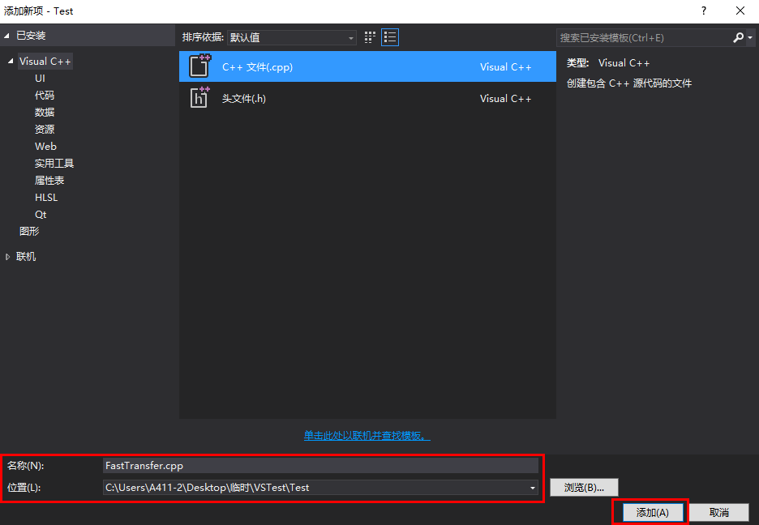

3. **修改输出目录**

    打开项目右键 -> <kbd>属性</kbd>。配置平台改为所有配置，所有平台模式，点击 <kbd>常规</kbd> -> <kbd>输出目录</kbd>，将输出目录修改为项目目录。

    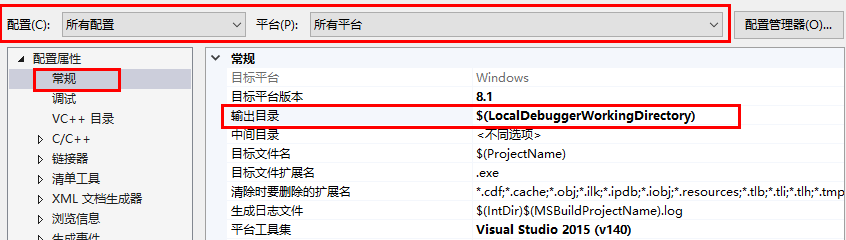

4. **附加包含目录设置**

    点击 <kbd>C/C++</kbd> -> <kbd>常规</kbd> -> <kbd>附加包含目录</kbd>，将头文件目录添加至附加包含目录。点击 <kbd>应用</kbd> 按钮将环境配置应用到项目，点击 <kbd>确定</kbd> 按钮。

    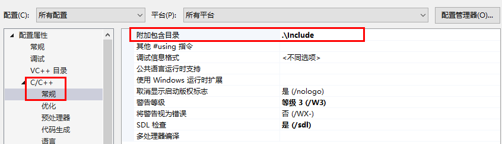
