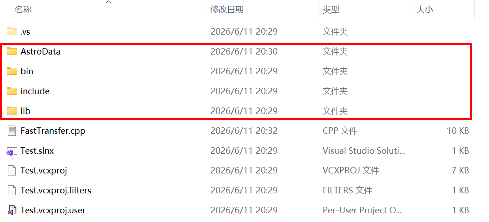
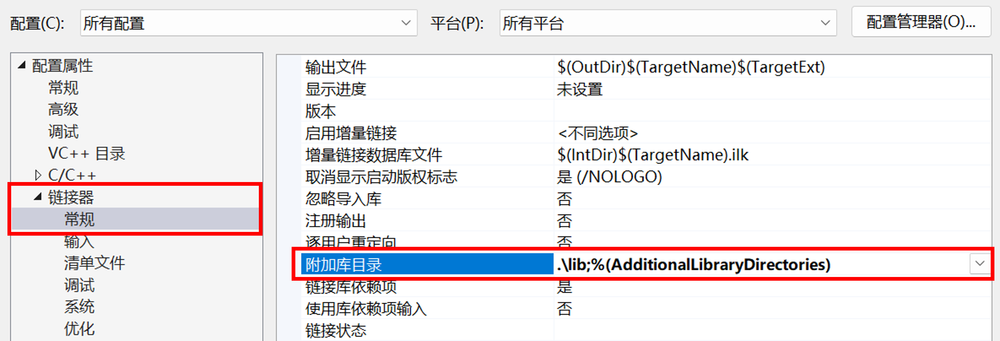
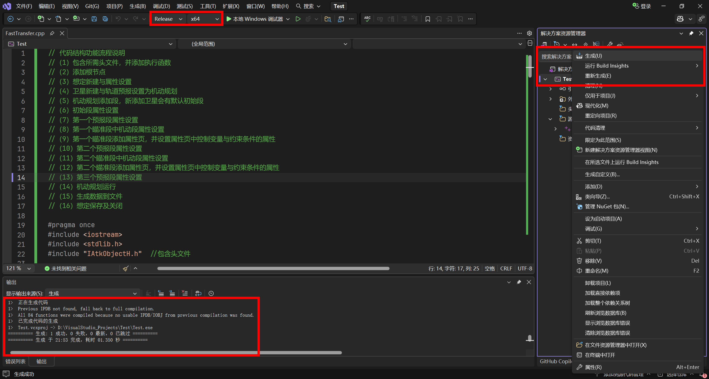
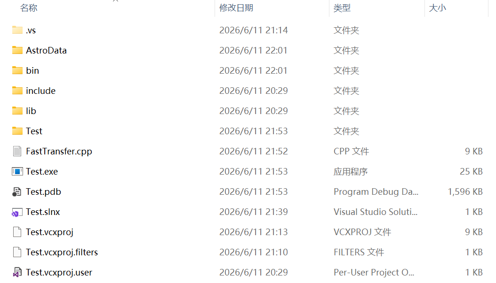
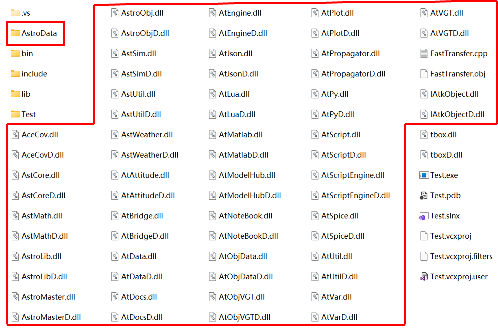

# 基于ATK.Component模式的轨道快速转移的C++实现

完成人：董敏，杨震，王华，陈明畅 | 完成日期：2026 年 6 月 12 日 | ATK 版本号：ATK 4.0

## 内容简介

本案例实现半径为 6700 km 的近地停泊轨道（LEO 轨道）快速转移到半径为 42164.197 km 的地球同步轨道（GEO 轨道）的轨道机动规划设计。案例使用 C++ 语言基于组件模式的 ATK.Component 动态库编码实现。

本案例使用 VS 工程，通过提供的头文件及库文件，使用 C++ 语言进行代码编译，完成案例实现，并保存想定文件。提供的文件及路径如下表所示：

|       文件分类       |                      文件路径                      |                       说明                       |
|:--------------------:|:--------------------------------------------------:|:------------------------------------------------:|
|    头文件（`.h`）    | `(ATK根目录)\IntegratingWithATK\component\include` | 包含 `IAtkObjectH.h` 等 ATK Component 接口头文件 |
| 动态库文件（`.dll`） |   `(ATK根目录)\IntegratingWithATK\component\bin`   |     ATK Component 运行时所需的动态链接库文件     |
| 静态库文件（`.lib`） |   `(ATK根目录)\IntegratingWithATK\component\lib`   |       ATK Component 编译时所需的静态库文件       |
|     辅助数据文件     |               `(ATK根目录)\AstroData`              |    ATK 运行所需的引力模型、星历等辅助数据文件    |

::: tip 说明
`(ATK根目录)` 指 ATK 软件的安装目录，与用户的实际设置有关。
示例： `D:\ATK-4.0.0`。
:::

本案例会生成想定文件 "FastTransfer.atk"、报告文件 "J2000位置速度.txt"，生成文件均在工程输出目录的 Output 文件夹中，如下图所示：


使用 ATK 软件打开想定文件，快速转移轨道如下图所示。


## 案例实现

本案例使用 Visual Studio 2015 开发实现（ATK.Component 动态库可支持 Visual Studio 更高版本），案例实现流程如下所示。

1. 启动 Visual Studio 2015，在 <kbd>文件</kbd> 菜单栏，单击 <kbd>新建</kbd> 然后单击 <kbd>项目</kbd>，弹出【新建项目】对话框。

2. 在项目类型模板里选择 Visual C++ 项目，然后选择空项目，输入项目名称 "Test"，点击 <kbd>确定</kbd> 按钮完成项目创建。

3. 将所需的文件拷贝到工程目录下（具体操作可查看文件末尾附录）。

4. 新建 "FastTransfer.cpp" 文件，包含头文件 "IAtkObjectH.h"，添加 main() 函数，编写案例代码（代码可以直接拷贝编译运行）。

FastTransfer.cpp 文件代码说明如下：

```cpp
// 代码结构功能流程说明
//（1）包含所需头文件，并添加执行函数
//（2）添加根节点
//（3）想定新建与属性设置
//（4）卫星新建与轨道预报设置为机动规划
//（5）机动规划添加段，新添加卫星会有默认初始段
//（6）初始段属性设置
//（7）第一个预报段属性设置
//（8）第一个瞄准段中机动段属性设置
//（9）第一个瞄准段添加属性页，并设置属性页中控制变量与约束条件的属性
//（10）第二个预报段属性设置
//（11）第二个瞄准段中机动段属性设置
//（12）第二个瞄准段添加属性页，并设置属性页中控制变量与约束条件的属性
//（13）第三个预报段属性设置
//（14）机动规划运行
//（15）生成数据到文件
//（16）想定保存及关闭

#pragma once
#include <iostream>
#include <stdlib.h>
#include "IAtkObjectH.h"    // 包含头文件

using namespace std;

int main()
{
    IAtkObjectRoot* pRoot = new IAtkObjectRoot();

    // 想定新建与属性设置
    IScenario* pIScen = (IScenario*)pRoot->GetChildren()->New(eScenario, "FastTransfer");
    if (nullptr == pIScen) return false;
    pIScen->SetTimePeriod("5 Nov 2022 00:00:00.000", "8 Nov 2022 00:00:00.000");

    // 卫星新建与轨道预报设置为机动规划
    ISatellite* pISatellite = (ISatellite*)pIScen->GetChildren()->New(eSatellite, "Satellite1");
    pISatellite->SetPropagatorType(ePropagatorAstromaster);
    IVADriverMCS* pIVADriverMCS = (IVADriverMCS*)pISatellite->GetPropagator();
    IVAMCSSegmentCollection* pIVAMCSSegmentCollection = pIVADriverMCS->GetMainSequence();

    // 机动规划添加段，新添加卫星会有默认初始段（直接获取第一段，无需检查类型）
    IVAMCSInitialState* pIVAMCSInitialState = (IVAMCSInitialState*)pIVAMCSSegmentCollection->Item(0);

    IVAMCSPropagate* pIVAMCSPropagate = (IVAMCSPropagate*)pIVAMCSSegmentCollection->Insert(
        eVASegmentTypePropagate, "Propagate", "-");
    IVAMCSTargetSequence* pIVAMCSTargetSequence = (IVAMCSTargetSequence*)pIVAMCSSegmentCollection->Insert(
        eVASegmentTypeTargetSequence, "TargetSequence", "-");
    IVAMCSManeuver* pIVAMCSManeuver = (IVAMCSManeuver*)pIVAMCSTargetSequence->GetSegments()->Insert(
        eVASegmentTypeManeuver, "Maneuver", "-");
    IVAMCSPropagate* pIVAMCSPropagate1 = (IVAMCSPropagate*)pIVAMCSSegmentCollection->Insert(
        eVASegmentTypePropagate, "Propagate", "-");
    IVAMCSTargetSequence* pIVAMCSTargetSequence1 = (IVAMCSTargetSequence*)pIVAMCSSegmentCollection->Insert(
        eVASegmentTypeTargetSequence, "TargetSequence1", "-");
    IVAMCSManeuver* pIVAMCSManeuver1 = (IVAMCSManeuver*)pIVAMCSTargetSequence1->GetSegments()->Insert(
        eVASegmentTypeManeuver, "Maneuver", "-");
    IVAMCSPropagate* pIVAMCSPropagate2 = (IVAMCSPropagate*)pIVAMCSSegmentCollection->Insert(
        eVASegmentTypePropagate, "Propagate", "-");

    // 初始段属性设置
    pIVAMCSInitialState->SetOrbitEpoch("5 Nov 2022 00:00:00.000");
    pIVAMCSInitialState->SetElementType(eVAElementTypeKeplerian);
    IVAElementKeplerian* pIVAElementKeplerian = (IVAElementKeplerian*)pIVAMCSInitialState->GetElement();
    pIVAElementKeplerian->SetSemiMajorAxis(6700000.0);
    pIVAElementKeplerian->SetEccentricity(0);
    pIVAElementKeplerian->SetInclination(0);
    pIVAElementKeplerian->SetRAAN(0);
    pIVAElementKeplerian->SetArgOfPeriapsis(0);
    pIVAElementKeplerian->SetTrueAnomaly(0);

    // 第一个预报段属性设置
    IVAStoppingConditionElement* pIVAStoppingConditionElement =
        pIVAMCSPropagate->GetStoppingConditions()->Add("Duration");
    IVAStoppingCondition* pIVAStoppingCondition =
        (IVAStoppingCondition*)pIVAStoppingConditionElement->GetProperties();
    pIVAStoppingCondition->SetTrip(7200);
    pIVAStoppingCondition->SetTolerance(0.0001);

    // 第一个瞄准段中机动段属性设置
    pIVAMCSManeuver->SetManeuverType(eVAManeuverTypeImpulsive);
    IVAManeuverImpulsive* pIVAManeuverImpulsive = (IVAManeuverImpulsive*)pIVAMCSManeuver->GetManeuver();
    IVAAttitudeControlImpulsiveThrustVector* pIVAAttitudeControlImpulsiveThrustVector =
        (IVAAttitudeControlImpulsiveThrustVector*)pIVAManeuverImpulsive->GetAttitudeControl();
    pIVAAttitudeControlImpulsiveThrustVector->SetThrustAxesName("Satellite VNC(Earth)");
    pIVAMCSManeuver->EnableControlParameter(eVAControlManeuverImpulsiveCartesianX);
    pIVAMCSManeuver->GetResults()->Add("Radius_Of_Apoapsis");

    // 第一个瞄准段添加属性页
    IVAProfileDifferentialCorrector* pIVAProfileDifferentialCorrector =
        (IVAProfileDifferentialCorrector*)pIVAMCSTargetSequence->GetProfiles()->Add(
            "Differential Corrector");
    IVADCControl* pIVADCControl = pIVAProfileDifferentialCorrector->GetControlParameters()->GetControlByPaths(
        "Maneuver", "ImpulseX");
    IVADCResult* pIVADCResult = pIVAProfileDifferentialCorrector->GetResults()->GetResultByPaths(
        "Maneuver", "StateCalcRadiusOfApoapsis");

    // 属性页中控制变量属性设置
    pIVADCControl->SetEnable(true);
    pIVADCControl->SetMaxStep(100);
    pIVADCControl->SetCorrection(2781.50365947627);
    pIVADCControl->SetPerturbation(0.1);
    pIVADCControl->SetScalingValue(1);

    // 属性页中约束条件属性设置
    pIVADCResult->SetEnable(true);
    pIVADCResult->SetDesiredValue(84328394);
    pIVADCResult->SetScalingValue(1);
    pIVADCResult->SetTolerance(0.1);
    pIVADCResult->SetWeight(1);

    // 第二个预报段属性设置
    IVAStoppingConditionElement* pIVAStoppingConditionElement1 =
        pIVAMCSPropagate1->GetStoppingConditions()->Add("Apoapsis");
    IVAStoppingCondition* pIVAStoppingCondition1 =
        (IVAStoppingCondition*)pIVAStoppingConditionElement1->GetProperties();
    pIVAStoppingCondition1->SetTolerance(1e-4);
    pIVAStoppingCondition1->SetRepeatCount(1);

    // 第二个瞄准段中机动段属性设置
    pIVAMCSManeuver1->SetManeuverType(eVAManeuverTypeImpulsive);
    IVAManeuverImpulsive* pIVAManeuverImpulsive1 = (IVAManeuverImpulsive*)pIVAMCSManeuver1->GetManeuver();
    IVAAttitudeControlImpulsiveThrustVector* pIVAAttitudeControlImpulsiveThrustVector1 =
        (IVAAttitudeControlImpulsiveThrustVector*)pIVAManeuverImpulsive1->GetAttitudeControl();
    pIVAAttitudeControlImpulsiveThrustVector1->SetThrustAxesName("Satellite VNC(Earth)");
    pIVAMCSManeuver1->EnableControlParameter(eVAControlManeuverImpulsiveCartesianX);
    pIVAMCSManeuver1->EnableControlParameter(eVAControlManeuverImpulsiveCartesianZ);
    pIVAMCSManeuver1->GetResults()->Add("Eccentricity");
    pIVAMCSManeuver1->GetResults()->Add("Cosine_of_Vertical_FPA");

    // 第二个瞄准段添加属性页
    IVAProfileDifferentialCorrector* pIVAProfileDifferentialCorrector1 =
        (IVAProfileDifferentialCorrector*)pIVAMCSTargetSequence1->GetProfiles()->Add(
            "Differential Corrector");

    // 属性页中控制变量属性设置
    IVADCControl* pIVADCControl1 = pIVAProfileDifferentialCorrector1->GetControlParameters()->Item(0);
    pIVADCControl1->SetEnable(true);
    pIVADCControl1->SetMaxStep(300);
    pIVADCControl1->SetCorrection(1581.97670664023);
    pIVADCControl1->SetPerturbation(0.1);
    pIVADCControl1->SetScalingValue(1);

    IVADCControl* pIVADCControl2 = pIVAProfileDifferentialCorrector1->GetControlParameters()->Item(1);
    pIVADCControl2->SetEnable(true);
    pIVADCControl2->SetMaxStep(300);
    pIVADCControl2->SetCorrection(30.0);
    pIVADCControl2->SetPerturbation(0.1);
    pIVADCControl2->SetScalingValue(1);

    // 属性页中约束条件属性设置
    IVADCResult* pIVADCResult1 = pIVAProfileDifferentialCorrector1->GetResults()->Item(0);
    pIVADCResult1->SetEnable(true);
    pIVADCResult1->SetDesiredValue(0);
    pIVADCResult1->SetScalingValue(1);
    pIVADCResult1->SetTolerance(0.1);
    pIVADCResult1->SetWeight(1);

    IVADCResult* pIVADCResult2 = pIVAProfileDifferentialCorrector1->GetResults()->Item(1);
    pIVADCResult2->SetEnable(true);
    pIVADCResult2->SetDesiredValue(0);
    pIVADCResult2->SetScalingValue(1);
    pIVADCResult2->SetTolerance(0.1);
    pIVADCResult2->SetWeight(1);

    // 第三个预报段属性设置
    IVAStoppingConditionElement* pIVAStoppingConditionElement2 =
        pIVAMCSPropagate2->GetStoppingConditions()->Add("Duration");
    IVAStoppingCondition* pIVAStoppingCondition2 =
        (IVAStoppingCondition*)pIVAStoppingConditionElement2->GetProperties();
    pIVAStoppingCondition2->SetTrip(259200);
    pIVAStoppingCondition2->SetTolerance(0.0001);

    // 机动规划运行
    pIVADriverMCS->RunMCS();
    pIVADriverMCS->ApplyAllProfileChanges();

    // 生成数据到文件
    std::string strReportFilePath = pRoot->OutputDataReport(pISatellite,
        "J2000位置速度", "5 Nov 2022 00:00:00.000", "8 Nov 2022 00:00:00.000");
    cout << "报告文件位置：" << strReportFilePath << endl;

    // 想定保存及关闭
    pRoot->SaveScenario();
    pRoot->CloseScenario();
    delete pRoot;
    pRoot = nullptr;
    system("Pause");
}
```

::: warning 注意
将上述代码复制到 VS 工程前，务必确保 cpp 文件编码格式选择的是 `简体中文(GB2312) - 代码页936`，否则在可执行文件编译生成阶段会出现错误和警告：`该文件包含不能在当前代码页(936)中表示的字符。请将该文件保存为 Unicode 格式以防止数据丢失`。
:::

5. 点击 <kbd>本地 Windows 调试器</kbd> 运行程序，使用保存想定接口，会生成想定文件，在项目目录 Output 文件夹中可查看生成文件。

## 案例结果

结果展示：生成文件均在工程目录 Output 文件夹中，如下图：


调用输出数据报告接口，会生成报告文件（接口返回值为数据报告文件位置），如下图：


可输出卫星位置速度变化过程，如下图：


保存想定后，本案例生成 FastTransfer.atk 想定文件；启动 ATK 软件，打开生成的想定文件 FastTransfer.atk，三维展示卫星快速转移轨迹如下图：


::: tip 说明
若发现快速转移轨迹显示不全，请在 ATK 图形界面中，右键点击 "Satellite1" 卫星对象，选择 <kbd>属性</kbd>，进入卫星对象属性设置界面，然后选择【二维视图 -> 轨迹】设置，将轨迹类型由【时间】更改为【所有】。
:::

## 附录：工程配置

以 Visual Studio 2015 为例（库文件可支持 VS 更高版本），进行项目配置。假设用户已新建工程 "Test"，并新建 cpp 文件 "FastTransfer.cpp"。

1.**文件配置**

二次开发所需的文件及路径如下表所示。

|       文件分类       |                      文件路径                      |                       说明                       |
|:--------------------:|:--------------------------------------------------:|:------------------------------------------------:|
|    头文件（`.h`）    | `(ATK根目录)\IntegratingWithATK\component\include` | 包含 `IAtkObjectH.h` 等 ATK Component 接口头文件 |
| 动态库文件（`.dll`） |   `(ATK根目录)\IntegratingWithATK\component\bin`   |     ATK Component 运行时所需的动态链接库文件     |
| 静态库文件（`.lib`） |   `(ATK根目录)\IntegratingWithATK\component\lib`   |       ATK Component 编译时所需的静态库文件       |
|     辅助数据文件     |               `(ATK根目录)\AstroData`              |    ATK 运行所需的引力模型、星历等辅助数据文件    |

将上述所有文件复制到工程 "Test" 根目录中。复制完成后，工程期望目录结构如下图所示：



2.**项目添加文件**

右键单击 "Test" 项目 -> <kbd>添加</kbd> -> <kbd>新建项</kbd>。


设置文件名称及位置，点击 <kbd>添加</kbd>，完成后点击 <kbd>生成</kbd>。


3.**修改工程输出目录**

右键单击 "Test" 项目 -> <kbd>属性</kbd>。配置平台改为`所有配置、所有平台`模式，点击 <kbd>常规</kbd> -> <kbd>输出目录</kbd>，将输出目录修改为 "Test" 工程根目录。


4.**附加包含目录设置**

点击 <kbd>C/C++</kbd> -> <kbd>常规</kbd> -> <kbd>附加包含目录</kbd>，将头文件目录(`include`文件夹)添加至附加包含目录。点击 <kbd>应用</kbd> 按钮将环境配置应用到项目，点击 <kbd>确定</kbd> 按钮。


5.**附加库目录和附加依赖项设置**

点击 <kbd>链接器</kbd> -> <kbd>常规</kbd> -> <kbd>附加库目录</kbd>，将库文件目录(`lib`文件夹)添加至附加库目录。再点击 <kbd>链接器</kbd> -> <kbd>输入</kbd> -> <kbd>附加依赖项</kbd>，将库文件目录下的 `IAtkObject.lib`和`IAtkObjectD.lib` 添加至附加依赖项。点击 <kbd>应用</kbd> 按钮将环境配置应用到项目，点击 <kbd>确定</kbd> 按钮。




6.**配置动态库文件和辅助数据文件**

推荐将 "Test" 项目配置选择为 `Release` 模式，右键单击 "Test" 项目 -> <kbd>生成</kbd>，此时终端将输出生成成功标志：



右键单击 "Test" 项目 -> <kbd>在文件资源管理器中打开</kbd>，进入 "Test" 工程根目录。此时工程根目录结构如下图所示：



可以看出，`Test.exe` 可执行文件已生成，然而尝试运行后会发现输出结果与预期不符，这是因为动态库文件(`bin`文件夹)和辅助数据文件(`AstroData`文件夹)未完成配置。需要将 **`bin` 文件夹下的所有 `dll` 文件** 和 **`AstroData` 文件夹** 移动到 `"Test" 工程根目录(与可执行文件在同一目录)`下，完成后 "Test" 工程根目录结构如下图所示：


