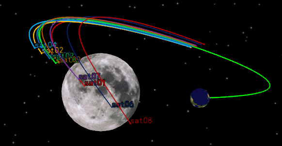
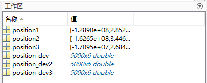
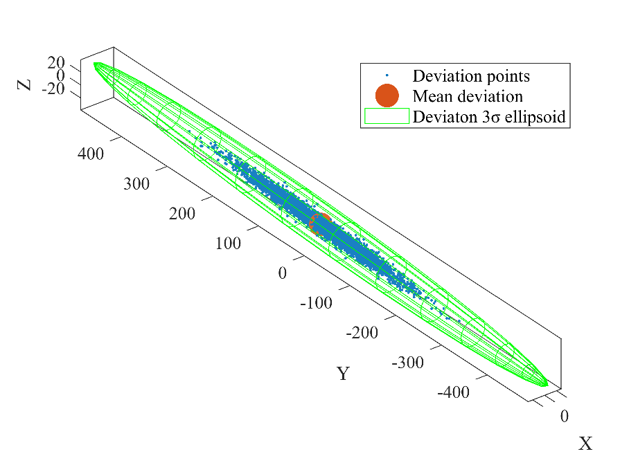
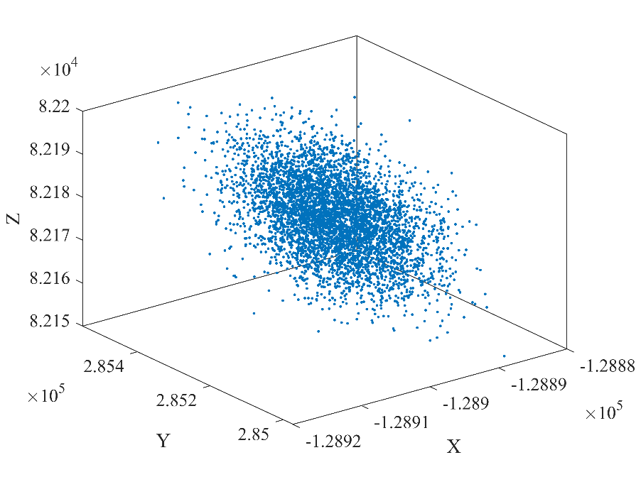

# 基于二次开发的轨道偏差演化分析

## 内容简介

受各种误差影响，航天器入轨参数往往与标称值存在一定偏差，经过一段时间演化，会出现轨道偏离。为保证轨道方案设计的鲁棒性，需要精确预报航天器的状态偏差，航天器轨道偏差演化分析因此具有重要意义。下图是地月空间轨道偏差演化示意图。工程中为了更精确地获得偏差经非线性传播后的分布情况，一般采用蒙特卡洛方法进行大量随机抽样与仿真。


航天任务工具箱 ATK（Aerospace Tool Kit）软件本身不具备准确的偏差演化分析功能，但可以通过二次开发模块实现基于蒙特卡洛方法的精确偏差演化。二次开发模块拥有 C++、Matlab、Python 等多种语言接口，可以通过编程形式实现对 ATK 软件的快速操作。本文采用 Matlab 进行二次开发。本文以地月自由返回轨道作为研究对象，分析存在初始位置速度偏差时，高精度轨道预报模型下的轨道偏差演化情况。初始位置速度来源于前序 ATK 特定问题建模结果（详见 ATK 特定问题建模——地月自由返回轨道设计），初值偏差采用高斯型随机分布。本文案例包括 3 个 m 文件，分别是标称轨道仿真、蒙特卡洛打靶仿真和数据分析，完整代码详见文末附录。接下来将结合代码和注解，带大家实现该仿真案例。

## 标称轨道仿真

### 交互配置检查与文件目录设置

::: warning 交互配置检查

确认 ATK 软件与 MATLAB 间交互配置是否正确，请参考：
- [ATK 的安装与配置](../01-安装/README.md)
- [ATK 二次开发配置](../二次开发教程/2-二次开发CONNECT模式/4-Matlab接口/README.md)

:::

打开 ATK 软件，关闭弹出的【欢迎使用 ATK】窗口，保持 ATK 界面为无场景状态。之后新建 m 文件，命名为 `A1_LunarFreeReturn.m`，保存路径自主决定。

### 标称轨道生成代码实现

地月自由返回轨道的标称轨道生成代码如下，共分为 2 部分，第 1 部分实现与 ATK 建立连接、场景初始化功能，第 2 部分实现标称轨道参数设置及仿真功能。

```matlab
%% 初始化
clear
clc
% 与ATK建立连接，添加路径要与个人电脑上的ATK安装路径一致
addpath('E:\ATK\ATK-4.0.1-rc.1\IntegratingWithATK\connect\Matlab\Win_2015b');
conID = atkOpen();
% 新建场景
atkConnect(conID, 'New', '/ Scenario LunarFreeReturn');
% 设置场景历元时刻
atkConnect(conID, 'SetAnalysisTimePeriod', '* "4 Apr 2033 10:05:23.00" "10 Apr 2033 08:01:38.04"');
% 重置场景开始时间
atkConnect(conID, 'Animate', '* Reset');

% 新建卫星
atkConnect(conID, 'New', '/ Satellite sat0');
atkConnect(conID, 'SetState', ['*/Satellite/sat0 Cartesian HPOP ' ...
    '"4 Apr 2033 10:05:00.00" ' ...
    '"10 Apr 2033 08:01:38.04" ' ...
    '60 J2000 ' ...
    '"4 Apr 2033 10:05:00.00" ' ...
    '3496183.80951811 -5158739.1800055 -2106180.2471557 ' ...
    '7588.16412302495 6884.317409025 -3872.7905851142']);
% 不考虑大气阻力摄动
atkConnect(conID, 'HPOP', '*/Satellite/sat0 Drag Off');
% 考虑太阳光压摄动，Cr = 1，面积质量比 = 20.0
atkConnect(conID, 'HPOP', ...
    '*/Satellite/sat0 Force SRP On Model Spherical 1 20.0');
% 考虑非球形引力摄动：JGM3，6阶6次。非球形摄动相关文件的路径要与个人电脑上ATK安装路径一致
atkConnect(conID, 'HPOP', ['*/Satellite/sat0 Force Gravity ' ...
    '"E:\ATK\ATK-4.0.1-rc.1\AstroData\Earth\JGM3.grv" 6 6']);
% 考虑太阳三体引力，点质量模型
atkConnect(conID, 'HPOP', ...
    '*/Satellite/sat0 Force ThirdBodyGravity Sun on PointMass 0 0 1.3271244004193938e20');
% 考虑月球三体引力，点质量模型
atkConnect(conID, 'HPOP', ...
    '*/Satellite/sat0 Force ThirdBodyGravity Moon on PointMass 0 0 4.9048695e12');
% 积分器设置：固定步长输出
atkConnect(conID, 'HPOP', ...
    '*/Satellite/sat0 Integrator ReportOnFixedStep On');
% 积分精度
atkConnect(conID, 'HPOP', ...
    '*/Satellite/sat0 Integrator OrbitEps 1e-13');
% 重置动画
atkConnect(conID, 'Animate', '* Reset');
% 开始仿真
atkConnect(conID, 'Animate', '* Start');
% 记录标称轨道终端时刻位置速度，放置在数组position0中
position0= str2num(atkConnect(conID, 'Position',' */Satellite/sat0 "10 Apr 2033 08:01:38.04"'));
save('Standard.mat', 'position0');
```

接下来将分块介绍各部分的实现功能。

### 场景初始化代码详解（标称轨道）

```matlab
% 与ATK建立连接，添加路径要与个人电脑上的ATK安装路径一致
addpath('F:\ATK-v2.3.0.0-20240730\IntegratingWithATK\connect\win\Matlab\Win_2015b');
conID = atkOpen();
% 新建场景
atkConnect(conID, 'New', '/ Scenario LunarFreeReturn');
% 设置场景历元时刻
atkConnect(conID, 'SetAnalysisTimePeriod', '* "4 Apr 2033 10:05:23.00" "10 Apr 2033 08:01:38.04"');
% 重置场景开始时间
atkConnect(conID, 'Animate', '* Reset');
```

以上代码实现以下功能：与 ATK 建立连接；新建场景并命名为 **LunarFreeReturn**；设置场景历元起始时刻 **4 Apr 2033 10:05:00.00**，终止时刻 **10 Apr 2033 08:01:38.04**。终端时刻接近地月返回轨道的近地点时刻。

### 标称轨道卫星参数设置代码详解

```matlab
% 新建卫星
atkConnect(conID,'New','/ Satellite sat0');
% 设置轨道坐标系、坐标类型、预报器类型为HPOP、计算步长、历元时刻、初始位置速度
atkConnect(conID, 'SetState', ['*/Satellite/sat0 Cartesian HPOP ' ...
    '"4 Apr 2033 10:05:00.00" ' ...
    '"10 Apr 2033 08:01:38.04" ' ...
    '60 J2000 ' ...
    '"4 Apr 2033 10:05:00.00" ' ...
    '3496183.80951811 -5158739.1800055 -2106180.2471557 ' ...
    '7588.16412302495 6884.317409025 -3872.7905851142']);
```

以上代码实现以下功能：在上述新建的场景中添加卫星，命名为 **sat0**；设置参考坐标系为 **地心 J2000 坐标系（"J2000"）**；设置坐标类型为 **直角坐标（"Cartesian"）**；设置轨道预报器类型为 **高精度轨道预报（"HPOP"）**；设置仿真步长为 **60 s**；根据前序轨道设计结果，设置地月转移轨道初始历元为 **2033-04-04 10:05:00**，分别设置初始位置和初始速度：

$$
\left[\begin{matrix}
X \\
Y \\
Z
\end{matrix}\right]^T
=
\left[\begin{matrix}
3496183.809518110 \\
-5158739.180005480 \\
-2106180.247155680
\end{matrix}\right]^T
\quad (\text{m})
$$

$$
\left[\begin{matrix}
D_x \\
D_y \\
D_z
\end{matrix}\right]^T
=
\left[\begin{matrix}
7588.164123024952 \\
6884.317409024999 \\
-3872.790585114183
\end{matrix}\right]^T
\quad (\text{m/s})
$$

```matlab
% 不考虑大气阻力摄动
atkConnect(conID, 'HPOP', '*/Satellite/sat0 Drag Off');

% 考虑太阳光压摄动，Cr = 1，面积质量比 = 20.0
atkConnect(conID, 'HPOP', ...
    '*/Satellite/sat0 Force SRP On Model Spherical 1 20.0');

% 考虑非球形引力摄动：JGM3，6阶6次。非球形摄动相关文件的路径要与个人电脑上ATK安装路径一致
atkConnect(conID, 'HPOP', ['*/Satellite/sat0 Force Gravity ' ...
    '"E:\ATK\ATK-4.0.1-rc.1\AstroData\Earth\JGM3.grv" 6 6']);

% 考虑太阳三体引力，点质量模型
atkConnect(conID, 'HPOP', ...
    '*/Satellite/sat0 Force ThirdBodyGravity Sun on PointMass 0 0 1.3271244004193938e20');

% 考虑月球三体引力，点质量模型
atkConnect(conID, 'HPOP', ...
    '*/Satellite/sat0 Force ThirdBodyGravity Moon on PointMass 0 0 4.9048695e12');

% 积分器设置：固定步长输出
atkConnect(conID, 'HPOP', ...
    '*/Satellite/sat0 Integrator ReportOnFixedStep On');

% 积分精度
atkConnect(conID, 'HPOP', ...
    '*/Satellite/sat0 Integrator OrbitEps 1e-13');

% 重置动画
atkConnect(conID, 'Animate', '* Reset');
```

以上代码实现高精度轨道的摄动项设置。分别对高精度轨道预报器的太阳光压摄动、地球非球形引力摄动、三体引力摄动、数值算法进行设置。其中地球非球形引力摄动模型为 "JGM3"，阶数、次数均为 6；三体引力摄动选择太阳、月球，月球引力场模型类型选择点质量模型，阶数、次数均为 0；不考虑大气阻力摄动和太阳光压摄动；积分算法选择 固定步长输出，精度1e-13。

```matlab
% 开始仿真
atkConnect(conID, 'Animate', '* Start');
% 记录标称轨道终端时刻位置速度，放置在数组position0中
position0=str2num(atkConnect(conID, 'Position',' */Satellite/sat0 "10 Apr 2033 08:01:38.04"'));
save('Standard.mat', 'position0');
```

上述代码实现以下功能：开始仿真，记录卫星在终端时刻的位置和速度，并保存在 mat 文件中，文件命名为 `Standard.mat`。

### 标称轨道仿真结果查看

按照上述操作步骤完成卫星各参数设置后，点击 MATLAB 中的 <kbd>运行</kbd> 按钮，可以看到 ATK 界面中出现了对应场景（场景里面包含卫星），双击卫星，查看各项参数可以发现均与上述代码设置保持一致。读者可以在 ATK 三维视图中查看上述标称轨道在地心 J2000 坐标系中的飞行轨迹，轨迹如图所示。


## 蒙特卡洛打靶仿真过程

### 蒙特卡洛仿真前期准备工作

开始蒙特卡洛仿真之前，先请读者确认一下 ATK 的界面，此时应该仍是标称轨道的场景，我们需要关闭这个场景，点击 ATK 界面 <kbd>开始</kbd> 栏的 <kbd>×</kbd>，弹出【是否保存当前想定】窗口，点击 <kbd>是</kbd>，如图所示。该 xml 文件将保存在 `ATK.exe` 同一文件夹下。可直接运行 xml 文件，方便随时查看标称轨道的仿真结果。


操作完之后，ATK 变为无场景状态，才可以进行下一步的代码原理解析及编写。在 `A1_LunarFreeReturn.m` 文件所在文件夹下新建 m 文件，命名为 `A2_MonteCarlo_LunarFreeReturn.m`，并保存。

### 偏差演化的蒙特卡洛方法流程

得到地月自由返回轨道的标称数据之后，接下来针对轨道初始偏差演化进行蒙特卡洛仿真。本文仅考虑航天器导航误差，误差均值及标准差均在地心 J2000 坐标系中描述。蒙特卡洛仿真样本数为 5000。下面先介绍代码实现思路：首先，生成带有随机偏差的样本，以 10 个样本为一组，在 ATK 里进行高精度轨道外推，并记录卫星终端时刻的位置速度数据；然后，为充分利用 ATK 算力，且及时释放内存，删除这 10 个样本点，并重新生成 10 个样本，进行高精度轨道外推，直至样本总数达 5000，仿真结束。思路流程图如图所示。完整代码也一并附上。


```matlab
%% 初始化
clear; clc;
% 与 ATK 建立连接，添加路径要与个人电脑上的 ATK 安装路径一致
addpath('E:\ATK\ATK-4.0.1-rc.1\IntegratingWithATK\connect\Matlab\Win_2015b');
% 连接 ATK
conID = atkOpen();
% 新建场景
atkConnect(conID, 'New', '/ Scenario LunarFreeReturn');
% 设置场景分析时间段
atkConnect(conID, 'SetAnalysisTimePeriod', ...
    '* "4 Apr 2033 10:05:00.00" "10 Apr 2033 08:01:38.04"');
% 重置场景到开始时间
atkConnect(conID, 'Animate', '* Reset');
% 给定标称轨道的初始位置速度
Cartesian=[3496183.80951811,-5158739.1800055,-2106180.2471557,7588.16412302495,6884.317409025,-3872.7905851142];

%% 偏差轨道
% 用来记录终端时刻偏差的位置速度，共5000个样本，每个样本3个位置数据、3个速度数据
position_dev=zeros(5000,6);
% 时间设置
startTime = '4 Apr 2033 10:05:00.00';
stopTime  = '10 Apr 2033 08:01:38.04';
epochTime = '4 Apr 2033 10:05:00.00';

% 用来记录终端时刻偏差的位置速度，共5000个样本，每个样本3个位置数据、3个速度数据
% 10个样本为1组
for i=0:1:499
    % 10个样本为1组
    for j=0:1:9
        % 卫星名称，例如 sat00, sat01, ..., sat4999
        satName = sprintf('sat%d%d', i, j);
        % 新建卫星
        satellite = sprintf('/ Satellite %s', satName);
        atkConnect(conID, 'New', satellite);
        % 位置随机偏差的标准差为1000 m
        location = randn(1,3) * 1000 + Cartesian(1:3);
        % 速度随机偏差的标准差为0.2 m/s
        velocity = randn(1,3) * 0.2 + Cartesian(4:6);
        % 卫星初始位置速度发生偏差，创建样本点
        state = sprintf(['*/Satellite/%s Cartesian HPOP ' ...
            '"%s" "%s" 60 J2000 "%s" ' ...
            '%.15f %.15f %.15f %.15f %.15f %.15f'], ...
            satName, startTime, stopTime, epochTime, ...
            location(1), location(2), location(3), ...
            velocity(1), velocity(2), velocity(3));
        % 设置偏差卫星初始轨道
        atkConnect(conID, 'SetState', state);

        % 不考虑大气阻力摄动
        sate_Drag = sprintf('*/Satellite/%s Drag Off', satName);
        atkConnect(conID, 'HPOP', sate_Drag);

        % 设置太阳光压摄动
        sate_SRP = sprintf('*/Satellite/%s Force SRP On Model Spherical 1 20.0', satName);
        atkConnect(conID, 'HPOP', sate_SRP);

        % 设置地球非球形引力摄动：JGM3，6阶6次
        gravFile = 'E:\ATK\ATK-4.0.1-rc.1\AstroData\Earth\JGM3.grv';
        sata_Grav = ['*/Satellite/' satName ' Force Gravity "' gravFile '" 6 6'];
        atkConnect(conID, 'HPOP', sata_Grav);

        % 设置太阳三体引力摄动：点质量模型
        sata_ThirdBody_Sun = sprintf(['*/Satellite/%s Force ThirdBodyGravity ' ...
            'Sun On PointMass 0 0 1.3271244004193938e20'], satName);
        atkConnect(conID, 'HPOP', sata_ThirdBody_Sun);

        % 设置月球三体引力摄动：点质量模型
        sata_ThirdBody_Moon = sprintf(['*/Satellite/%s Force ThirdBodyGravity ' ...
            'Moon On PointMass 0 0 4.9048695e12'], satName);
        atkConnect(conID, 'HPOP', sata_ThirdBody_Moon);

        % 设置积分器：固定步长报告输出
        sata_Inte1 = sprintf('*/Satellite/%s Integrator ReportOnFixedStep On', satName);
        atkConnect(conID, 'HPOP', sata_Inte1);

        % 设置积分精度
        sata_Inte2 = sprintf('*/Satellite/%s Integrator OrbitEps 1e-13', satName);
        atkConnect(conID, 'HPOP', sata_Inte2);

    end
    % 10个样本为一组开始仿真
    atkConnect(conID, 'Animate', '* Start');
    % 依次记录10个样本的数据，记录完成后为释放内存立即删除该样本点
    for j=0:9
        % 记录位置速度
        sata_position=[' */Satellite/sat',num2str(i),num2str(j),' "10 Apr 2033 08:01:38.04"'];
        position_dev(10*i+j+1,:)=str2num(atkConnect(conID, 'Position',sata_position));
        % 删除样本点
        sata_unload=['/ */Satellite/sat',num2str(i),num2str(j)];
        atkConnect(conID, 'Unload',sata_unload);
    end
    % 每次开始一组样本仿真之前，重置场景时间
    atkConnect(conID, 'Animate', '* Reset');
end
save('Error.mat', 'position_dev');
```

接下来分块介绍代码功能。

### 场景初始化代码详解（蒙特卡洛仿真）

```matlab
%% 初始化
clear; clc;
% 与 ATK 建立连接，添加路径要与个人电脑上的 ATK 安装路径一致
addpath('E:\ATK\ATK-4.0.1-rc.1\IntegratingWithATK\connect\Matlab\Win_2015b');
% 连接 ATK
conID = atkOpen();
% 新建场景
atkConnect(conID, 'New', '/ Scenario LunarFreeReturn');
% 设置场景分析时间段
atkConnect(conID, 'SetAnalysisTimePeriod', ...
    '* "4 Apr 2033 10:05:00.00" "10 Apr 2033 08:01:38.04"');
% 重置场景到开始时间
atkConnect(conID, 'Animate', '* Reset');
% 给定标称轨道的初始位置速度
Cartesian=[3496183.80951811,-5158739.1800055,-2106180.2471557,7588.16412302495,6884.317409025,-3872.7905851142];
```

以上代码实现仿真场景的初始化。依次实现与 ATK 建立连接、新建场景并命名为 **LunarFreeReturn-error**，设置场景历元、重置场景开始时间、设置标称轨道的初始位置速度。场景历元和标称轨道位置速度均由前序轨道设计给出。

### 样本生成与分组仿真代码详解

```matlab
% 用来记录终端时刻偏差的位置速度，共5000个样本，每个样本3个位置数据、3个速度数据
% 10个样本为1组
for i=0:1:499
    % 10个样本为1组
    for j=0:1:9
        % 卫星名称，例如 sat00, sat01, ..., sat4999
        satName = sprintf('sat%d%d', i, j);
        % 新建卫星
        satellite = sprintf('/ Satellite %s', satName);
        atkConnect(conID, 'New', satellite);
        % 位置随机偏差的标准差为1000 m
        location = randn(1,3) * 1000 + Cartesian(1:3);
        % 速度随机偏差的标准差为0.2 m/s
        velocity = randn(1,3) * 0.2 + Cartesian(4:6);
        % 卫星初始位置速度发生偏差，创建样本点
        state = sprintf(['*/Satellite/%s Cartesian HPOP ' ...
            '"%s" "%s" 60 J2000 "%s" ' ...
            '%.15f %.15f %.15f %.15f %.15f %.15f'], ...
            satName, startTime, stopTime, epochTime, ...
            location(1), location(2), location(3), ...
            velocity(1), velocity(2), velocity(3));
        % 设置偏差卫星初始轨道
        atkConnect(conID, 'SetState', state);
        ...
```

以上代码实现以下功能：新建卫星；设置加入初始误差后的卫星轨道参数，其中导航误差假设为零均值高斯分布，位置标准差：$\sigma_{\delta r} = [100, 100, 100]$(m)，速度标准差：$\sigma_{\delta v} = [0.01, 0.01, 0.01]$(m/s)。为充分利用 ATK 算力，及时释放内存，以 10 个样本点为一组同时进行高精度轨道外推。此外读者也可以尝试 20、30 等样本分组形式。

```matlab
    % 10个样本为一组开始仿真
    atkConnect(conID, 'Animate', '* Start');
    % 依次记录10个样本的数据，记录完成后为释放内存立即删除该样本点
    for j=0:9
        % 记录位置速度
        sata_position=[' */Satellite/sat',num2str(i),num2str(j),' "10 Apr 2033 08:01:38.04"'];
        position_dev(10*i+j+1,:)=str2num(atkConnect(conID, 'Position',sata_position));
        % 删除样本点
        sata_unload=['/ */Satellite/sat',num2str(i),num2str(j)];
        atkConnect(conID, 'Unload',sata_unload);
    end
    % 每次开始一组样本仿真之前，重置场景时间
    atkConnect(conID, 'Animate', '* Reset');
```

以上代码实现以下功能：依次记录样本的终端偏差数据，包括位置和速度偏差，保存在数组 "position_dev" 中；删除样本点；重置场景时间。

### 仿真过程数据查看

按照上述代码示例完成编写后，点击 MATLAB 的 <kbd>运行</kbd> 按钮，开始批量生成样本进行蒙特卡洛仿真。读者也可以在 MATLAB 代码"删除样本点"处打上断点，以观察每组样本点所属卫星的运行轨迹，如图所示。


运行至断点后，可在 ATK 三维视图中查看该组样本点对应的蒙特卡洛仿真过程，卫星的飞行轨迹在不同初始导航误差的情况下呈现出明显的差异，第一组样本点地心 J2000 坐标系下的飞行轨迹在 ATK 三维视图中如下所示。



## 偏差结果分析

为方便分析偏差的演化情况，将自由返回轨道划分为三个阶段：出发近地点时刻至出发后两天；出发后两天至近月点时刻；近月点时刻至返回近地点时刻。保存每个阶段结束时刻的轨道偏差数据，作为下一阶段的输入。通过对轨道外推进行分段，可以减少重复运行，提高效率。将场景时间分别修改为出发后两天和近月点时刻，重复步骤二、三，可以得到三个阶段的偏差结果数据，如图所示，标称轨道各阶段的数据同理可获得。



接下来开始进行偏差结果分析。新建 m 文件，文件路径同以上两个代码文件，命名为 `DataAnalysis.m`。

```matlab
load('Standard.mat');
load('Error.mat');
dev1=zeros(5000,6);
dev2=zeros(5000,6);
dev3=zeros(5000,6);
pos_dev1=zeros(5000,6);
pos_dev2=zeros(5000,6);
pos_dev3=zeros(5000,6);
for i=1:5000
    dev1(i,:)=(position_dev(i,:)-position1)*1e-3;  %% 偏差轨道与标称轨道相对位置速度偏差
    dev2(i,:)=(position_dev2(i,:)-position2)*1e-3;
    dev3(i,:)=(position_dev3(i,:)-position3)*1e-3;
    pos_dev1(i,:)=position_dev(i,:)*1e-3;  %% 偏差轨道绝对位置速度偏差
    pos_dev2(i,:)=position_dev2(i,:)*1e-3;
    pos_dev3(i,:)=position_dev3(i,:)*1e-3;
end
dev_p=mean(dev3(:,1:3));
dev_v=mean(dev3(:,4:6));
std=std(dev3);

figure;
% 绘制两天后误差三维散点图
scatter3(dev1(:,1), dev1(:,2), dev1(:,3), '.');
hold on;
scatter3(mean(dev1(:,1)), mean(dev1(:,2)), mean(dev1(:,3)),'filled');
plot3sigma3D([mean(dev1(:,1));mean(dev1(:,2));mean(dev1(:,3))],cov(dev1(:,1:3)),15);
lgd=legend('偏差分布','偏差均值','3\sigma(标准差椭圆)');
lgd.Location='northwest';
title(lgd,' 偏差结果');
title('终端位置偏差分布（单位：千米）');
xlabel('X轴');ylabel('Y轴');zlabel('Z轴');

figure;
% 绘制两天后绝对位置三维散点图
scatter3(pos_dev1(:,1), pos_dev1(:,2), pos_dev1(:,3), '.');
title('终端位置分布（单位：千米）');
xlabel('X轴');ylabel('Y轴');zlabel('Z轴');

figure;
% 绘制近月点误差三维散点图
scatter3(dev2(:,1), dev2(:,2), dev2(:,3), '.');
hold on;
scatter3(mean(dev2(:,1)), mean(dev2(:,2)), mean(dev2(:,3)),'filled');
plot3sigma3D([mean(dev2(:,1));mean(dev2(:,2));mean(dev2(:,3))],cov(dev2(:,1:3)),15);
lgd=legend('偏差分布','偏差均值','3\sigma(标准差椭圆)');
lgd.Location='northwest';
title(lgd,' 偏差结果');
title('终端位置偏差分布（单位：千米）');
xlabel('X轴');ylabel('Y轴');zlabel('Z轴');

figure;
% 绘制近月点绝对位置三维散点图
scatter3(pos_dev2(:,1), pos_dev2(:,2), pos_dev2(:,3), '.');
hold on
r_M=1737.10;
[x,y,z] = sphere;
X = -161709.6466355966+x*r_M;
Y = 343085.1082100035+y*r_M;
Z = 109073.0619716160+z*r_M;
mesh(X,Y,Z);
lgd=legend('终端轨迹分布','月球');
title('终端位置分布（单位：千米）');
xlabel('X轴');ylabel('Y轴');zlabel('Z轴');

figure;
% 绘制返回近地点误差三维散点图
scatter3(dev3(:,1), dev3(:,2), dev3(:,3), '.');
hold on;
scatter3(mean(dev3(:,1)), mean(dev3(:,2)), mean(dev3(:,3)),'filled');
plot3sigma3D([mean(dev3(:,1));mean(dev3(:,2));mean(dev3(:,3))],cov(dev3(:,1:3)),15);
lgd=legend('偏差分布','偏差均值','3\sigma(标准差椭圆)');
lgd.Location='northwest';
title(lgd,' 偏差结果');
title('终端位置偏差分布（单位：千米）');
xlabel('X轴');ylabel('Y轴');zlabel('Z轴');

figure;
% 绘制返回近地点绝对位置三维散点图
scatter3(pos_dev3(:,1), pos_dev3(:,2), pos_dev3(:,3), '.');
hold on
r_E=6378.137;
[x,y,z] = sphere;
X = x*r_E;
Y = y*r_E;
Z = z*r_E;
mesh(X,Y,Z);
text(6378.137,6378.137,6378.137,'地球');
lgd=legend('终端轨迹分布','地球');
title('终端位置分布（单位：千米）');
xlabel('X轴');ylabel('Y轴');zlabel('Z轴');

function [xx,yy,zz] = plot3sigma3D(M0,P0,Nh)
% 主轴坐标系
[VectP,ValueP] = eig(P0);
A = 3*sqrt(ValueP(1,1)); B = 3*sqrt(ValueP(2,2)); C = 3*sqrt(ValueP(3,3));
% 产生主轴坐标系的3D图点
[X,Y,Z] = ellipsoid(0,0,0,A,B,C,Nh);
% 将3D图点转换到原坐标系
for ii=1:Nh+1
    for jj=1:Nh+1
        VV = [X(ii,jj);Y(ii,jj);Z(ii,jj)];
        VV = VectP*VV;
        xx(ii,jj) = M0(1) + VV(1);
        yy(ii,jj) = M0(2) + VV(2);
        zz(ii,jj) = M0(3) + VV(3);
    end
end
mesh(xx, yy, zz,'FaceAlpha',0.1,'EdgeColor','green')
axis equal
```

上述代码实现以下功能：计算终端位置、速度误差均值和协方差矩阵；绘制终端误差的三维分布图。

出发后两天，观察偏差的演化情况如下所示。





可以看到，在预报 2 天的情况下，偏差演化情况仍基本保持高斯分布特性，$3\sigma$ 误差椭球能够很好描述误差的分布情况。

近月点时刻，即 "7 Apr 2033 05:48:14.88"，观察偏差的演化情况如下所示。


可以看到，在预报到近月点的情况下，偏差演化已经初现非高斯分布特性，发生了变形，$3\sigma$ 误差椭球虽能包含绝大多数样本点，但已不能完整表征其分布特性。

进一步预报到返回近地点时刻，终端偏差在三维空间的分布以及终端位置的分布情况如下。


可以看到，偏差轨迹沿航天器标称轨道弧线发生弯曲，初始高斯分布偏差已经演变为非高斯分布，高斯分布 $3\sigma$ 误差椭球已不能描述其分布情况。

终端位置偏差的样本均值为：

$$
D_p = \left[\begin{matrix} 15443 & -655 & -12521 \end{matrix}\right] \ (\text{km})
$$

终端速度偏差的样本均值为：

$$
D_v = \left[\begin{matrix} 0.5563 & 5.1048 & -0.9030 \end{matrix}\right] \ (\text{km/s})
$$

## 附录

### A1_LunarFreeReturn.m

```matlab
%% 初始化
clear
clc
% 与ATK建立连接，添加路径要与个人电脑上的ATK安装路径一致
addpath('E:\ATK\ATK-4.0.1-rc.1\IntegratingWithATK\connect\Matlab\Win_2015b');
conID = atkOpen();
% 新建场景
atkConnect(conID, 'New', '/ Scenario LunarFreeReturn');
% 设置场景历元时刻
atkConnect(conID, 'SetAnalysisTimePeriod', '* "4 Apr 2033 10:05:23.00" "10 Apr 2033 08:01:38.04"');
% 重置场景开始时间
atkConnect(conID, 'Animate', '* Reset');

% 新建卫星
atkConnect(conID, 'New', '/ Satellite sat0');
atkConnect(conID, 'SetState', ['*/Satellite/sat0 Cartesian HPOP ' ...
    '"4 Apr 2033 10:05:00.00" ' ...
    '"10 Apr 2033 08:01:38.04" ' ...
    '60 J2000 ' ...
    '"4 Apr 2033 10:05:00.00" ' ...
    '3496183.80951811 -5158739.1800055 -2106180.2471557 ' ...
    '7588.16412302495 6884.317409025 -3872.7905851142']);
% 不考虑大气阻力摄动
atkConnect(conID, 'HPOP', '*/Satellite/sat0 Drag Off');
% 考虑太阳光压摄动，Cr = 1，面积质量比 = 20.0
atkConnect(conID, 'HPOP', ...
    '*/Satellite/sat0 Force SRP On Model Spherical 1 20.0');
% 考虑非球形引力摄动：JGM3，6阶6次。非球形摄动相关文件的路径要与个人电脑上ATK安装路径一致
atkConnect(conID, 'HPOP', ['*/Satellite/sat0 Force Gravity ' ...
    '"E:\ATK\ATK-4.0.1-rc.1\AstroData\Earth\JGM3.grv" 6 6']);
% 考虑太阳三体引力，点质量模型
atkConnect(conID, 'HPOP', ...
    '*/Satellite/sat0 Force ThirdBodyGravity Sun on PointMass 0 0 1.3271244004193938e20');
% 考虑月球三体引力，点质量模型
atkConnect(conID, 'HPOP', ...
    '*/Satellite/sat0 Force ThirdBodyGravity Moon on PointMass 0 0 4.9048695e12');
% 积分器设置：固定步长输出
atkConnect(conID, 'HPOP', ...
    '*/Satellite/sat0 Integrator ReportOnFixedStep On');
% 积分精度
atkConnect(conID, 'HPOP', ...
    '*/Satellite/sat0 Integrator OrbitEps 1e-13');
% 重置动画
atkConnect(conID, 'Animate', '* Reset');
% 开始仿真
atkConnect(conID, 'Animate', '* Start');
% 记录标称轨道终端时刻位置速度，放置在数组position0中
position0= str2num(atkConnect(conID, 'Position',' */Satellite/sat0 "10 Apr 2033 08:01:38.04"'));
save('Standard.mat', 'position0');
```

### A2_MonteCarlo_LunarFreeReturn.m

```matlab
%% 初始化
clear; clc;
% 与 ATK 建立连接，添加路径要与个人电脑上的 ATK 安装路径一致
addpath('E:\ATK\ATK-4.0.1-rc.1\IntegratingWithATK\connect\Matlab\Win_2015b');
% 连接 ATK
conID = atkOpen();
% 新建场景
atkConnect(conID, 'New', '/ Scenario LunarFreeReturn');
% 设置场景分析时间段
atkConnect(conID, 'SetAnalysisTimePeriod', ...
    '* "4 Apr 2033 10:05:00.00" "10 Apr 2033 08:01:38.04"');
% 重置场景到开始时间
atkConnect(conID, 'Animate', '* Reset');
% 给定标称轨道的初始位置速度
Cartesian=[3496183.80951811,-5158739.1800055,-2106180.2471557,7588.16412302495,6884.317409025,-3872.7905851142];

%% 偏差轨道
% 用来记录终端时刻偏差的位置速度，共5000个样本，每个样本3个位置数据、3个速度数据
position_dev=zeros(5000,6);
% 时间设置
startTime = '4 Apr 2033 10:05:00.00';
stopTime  = '10 Apr 2033 08:01:38.04';
epochTime = '4 Apr 2033 10:05:00.00';

% 用来记录终端时刻偏差的位置速度，共5000个样本，每个样本3个位置数据、3个速度数据
% 10个样本为1组
for i=0:1:499
    % 10个样本为1组
    for j=0:1:9
        % 卫星名称，例如 sat00, sat01, ..., sat4999
        satName = sprintf('sat%d%d', i, j);
        % 新建卫星
        satellite = sprintf('/ Satellite %s', satName);
        atkConnect(conID, 'New', satellite);
        % 位置随机偏差的标准差为1000 m
        location = randn(1,3) * 1000 + Cartesian(1:3);
        % 速度随机偏差的标准差为0.2 m/s
        velocity = randn(1,3) * 0.2 + Cartesian(4:6);
        % 卫星初始位置速度发生偏差，创建样本点
        state = sprintf(['*/Satellite/%s Cartesian HPOP ' ...
            '"%s" "%s" 60 J2000 "%s" ' ...
            '%.15f %.15f %.15f %.15f %.15f %.15f'], ...
            satName, startTime, stopTime, epochTime, ...
            location(1), location(2), location(3), ...
            velocity(1), velocity(2), velocity(3));
        % 设置偏差卫星初始轨道
        atkConnect(conID, 'SetState', state);

        % 不考虑大气阻力摄动
        sate_Drag = sprintf('*/Satellite/%s Drag Off', satName);
        atkConnect(conID, 'HPOP', sate_Drag);
        % 设置太阳光压摄动
        sate_SRP = sprintf('*/Satellite/%s Force SRP On Model Spherical 1 20.0', satName);
        atkConnect(conID, 'HPOP', sate_SRP);
        % 设置地球非球形引力摄动：JGM3，6阶6次
        gravFile = 'E:\ATK\ATK-4.0.1-rc.1\AstroData\Earth\JGM3.grv';
        sata_Grav = ['*/Satellite/' satName ' Force Gravity "' gravFile '" 6 6'];
        atkConnect(conID, 'HPOP', sata_Grav);
        % 设置太阳三体引力摄动：点质量模型
        sata_ThirdBody_Sun = sprintf(['*/Satellite/%s Force ThirdBodyGravity ' ...
            'Sun On PointMass 0 0 1.3271244004193938e20'], satName);
        atkConnect(conID, 'HPOP', sata_ThirdBody_Sun);
        % 设置月球三体引力摄动：点质量模型
        sata_ThirdBody_Moon = sprintf(['*/Satellite/%s Force ThirdBodyGravity ' ...
            'Moon On PointMass 0 0 4.9048695e12'], satName);
        atkConnect(conID, 'HPOP', sata_ThirdBody_Moon);
        % 设置积分器：固定步长报告输出
        sata_Inte1 = sprintf('*/Satellite/%s Integrator ReportOnFixedStep On', satName);
        atkConnect(conID, 'HPOP', sata_Inte1);
        % 设置积分精度
        sata_Inte2 = sprintf('*/Satellite/%s Integrator OrbitEps 1e-13', satName);
        atkConnect(conID, 'HPOP', sata_Inte2);

    end
    % 10个样本为一组开始仿真
    atkConnect(conID, 'Animate', '* Start');
    % 依次记录10个样本的数据，记录完成后为释放内存立即删除该样本点
    for j=0:9
        % 记录位置速度
        sata_position=[' */Satellite/sat',num2str(i),num2str(j),' "10 Apr 2033 08:01:38.04"'];
        position_dev(10*i+j+1,:)=str2num(atkConnect(conID, 'Position',sata_position));
        % 删除样本点
        sata_unload=['/ */Satellite/sat',num2str(i),num2str(j)];
        atkConnect(conID, 'Unload',sata_unload);
    end
    % 每次开始一组样本仿真之前，重置场景时间
    atkConnect(conID, 'Animate', '* Reset');
end
save('Error.mat', 'position_dev');
```

### DataAnalysis.m

```matlab
load('Standard.mat');
load('Error.mat');
dev1=zeros(5000,6);
dev2=zeros(5000,6);
dev3=zeros(5000,6);
pos_dev1=zeros(5000,6);
pos_dev2=zeros(5000,6);
pos_dev3=zeros(5000,6);
for i=1:5000
    dev1(i,:)=(position_dev(i,:)-position1)*1e-3;  %% 偏差轨道与标称轨道相对位置速度偏差
    dev2(i,:)=(position_dev2(i,:)-position2)*1e-3;
    dev3(i,:)=(position_dev3(i,:)-position3)*1e-3;
    pos_dev1(i,:)=position_dev(i,:)*1e-3;
    pos_dev2(i,:)=position_dev2(i,:)*1e-3;
    pos_dev3(i,:)=position_dev3(i,:)*1e-3;
end
dev_p=mean(dev3(:,1:3));
dev_v=mean(dev3(:,4:6));
std=std(dev3);

figure;
scatter3(dev1(:,1), dev1(:,2), dev1(:,3), '.');
hold on;
scatter3(mean(dev1(:,1)), mean(dev1(:,2)), mean(dev1(:,3)),'filled');
plot3sigma3D([mean(dev1(:,1));mean(dev1(:,2));mean(dev1(:,3))],cov(dev1(:,1:3)),15);
lgd=legend('偏差分布','偏差均值','3\sigma(标准差椭圆)');
lgd.Location='northwest';
title(lgd,' 偏差结果');
title('终端位置偏差分布（单位：千米）');
xlabel('X轴');ylabel('Y轴');zlabel('Z轴');

figure;
scatter3(pos_dev1(:,1), pos_dev1(:,2), pos_dev1(:,3), '.');
title('终端位置分布（单位：千米）');
xlabel('X轴');ylabel('Y轴');zlabel('Z轴');

figure;
scatter3(dev2(:,1), dev2(:,2), dev2(:,3), '.');
hold on;
scatter3(mean(dev2(:,1)), mean(dev2(:,2)), mean(dev2(:,3)),'filled');
plot3sigma3D([mean(dev2(:,1));mean(dev2(:,2));mean(dev2(:,3))],cov(dev2(:,1:3)),15);
lgd=legend('偏差分布','偏差均值','3\sigma(标准差椭圆)');
lgd.Location='northwest';
title(lgd,' 偏差结果');
title('终端位置偏差分布（单位：千米）');
xlabel('X轴');ylabel('Y轴');zlabel('Z轴');

figure;
scatter3(pos_dev2(:,1), pos_dev2(:,2), pos_dev2(:,3), '.');
hold on
r_M=1737.10;
[x,y,z] = sphere;
X = -161709.6466355966+x*r_M;
Y = 343085.1082100035+y*r_M;
Z = 109073.0619716160+z*r_M;
mesh(X,Y,Z);
lgd=legend('终端轨迹分布','月球');
title('终端位置分布（单位：千米）');
xlabel('X轴');ylabel('Y轴');zlabel('Z轴');

figure;
scatter3(dev3(:,1), dev3(:,2), dev3(:,3), '.');
hold on;
scatter3(mean(dev3(:,1)), mean(dev3(:,2)), mean(dev3(:,3)),'filled');
plot3sigma3D([mean(dev3(:,1));mean(dev3(:,2));mean(dev3(:,3))],cov(dev3(:,1:3)),15);
lgd=legend('偏差分布','偏差均值','3\sigma(标准差椭圆)');
lgd.Location='northwest';
title(lgd,' 偏差结果');
title('终端位置偏差分布（单位：千米）');
xlabel('X轴');ylabel('Y轴');zlabel('Z轴');

figure;
scatter3(pos_dev3(:,1), pos_dev3(:,2), pos_dev3(:,3), '.');
hold on
r_E=6378.137;
[x,y,z] = sphere;
X = x*r_E;
Y = y*r_E;
Z = z*r_E;
mesh(X,Y,Z);
text(6378.137,6378.137,6378.137,'地球');
lgd=legend('终端轨迹分布','地球');
title('终端位置分布（单位：千米）');
xlabel('X轴');ylabel('Y轴');zlabel('Z轴');

function [xx,yy,zz] = plot3sigma3D(M0,P0,Nh)
[VectP,ValueP] = eig(P0);
A = 3*sqrt(ValueP(1,1)); B = 3*sqrt(ValueP(2,2)); C = 3*sqrt(ValueP(3,3));
[X,Y,Z] = ellipsoid(0,0,0,A,B,C,Nh);
for ii=1:Nh+1
    for jj=1:Nh+1
        VV = [X(ii,jj);Y(ii,jj);Z(ii,jj)];
        VV = VectP*VV;
        xx(ii,jj) = M0(1) + VV(1);
        yy(ii,jj) = M0(2) + VV(2);
        zz(ii,jj) = M0(3) + VV(3);
    end
end
mesh(xx, yy, zz,'FaceAlpha',0.1,'EdgeColor','green')
axis equal
```
