# 考虑入轨偏差的地月转移中途修正轨道设计与分析

## 内容简介

航天器进行地月转移时，通常会通过优化设计获得一条满足任务飞行约束的轨迹，一般称为标称轨迹或参考轨迹。然而，由于状态估计误差、导航误差以及控制误差等不确定因素的存在，航天器的实际飞行轨迹通常会偏离标称轨迹。为保证航天器顺利进入目标轨道，工程上通常采用中途修正对偏差进行调控，以减小任务失败的概率，提高任务鲁棒性。下图为地月转移中途修正轨道示意图。

轨道中途修正设计的本质，是在给定标称轨道与初始偏差的前提下，通过求解修正时刻所需的脉冲控制矢量，使终端时刻实际轨道的位置与标称轨道位置的偏差满足预设要求。

本案例基于航天任务工具箱ATK（Aerospace Tool Kit）的机动规划模块，实现固定修正时刻的1次中途修正轨道设计与分析。初始标称轨道为一条飞行时间为3天左右的地月转移轨道，从地球出发到达近月点。该标称轨道的初始历元、初始位置速度、终端历元以及终端位置速度通过前序设计给出，参考《ATK特定问题建模—地月自由返回轨道设计》。修正时刻设置为出发时刻后1天，入轨位置各方向偏差设置为500 m，速度各方向偏差设置为0.1 m/s。设计变量选择为VVLH坐标系下的脉冲矢量，初值均设置为0 m/s。瞄准量为终端位置矢量，终端位置收敛误差设置为50 m。

## 创建地月转移中途修正轨道任务场景与对象

首先，新建一个想定“地月转移中途修正场景”。设置开始历元为 2029-08-09 13:00:00.000000，结束历元 2029-08-13 13:00:00.000000；然后，插入卫星对象，将其命名为“地月转移中途修正卫星”；最后，轨道预报器选择ATK中的机动规划模块。

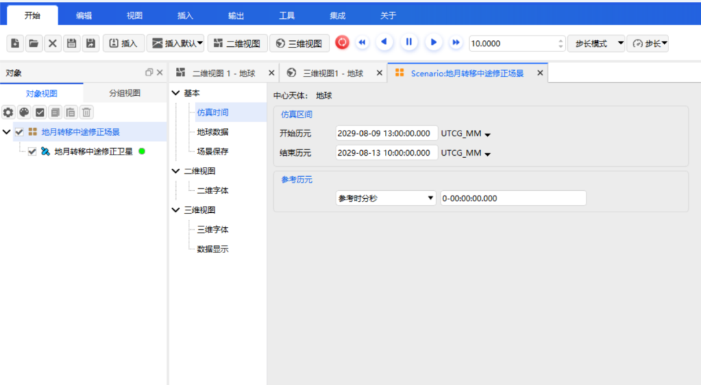

## 设计中途修正轨道

1. **定义瞄准序列段**

    添加一个瞄准序列段，命名为“地月转移中途修正设计”；嵌入一个初始段，命名为初始状态。根据前序设计结果，给出一条标称轨道的初始历元及初始轨道参数，终端历元及终端轨道参数。

    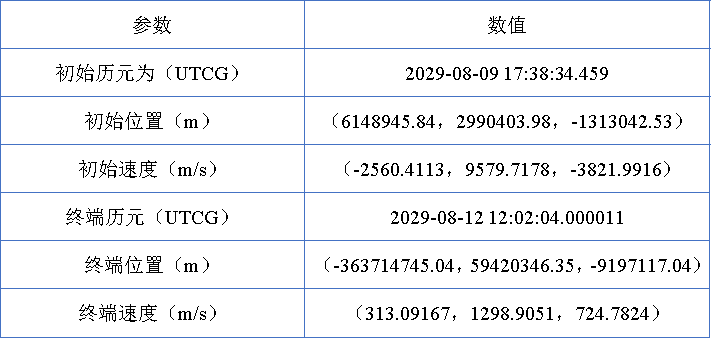

    将该标称轨道的参数分别作为卫星对象的初始轨道状态和终端瞄准状态，坐标系选择地球 J2000，坐标类型选择轨道根数，如下图所示。

    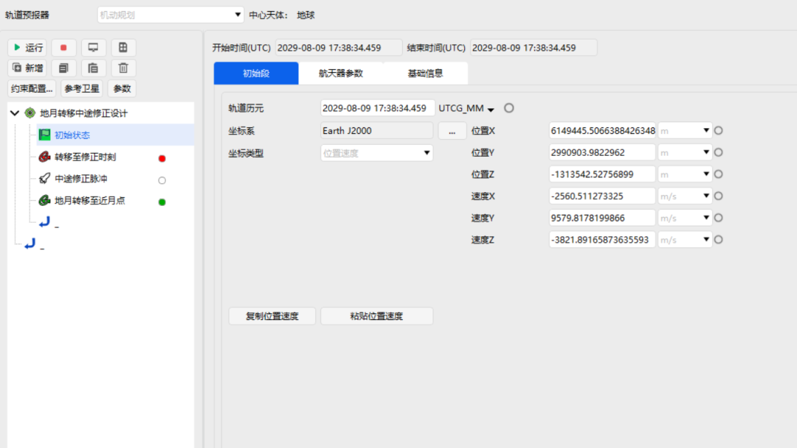

    在初始段后插入一个预报段，将其命名为“转移至修正时刻”。停止条件选择预报时长，触发值设置为“86400 s”。

    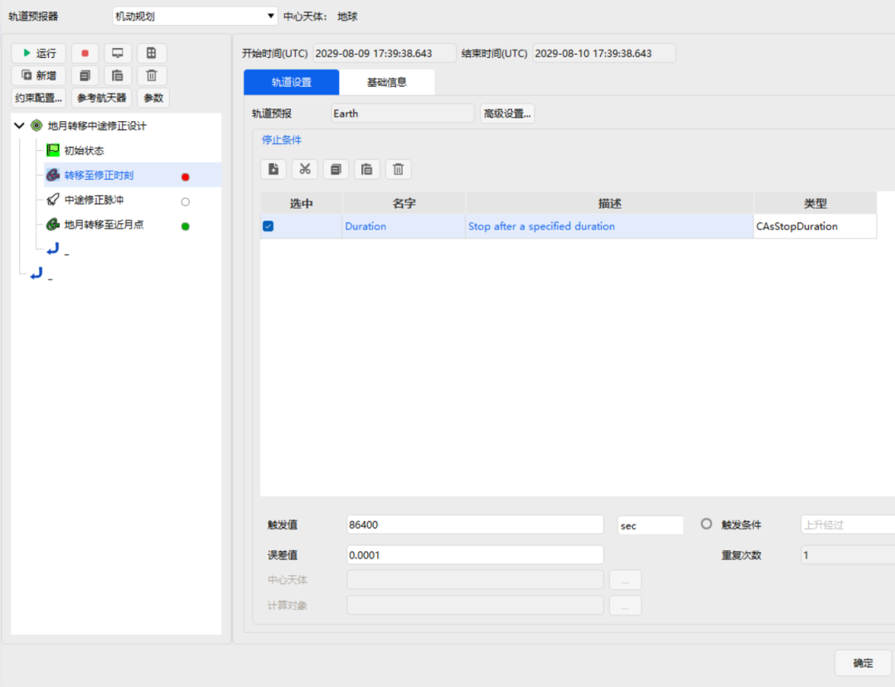

    该预报段的中心天体选择为地球，引力场模型选择为WGS84，引力的次数和阶次均选择为20，忽略大气阻力摄动，考虑太阳光压摄动以及太阳和月球的三体摄动，月球选择“引力场”模型GLGM2。

    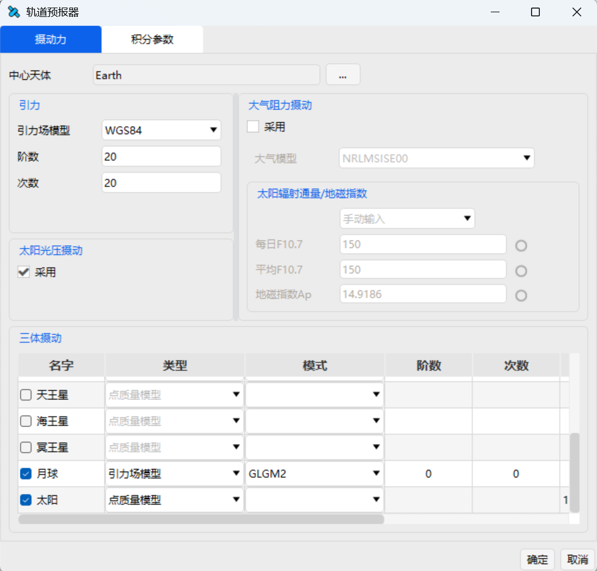

    当转移转移至修正时刻后插入机动段，命名为“中途修正脉冲”。机动类型为脉冲机动，推力坐标轴为VVLH坐标系，初始速度增量Vx、Vy、Vz分别设定为0 m/s、0 m/s和0 m/s。勾选速度增量Vx、Vy、Vz作为设计变量，如下图所示：

    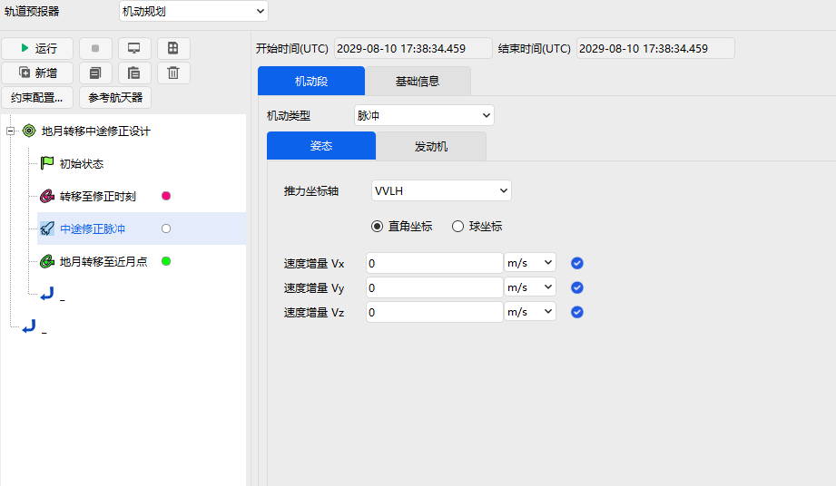

    当中途修正完成后插入预报段，命名为“地月转移至近月点”。停止条件选择历元时刻，其余参数设置与上一个预报段相同，停止条件触发值为“2029-08-12 12:02:04.000011”。

    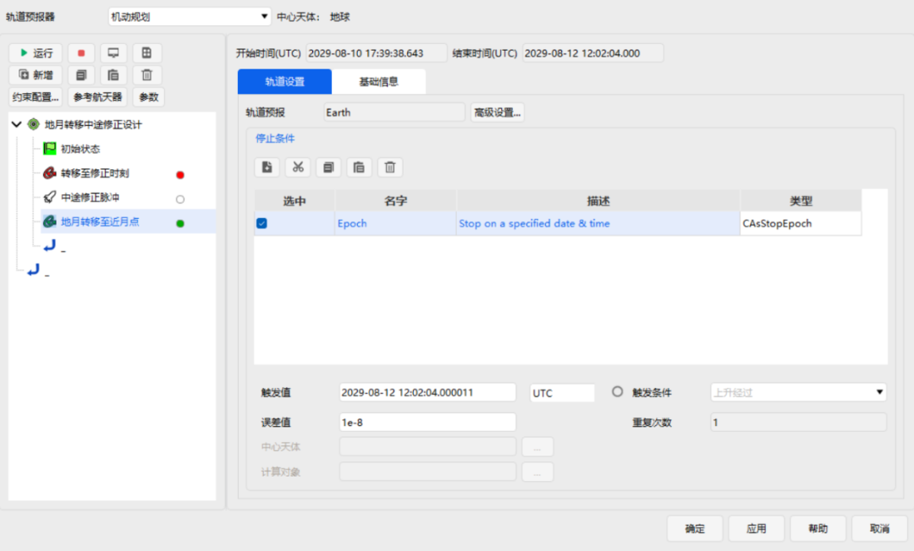

    在该预报段中，选择近月点位置作为目标变量。约束配置中选择笛卡尔坐标（位置X、位置Y、位置Z），约束坐标系设置为地球 J2000。

    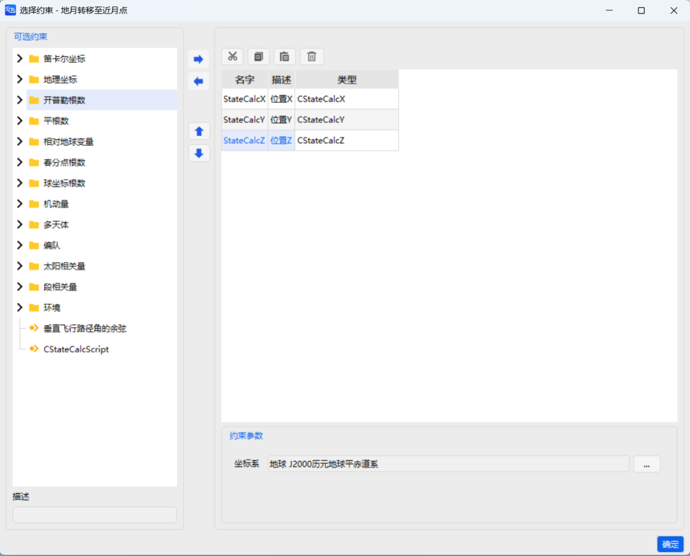

2. **设置瞄准器**

    为实现地月转移中途修正轨道的设计，选择配置类型 <kbd>微分修正</kbd>。

    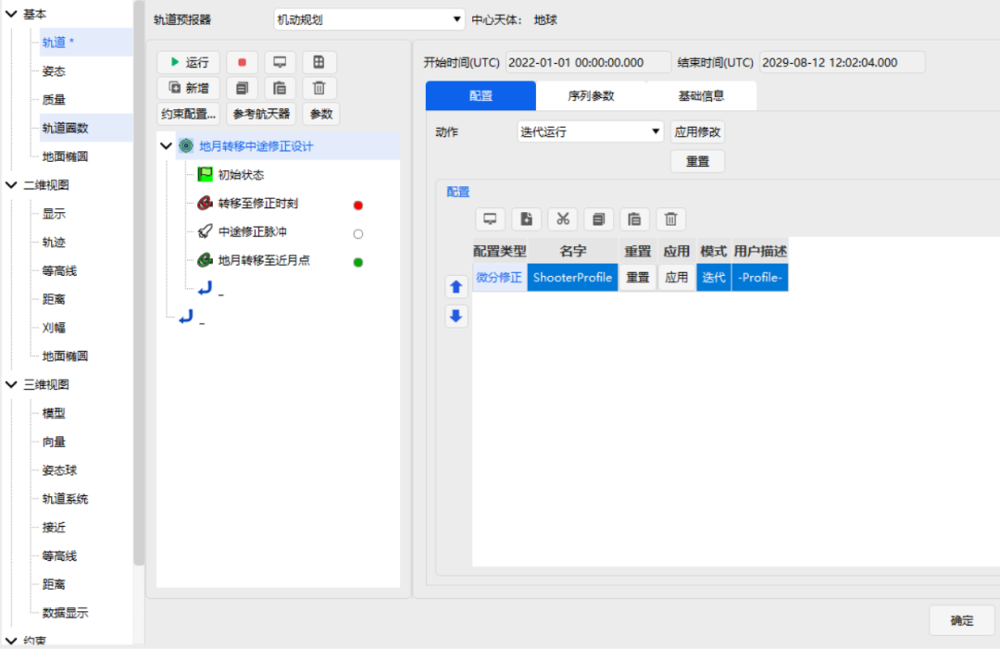

    双击 <kbd>微分修正</kbd> 进入【瞄准器设置】界面。分别点击“控制变量”和“约束”中“应用”栏下的方框，勾选使用的控制变量和约束，具体的控制变量和约束及其数值如下图所示。近月点的期望位置设置为（-363714745.042421 m，59420346.3452685 m，-9197117.03963177 m），近月点位置的收敛误差为50 m，其余参数可以选择默认参数。控制变量在“微分修正”优化下，得到满足约束配置的中途修正轨道设计方案。

    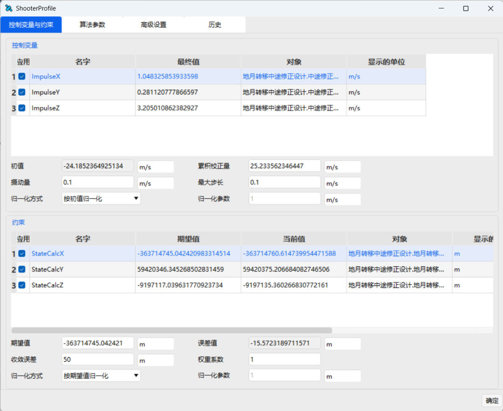

## 结果分析

构建完整个任务的控制序列后，点击瞄准序列段，选择 <kbd>迭代运行</kbd>，迭代运行三次后，得到如下运行结果。

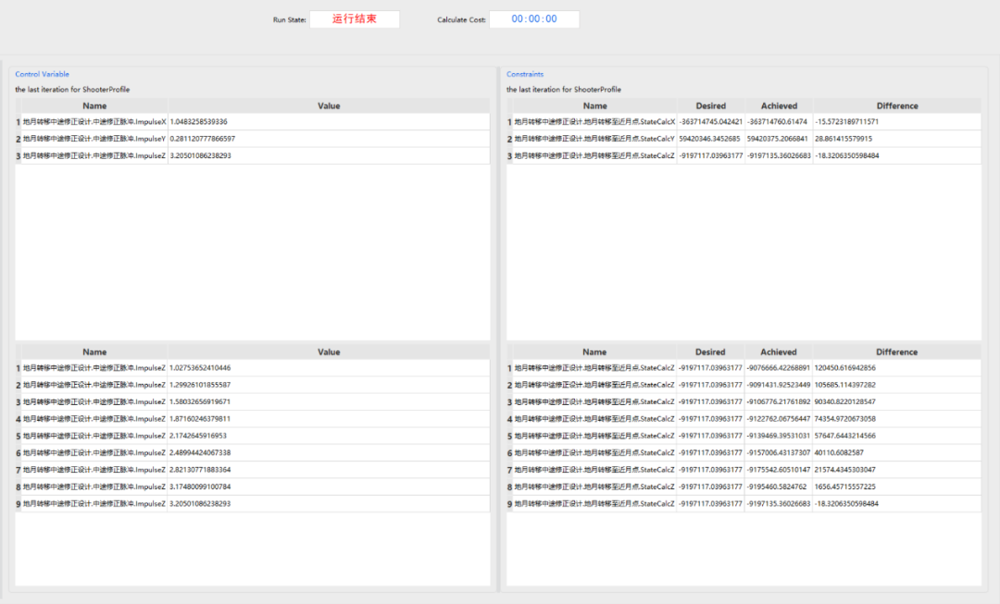

设计出的中途修正脉冲量与中途修正轨道的终端偏差如下表所示，可以看到中途修正轨道的近月点位置偏差符合约束要求，实现了考虑入轨偏差的地月转移中途修正轨道设计与分析。

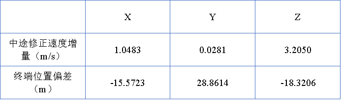

进一步在ATK【三维视图】中，将地心视角下和月心视角下的转移轨迹展示如下。

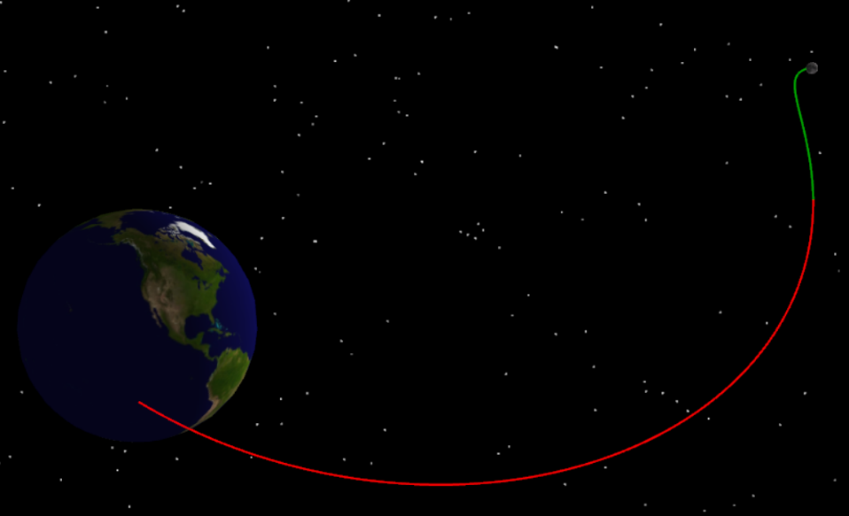

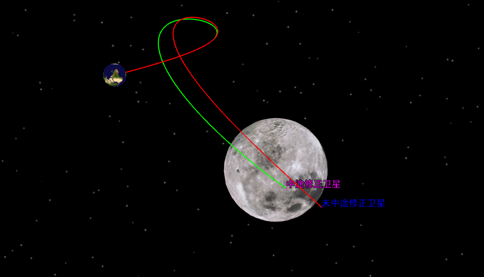
